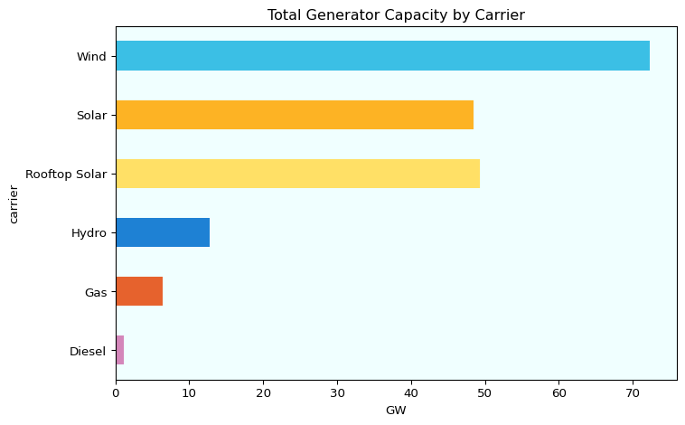

# A High-level Open Source Model for the Australian National Electricity
Market (NEM)
Grant Chalmers
2025-07-22

## **Introduction**

The NEM power system is undergoing rapid transformation, driven by the
need for increased renewable energy (RE) integration, grid
modernization, and the pursuit of sustainable, reliable, and affordable
electricity. To support these goals, advanced modeling tools are
essential for analyzing the current state of the grid, evaluating future
scenarios, and informing policy and investment decisions.

This notebook presents the development of a high-level baseline model
for the NEM power system using [PyPSA (Python for Power System
Analysis)](https://pypsa.readthedocs.io/en/latest/), an open-source
framework for simulating and optimizing modern energy systems. The
model, referred to as High-level_NEM, is a 5-node model (one bus per
region) based on actual 2024 generation and demand profiles at hourly
resolution. A comparison of the 2024 baseline model with a future
scenario is presented in the notebook. The future scenario has increased
renewable energy and storage and associated reduction in thermal
generation.

The workflow implemented in this notebook encompasses the following key
steps:  
- **Data Import and Preprocessing:** Loading and preparing network
topology, generator, storage, and time series data from actual NEM
system records and relevant administrative datasets.  
- **Network Construction:** Building the PyPSA network by adding buses,
loads, generators, storage units, and transmission lines.  
- **Temporal Resolution and Snapshots:** Setting up the model to operate
at a chosen temporal granularity, allowing for the study of daily and
seasonal variability in demand and renewable generation.  
- **Optimisation and Scenario Analysis:** Solving the baseline model
using linear optimisation to determine the optimal dispatch of
resources, and extending the analysis to a plausible future scenario
with an agressive increase in variable renewable energy and associated
reduction in thermal generation.  
- **Results Visualization and Verification:** Generating plots and
statistics to interpret model outputs, including network topology,
dispatch profiles, generation mix, and importantly, curtailment.  
- **Scenario Functions:** Providing reusable functions for projecting
various scaled-up generation scenarios.

## **Research Objectives**

*Objective:*

Develop a high-level 5-node baseline PyPSA model for the NEM and
VRE/storage scale-up scenarios with:  
1. One bus per NEM region with transmission interconnectors  
2. Hourly time resolution to capture some RE intermittency  
3. Comparison of 2024 baseline model to a high penetration renewable
energy scenario

*Key Assumptions*

Baseline 2024 model: - 2024 demand  
- 2024 generation profiles  
- 2024 renewable energy availability (capacity) factors (incl. hydro).  
- Generator registered capacities sourced from [Open Electricity
facilities](https://explore.openelectricity.org.au/facilities/nem/?status=operating,committed)
Inclusive of operating and **committed**, therefore includes Snowy 2.0,
Hunter Gas and a significant increase in battery storage over what is
currently operating.  
- Time series data is at hourly resolution.  
- Rooftop solar sourced from AEMO via
[nemosis](https://github.com/UNSW-CEEM/NEMOSIS) python package (TYPE =
*‘MEASUREMENT’*).  
- Efficiency of storage on the way in and out set at 0.917 (round trip
0.84) via [2024 ISP Inputs and Assumptions
workbook](https://aemo.com.au/-/media/files/major-publications/isp/2024/2024-isp-inputs-and-assumptions-workbook.xlsx?la=en).  
- Starter battery (600MW Cellars Hill) added in TAS1 in order to be able
to scale up (not currently operating, but has some level of state govt.
support).  
- Project EnergyConnect and Marinus stage 1 implemented on top of
existing interconnectors (constrained by nominal capacity)  
- One generator of each major source and one battery setup per
region/bus

By following this workflow, the notebook provides a high-level example
for those learning power system analysis with PyPSA.

**Important links/references:**

[TU Berlin: Data Science for Energy System
Modelling](https://fneum.github.io/data-science-for-esm/intro.html#jupyter.org/)  
[PyPSA Documentation and
Components](https://pypsa.readthedocs.io/en/latest/user-guide/components.html)  
[PyPSA Earth
Documentation](https://pypsa-earth.readthedocs.io/en/latest/)  
[GitHub PyPSA Sources](https://github.com/PyPSA)  
[PyPSA-PH: High-Resolution Open Source Power System Model for the
Philippines](https://github.com/arizeosalac/PyPSA-PH/tree/main)  
[2024 Integrated System Plan
(ISP)](https://aemo.com.au/energy-systems/major-publications/integrated-system-plan-isp/2024-integrated-system-plan-isp)  
[Open Electricity](https://openelectricity.org.au/)

### 01 Import

This section imports all necessary Python packages and libraries
required for data processing, power system modeling, geospatial
analysis, and visualization. These packages provide the foundational
tools for building, analyzing, and visualising the High-leve_NEM
baseline model and high penetration renewable energy model.

``` python
import pandas as pd
import matplotlib.pyplot as plt
import matplotlib as mpl
from matplotlib.dates import AutoDateLocator, ConciseDateFormatter
import pypsa
from pypsa.plot.maps.static import add_legend_patches
from datetime import timedelta
from datetime import datetime  
from dateutil.parser import parse
import numpy as np
import cartopy.crs as ccrs
import cartopy.feature as cfeature
from time import perf_counter
from great_tables import GT, md, system_fonts, nanoplot_options
from IPython.display import display, HTML
```

### 02 Create Network

This section covers the creation of the High-level_NEME network,
including loading network data, initializing the PyPSA network object,
and preparing the structure for adding buses, loads, generators, storage
units, and transmission lines.

#### 02.01 Load Network Data

``` python
# Load components
generators = pd.read_csv("data/generators.csv").set_index('name')
buses = pd.read_csv("data/buses.csv", index_col=0)
loads = pd.read_csv("data/loads.csv", index_col=0)
lines = pd.read_csv("data/lines.csv", index_col=0)
links = pd.read_csv("data/links.csv", index_col=0)
storage_units = pd.read_csv("data/storage_units.csv", index_col=0)
```

``` python
# Load time series data
load_ts = pd.read_csv("data/loads_t.p_set.csv", index_col=0)
load_ts.index = pd.to_datetime(load_ts.index, errors="raise")
print(load_ts.index.dtype) 
# Below should be empty if all dates are valid
load_ts[~load_ts.index.notnull()]
generators_ts = pd.read_csv("data/generators_t.p_max_pu.csv", index_col=0)
generators_ts.index = pd.to_datetime(generators_ts.index, errors="raise")
print(generators_ts.index.dtype)

if not load_ts.index.equals(generators_ts.index):    
    raise ValueError("Time series indices are not aligned")
```

    datetime64[ns]
    datetime64[ns]

#### 02.02 Initialize the network

``` python
n = pypsa.Network()
```

### 03 Add Network Components

This section details the process of adding key components to the
PyPSA-PH network, including buses, loads, generators, storage units, and
transmission lines. Each component is integrated with relevant time
series data and technical parameters to accurately represent the
Philippine power system’s structure and operation.

``` python
# Add components
for name, row in buses.iterrows():
    n.add("Bus", name, **row.to_dict())

for name, row in loads.iterrows():
    n.add("Load", name, **row.to_dict())

for name, row in lines.iterrows():
    n.add("Line", name, **row.to_dict())

for name, row in generators.iterrows():
    n.add("Generator", name, **row.to_dict())

for name, row in links.iterrows():
    n.add("Link", name, **row.to_dict())
    
for name, row in storage_units.iterrows():
    n.add("StorageUnit", name, **row.to_dict())    


# Set time series
n.set_snapshots(load_ts.index)
n.loads_t.p_set = load_ts
n.generators_t.p_max_pu = generators_ts

assert all(n.generators_t.p_max_pu.index == n.snapshots)

# Remove negative values in p_max_pu (Hydro is the culprit)
n.generators_t.p_max_pu = n.generators_t.p_max_pu.clip(lower=0.0, upper=1.0)
```

Introduce a dummy ‘load shedding’ generator to help identify infeasible
scenarios within the model. This approach is more informative than
simply receiving a “not feasible” message from the solver, as it
highlights which regions are affected. With this information, we can
make targeted adjustments - such as increasing generation or storage in
future iterations.

Set the marginal cost very high so it is only used as a last resort.

``` python
# Add one unserved energy generator per load bus
# Acts like a dummy "load shedding" generator
for bus in n.loads.bus.unique():
    gen_name = f"{bus}-UNSERVED"
    n.add("Generator",
          name=gen_name,
          bus=bus,
          carrier="Unserved Energy",
          p_nom_extendable=True,
          p_nom=0,
          marginal_cost=10000,  # Very expensive fallback
          capital_cost=0,       # Optional: make it purely operational cost
    )
```

``` python
# Diagnostic output
print(f"Loaded {len(n.buses)} buses")
print(f"Loaded {len(n.loads)} loads with time series of shape {n.loads_t.p_set.shape}")
print(f"Loaded {len(n.generators)} generators with time series of shape {n.generators_t.p_max_pu.shape}")
print(f"Loaded {len(n.lines)} lines")
print(f"Loaded {len(n.links)} links")
print(f"Loaded {len(n.generators)} generators")
print(f"Loaded {len(n.storage_units)} storage units")

# Check total demand makes sense
print(f"Total demand:  {n.loads_t.p_set.sum(axis=1).max()}")
```

    Loaded 5 buses
    Loaded 5 loads with time series of shape (8784, 5)
    Loaded 37 generators with time series of shape (8784, 18)
    Loaded 9 lines
    Loaded 8 links
    Loaded 37 generators
    Loaded 5 storage units
    Total demand:  33459.57

Add carrier colours for plotting consistency.

``` python
# Add carrier colours for plotting consistency.
# Userved Energy bright red!

carrier_list = n.generators.carrier.unique()
carrier_colors = {
    "Biomass": '#127E2A',
    "Hydro": '#1E81D4',
    "Black Coal": "#39322D",
    "Solar": '#FDB324',
    "Rooftop Solar": '#FFE066',
    "Wind": '#3BBFE5',
    "Diesel": "#D486BA",
    "Brown Coal": "#715E50",
    "Gas": '#E6622D',
    "ROR": '#8ab2d4',
    "Battery": '#814ad4',
    "Pump Hydro": '#104775',
    "AC": '#999999',
    "DC": "#3277AF",
    "Unserved Energy": "#F40B16"
}

for carrier, color in carrier_colors.items():
    n.carriers.loc[carrier, 'color'] = color
```

Plot high-level NEM network (buses, lines & links).  
Note: the lines/links below are not geographically accurate - just for
representation.

``` python
# Plot high-level NEM network (buses, lines & links)

# Use PlateCarree projection for lat/lon
crs = ccrs.PlateCarree()

# Create figure and map
fig, ax = plt.subplots(figsize=(9, 6), subplot_kw={'projection': crs})

# Add base map features
ax.add_feature(cfeature.COASTLINE)
ax.add_feature(cfeature.BORDERS, linestyle=":")
ax.add_feature(cfeature.STATES, linewidth=0.5)
ax.set_extent([110, 155, -45, -10])  # Australia-wide view
# fig.patch.set_facecolor('#F0FFFF') 
# ax.set_facecolor('#F0FFFF')

# Plot buses
ax.scatter(
    n.buses["x"], n.buses["y"],
    color='red', s=50, transform=crs, zorder=5,
    label="Buses"
)

# Label each bus
for name, row in n.buses.iterrows():
    ax.text(
        row["x"], row["y"], name,
        transform=crs, fontsize=9, ha='left', va='bottom'
    )

# Plot lines (AC)
first_line = True
for _, line in n.lines.iterrows():
    x0, y0 = n.buses.loc[line.bus0, ["x", "y"]]
    x1, y1 = n.buses.loc[line.bus1, ["x", "y"]]
    color = carrier_colors.get(line.carrier, "gray")  # fallback if undefined
    
    ax.plot([x0, x1], [y0, y1], color=color, transform=crs, zorder=3,
            label="Lines (AC)" if first_line else None)
    first_line = False

# Plot links (DC)
first_link = True
for _, link in n.links.iterrows():
    x0, y0 = n.buses.loc[link.bus0, ["x", "y"]]
    x1, y1 = n.buses.loc[link.bus1, ["x", "y"]]
    color = carrier_colors.get(link.carrier, "blue")
    ax.plot([x0, x1], [y0, y1], color=color, linestyle="--", transform=crs, zorder=3,
            label="Links (DC)" if first_link else None)
    first_link = False

plt.title("PyPSA High-level NEM Network (Buses, Lines, Links)")
plt.legend()
plt.tight_layout()
plt.show()
```


### 03 Solve the network

``` python
# Solve the nework
# Change to open source solver if required, default is HiGHS:
# n.optimize()
# n.optimize(solver_name = "gurobi")
```

``` python
# Export the baseline network to NetCDF format so it is accessible for other tools.
# This is useful for sharing the network with others or for further analysis.
# n.export_to_netcdf("results/high-level_nem.nc")
```

``` python
# Read the network back from NetCDF format (if needed)
n = pypsa.Network("results/high-level_nem.nc")
```

    INFO:pypsa.io:Imported network high-level_nem.nc has buses, carriers, generators, lines, links, loads, storage_units

`.p_nom_opt` is the optimised nominal capacity of a generator, after
running n.optimize() in PyPSA. In the baseline model, it is expected
that there will be zero unserved energy.

``` python
# Group by bus and carrier to sum the optimised nominal power in MW.
n.generators.groupby(["bus", "carrier"]).p_nom_opt.sum().reset_index() \
    .pivot(index='bus', columns='carrier', values='p_nom_opt') \
    .fillna(0).astype(int).sort_index()
```

<div>
<style scoped>
    .dataframe tbody tr th:only-of-type {
        vertical-align: middle;
    }

    .dataframe tbody tr th {
        vertical-align: top;
    }

    .dataframe thead th {
        text-align: right;
    }
</style>

<table class="dataframe" data-quarto-postprocess="true" data-border="1">
<thead>
<tr class="header" style="text-align: right;">
<th data-quarto-table-cell-role="th">carrier</th>
<th data-quarto-table-cell-role="th">Black Coal</th>
<th data-quarto-table-cell-role="th">Brown Coal</th>
<th data-quarto-table-cell-role="th">Diesel</th>
<th data-quarto-table-cell-role="th">Gas</th>
<th data-quarto-table-cell-role="th">Hydro</th>
<th data-quarto-table-cell-role="th">Rooftop Solar</th>
<th data-quarto-table-cell-role="th">Solar</th>
<th data-quarto-table-cell-role="th">Unserved Energy</th>
<th data-quarto-table-cell-role="th">Wind</th>
</tr>
<tr class="odd">
<th data-quarto-table-cell-role="th">bus</th>
<th data-quarto-table-cell-role="th"></th>
<th data-quarto-table-cell-role="th"></th>
<th data-quarto-table-cell-role="th"></th>
<th data-quarto-table-cell-role="th"></th>
<th data-quarto-table-cell-role="th"></th>
<th data-quarto-table-cell-role="th"></th>
<th data-quarto-table-cell-role="th"></th>
<th data-quarto-table-cell-role="th"></th>
<th data-quarto-table-cell-role="th"></th>
</tr>
</thead>
<tbody>
<tr class="odd">
<td data-quarto-table-cell-role="th">NSW1</td>
<td>8270</td>
<td>0</td>
<td>155</td>
<td>3278</td>
<td>7122</td>
<td>5477</td>
<td>7329</td>
<td>0</td>
<td>3212</td>
</tr>
<tr class="even">
<td data-quarto-table-cell-role="th">QLD1</td>
<td>8119</td>
<td>0</td>
<td>453</td>
<td>3202</td>
<td>976</td>
<td>4604</td>
<td>5379</td>
<td>0</td>
<td>3402</td>
</tr>
<tr class="odd">
<td data-quarto-table-cell-role="th">SA1</td>
<td>0</td>
<td>0</td>
<td>454</td>
<td>3408</td>
<td>2</td>
<td>1876</td>
<td>735</td>
<td>0</td>
<td>2763</td>
</tr>
<tr class="even">
<td data-quarto-table-cell-role="th">TAS1</td>
<td>0</td>
<td>0</td>
<td>48</td>
<td>372</td>
<td>2356</td>
<td>250</td>
<td>0</td>
<td>0</td>
<td>587</td>
</tr>
<tr class="odd">
<td data-quarto-table-cell-role="th">VIC1</td>
<td>0</td>
<td>4690</td>
<td>0</td>
<td>2491</td>
<td>2352</td>
<td>3654</td>
<td>2034</td>
<td>0</td>
<td>6044</td>
</tr>
</tbody>
</table>

</div>

### 04 Visualisations

``` python
# Plotting function for generation dispatch
# Interactive version (optional)


def plot_dispatch(n, time="2024", days=None, regions=None,
                   show_imports=True, show_curtailment=True,
                   scenario_name=None, scenario_objective=None, interactive=False):
     """
     Plot a generation dispatch stack by carrier for a PyPSA network, with optional
     net imports/exports and a region‑filtered curtailment overlay.

     Parameters
     ----------
     n : pypsa.Network
         The PyPSA network to plot.
     time : str, default "2024"
         Start of the time window (e.g. "2024", "2024-07", or "2024-07-15").
     days : int, optional
         Number of days from `time` to include in the plot.
     regions : list of str, optional
         Region bus names to filter by. If None, the entire network is included.
     show_imports : bool, default True
         Whether to include net imports/exports in the dispatch stack.
     show_curtailment : bool, default True
         Whether to calculate and plot VRE curtailment (Solar, Wind, Rooftop Solar).
     scenario_name : str, optional
         Scenario label to display below the title.
     scenario_objective : str, optional
         Objective description to display next to the legend.
     interactive : bool, default False
         Whether to create an interactive plot using Plotly instead of matplotlib.

     Notes
     -----
     - All power values are converted to GW.
     - Curtailment is plotted as a dashed black line if enabled.
     - Demand (load) is plotted as a solid green line.
     - Storage charging and net exports (negative values) are shown below zero.
     """
     
     
     if interactive:
         import plotly.graph_objects as go
         from plotly.subplots import make_subplots
         import plotly.express as px
     else:
         import matplotlib.pyplot as plt
     
     # 1) REGION MASKS
     if regions is not None:
         gen_mask   = n.generators.bus.isin(regions)
         sto_mask   = n.storage_units.bus.isin(regions) if not n.storage_units.empty else []
         store_mask = n.stores.bus.isin(regions) if not n.stores.empty else []
         region_buses = set(regions)
         
     else:
        gen_mask = pd.Series(True, index=n.generators.index)
        sto_mask = pd.Series(True, index=n.storage_units.index) if not n.storage_units.empty else pd.Series(dtype=bool)
        store_mask = pd.Series(True, index=n.stores.index) if not n.stores.empty else pd.Series(dtype=bool)
        region_buses = set(n.buses.index)

     # 2) AGGREGATE BY CARRIER (GW)
     def _agg(df_t, df_stat, mask):
         return (
             df_t.loc[:, mask]
                 .T
                 .groupby(df_stat.loc[mask, 'carrier'])
                 .sum()
                 .T
                 .div(1e3)
         )

     p_by_carrier = _agg(n.generators_t.p, n.generators, gen_mask)
     if not n.storage_units.empty:
         p_by_carrier = pd.concat([p_by_carrier,
                                   _agg(n.storage_units_t.p, n.storage_units, sto_mask)],
                                  axis=1)
     if not n.stores.empty:
         p_by_carrier = pd.concat([p_by_carrier,
                                   _agg(n.stores_t.p, n.stores, store_mask)],
                                  axis=1)

     # 3) TIME WINDOW
     parts = time.split("-")
     if len(parts) == 1:
         start = pd.to_datetime(f"{parts[0]}-01-01")
     elif len(parts) == 2:
         start = pd.to_datetime(f"{parts[0]}-{parts[1]}-01")
     else:
         start = pd.to_datetime(time)

     if days is not None:
         end = start + pd.Timedelta(days=days) - pd.Timedelta(hours=1)
     elif len(parts) == 1:
         end = pd.to_datetime(f"{parts[0]}-12-31 23:00")
     elif len(parts) == 2:
         end = start + pd.offsets.MonthEnd(0) + pd.Timedelta(hours=23)
     else:
         end = start + pd.Timedelta(hours=23)

     p_slice = p_by_carrier.loc[start:end].copy()
     # drop carriers with zero activity
     zero = p_slice.columns[p_slice.abs().sum() == 0]
     p_slice.drop(columns=zero, inplace=True)

     # 4) IMPORTS/EXPORTS
     if show_imports:
         ac = ( n.lines_t.p0.loc[start:end, n.lines.bus1.isin(region_buses) & ~n.lines.bus0.isin(region_buses)].sum(axis=1)
              + n.lines_t.p1.loc[start:end, n.lines.bus0.isin(region_buses) & ~n.lines.bus1.isin(region_buses)].sum(axis=1) )
         dc = ( n.links_t.p0.loc[start:end, n.links.bus1.isin(region_buses) & ~n.links.bus0.isin(region_buses)].sum(axis=1)
              + n.links_t.p1.loc[start:end, n.links.bus0.isin(region_buses) & ~n.links.bus1.isin(region_buses)].sum(axis=1) )
         p_slice['Imports/Exports'] = (ac + dc).div(1e3)
         if 'Imports/Exports' not in n.carriers.index:
             n.carriers.loc['Imports/Exports','color']='#7f7f7f'

     # 5) LOAD SERIES
     if regions:
         load_cols = [c for c in n.loads[n.loads.bus.isin(regions)].index if c in n.loads_t.p_set]
         load_series = n.loads_t.p_set[load_cols].sum(axis=1)
     else:
         load_series = n.loads_t.p_set.sum(axis=1)
     load_series = load_series.loc[start:end].div(1e3)

     # 6) VRE CURTAILMENT (GW) if requested
     if show_curtailment:
         vre = ['Solar','Wind', 'Rooftop Solar']
         mask_vre = gen_mask & n.generators.carrier.isin(vre)
         avail = (n.generators_t.p_max_pu.loc[start:end, mask_vre]
                  .multiply(n.generators.loc[mask_vre,'p_nom'], axis=1))
         disp  = n.generators_t.p.loc[start:end, mask_vre]
         curtail = (avail.sub(disp, fill_value=0)
                        .clip(lower=0)
                        .sum(axis=1)
                        .div(1e3))
     else:
         curtail = None

     # 7) PLOT
     title_tail = f" for {', '.join(regions)}" if regions else ''
     plot_title = f"Dispatch by Carrier: {start.date()} to {end.date()}{title_tail}"
     
     if interactive:
         # PLOTLY INTERACTIVE PLOT
         fig = go.Figure()
         
         fig.update_layout(
            plot_bgcolor='#F0FFFF',
            xaxis=dict(gridcolor='#DDDDDD'),
            yaxis=dict(gridcolor='#DDDDDD')        # Plot area background
         ) 

         # Prepare data for stacked area plot
         positive_data = p_slice.where(p_slice > 0).fillna(0)
         negative_data = p_slice.where(p_slice < 0).fillna(0)
         
         # Add positive generation as stacked area
         for i, col in enumerate(positive_data.columns):
             if positive_data[col].sum() > 0:
                 color = n.carriers.loc[col, 'color']
                 # Only add points where value > 0.001
                 mask = positive_data[col].abs() > 0.001
                 if mask.any():
                     fig.add_trace(go.Scatter(
                         x=positive_data.index[mask],
                         y=positive_data[col][mask],
                         mode='lines',
                         fill='tonexty' if i > 0 else 'tozeroy',
                         line=dict(width=0, color=color),
                         fillcolor=color,
                         name=col,
                         stackgroup='positive',
                         hovertemplate='<b>%{fullData.name}</b><br>Power: %{y:.3f} GW<extra></extra>',
                         showlegend=True
                     ))
         
         # Add negative generation (storage charging, exports)
         for col in negative_data.columns:
             if negative_data[col].sum() < 0:
                 color = n.carriers.loc[col, 'color']
                 # Only add points where value < -0.001
                 mask = negative_data[col].abs() > 0.001
                 if mask.any():
                     fig.add_trace(go.Scatter(
                         x=negative_data.index[mask],
                         y=negative_data[col][mask],
                         mode='lines',
                         fill='tonexty',
                         line=dict(width=0, color=color),
                         fillcolor=color,
                         name=col,
                         stackgroup='negative',
                         hovertemplate='<b>%{fullData.name}</b><br>Power: %{y:.2f} GW<extra></extra>',
                         showlegend=True
                     ))
         
         # Add demand line (always show)
         fig.add_trace(go.Scatter(
             x=load_series.index,
             y=load_series,
             mode='lines',
             line=dict(color='green', width=2),
             name='Demand',
             hovertemplate='<b>Demand</b><br>Power: %{y:.2f} GW<extra></extra>',
             showlegend=True
         ))
         
         # Add curtailment line if requested
         if show_curtailment and curtail is not None:
             fig.add_trace(go.Scatter(
                 x=curtail.index,
                 y=curtail,
                 mode='lines',
                 line=dict(color='black', width=2, dash='dash'),
                 name='Curtailment',
                 hovertemplate='<b>Curtailment</b><br>Power: %{y:.2f} GW<extra></extra>',
                 showlegend=True
                 ))
         
         # Update layout
         fig.update_layout(
             title=plot_title,
             xaxis_title='Time',
             yaxis_title='Power (GW)',
             hovermode='x unified',
             hoverlabel=dict(
                 bgcolor="white",
                 bordercolor="black",
                 font_size=12,
             ),
             legend=dict(
                 x=1.02,
                 y=1,
                 bgcolor='rgba(255,255,255,0.8)',
                 bordercolor='rgba(0,0,0,0.2)',
                 borderwidth=1
             ),
             width=800,
             height=500
         )
         
         # Add scenario annotations
         annotations = []
         if scenario_name:
             annotations.append(
                 dict(
                     x=1.02, y=-0.05,
                     xref='paper', yref='paper',
                     text=f"Scenario: {scenario_name}",
                     showarrow=False,
                     font=dict(size=10, color='gray'),
                     xanchor='center',
                     yanchor='top'
                 )
             )
         
         if annotations:
             fig.update_layout(annotations=annotations)
         
         fig.show()
         
     else:
         # MATPLOTLIB STATIC PLOT 
         fig, ax = plt.subplots(figsize=(8.4, 6.5)) #12,6.5
         cols = p_slice.columns.map(lambda c: n.carriers.loc[c,'color'])
         p_slice.where(p_slice>0).plot.area(ax=ax,linewidth=0,color=cols)
         neg = p_slice.where(p_slice<0).dropna(how='all',axis=1)
         if not neg.empty:
             neg_cols=[n.carriers.loc[c,'color'] for c in neg.columns]
             neg.plot.area(ax=ax,linewidth=0,color=neg_cols)
         load_series.plot(ax=ax,color='g',linewidth=1.5,label='Demand')
         if show_curtailment and curtail is not None:
             curtail.plot(ax=ax,color='k',linestyle='--',linewidth=1.2,label='Curtailment')

         # limits & legend
         up = max(p_slice.where(p_slice>0).sum(axis=1).max(),
                  load_series.max(),
                  curtail.max() if curtail is not None else 0)
         dn = min(p_slice.where(p_slice<0).sum(axis=1).min(), load_series.min())
         ax.set_ylim(dn if not np.isclose(up,dn) else dn-0.1, up)
        #  fig.patch.set_facecolor('#F0FFFF') 
         ax.set_facecolor('#F0FFFF')
         h,l = ax.get_legend_handles_labels()
         seen={} ; fh,fl=[],[]
         for hh,ll in zip(h,l):
             if ll not in seen: fh.append(hh);fl.append(ll);seen[ll]=True
         ax.legend(fh,fl,loc=(1.02,0.67), fontsize=9)

         # scenario text
         if scenario_objective:
             ax.text(1.02,0.01,f"Objective:\n{scenario_objective}",transform=ax.transAxes,
                     fontsize=8,va='bottom',ha='left',bbox=dict(facecolor='white',alpha=0.7,edgecolor='none'))
         if scenario_name:
             ax.text(1.02,-0.05,f"Scenario: {scenario_name}",transform=ax.transAxes,
                     fontsize=9,color='gray',ha='center',va='top')

         ax.set_ylabel('GW')
         ax.set_title(plot_title)
         plt.tight_layout()
         plt.show()
```

Review dispatch for a 5-day period in NSW.

Note here that very little gas is dispatched due to having a higher
marginal price than black coal. In reality the ramping up and down of
coal plants is smoother than this. The hourly resolution does not
constrain the ramping much compared to actual five-minute dispatching in
the NEM. For example, Eraring black coal units maximum ramp-up of
4MW/min, is 240MW per model snapshot (hourly).

``` python
# plot_dispatch function example - static plot of NSW1 region for 3 days starting from 2024-07-01
plot_dispatch(n, time="2024-07-01", days=5, regions=["NSW1"], show_imports=True)
```


The interactive version is good for exploratory data analysis.

``` python
# plot_dispatch function example - interactive plot of VIC1 region for 10 days starting from 2024-01-19
plot_dispatch(n, time="2024-01-10", days=5, regions=["VIC1"], show_imports=True, interactive=True)
```

        <script type="text/javascript">
        window.PlotlyConfig = {MathJaxConfig: 'local'};
        if (window.MathJax && window.MathJax.Hub && window.MathJax.Hub.Config) {window.MathJax.Hub.Config({SVG: {font: "STIX-Web"}});}
        </script>
        <script type="module">import "https://cdn.plot.ly/plotly-3.0.1.min"</script>
        
<div>            <script src="https://cdnjs.cloudflare.com/ajax/libs/mathjax/2.7.5/MathJax.js?config=TeX-AMS-MML_SVG"></script><script type="text/javascript">if (window.MathJax && window.MathJax.Hub && window.MathJax.Hub.Config) {window.MathJax.Hub.Config({SVG: {font: "STIX-Web"}});}</script>                <script type="text/javascript">window.PlotlyConfig = {MathJaxConfig: 'local'};</script>
        <script charset="utf-8" src="https://cdn.plot.ly/plotly-3.0.1.min.js"></script>                <div id="8254f33b-1bcc-4787-8c5e-6d07417502f7" class="plotly-graph-div" style="height:500px; width:800px;"></div>            <script type="text/javascript">                window.PLOTLYENV=window.PLOTLYENV || {};                                if (document.getElementById("8254f33b-1bcc-4787-8c5e-6d07417502f7")) {                    Plotly.newPlot(                        "8254f33b-1bcc-4787-8c5e-6d07417502f7",                        [{"fill":"tozeroy","fillcolor":"#715E50","hovertemplate":"\u003cb\u003e%{fullData.name}\u003c\u002fb\u003e\u003cbr\u003ePower: %{y:.3f} GW\u003cextra\u003e\u003c\u002fextra\u003e","line":{"color":"#715E50","width":0},"mode":"lines","name":"Brown Coal","showlegend":true,"stackgroup":"positive","x":["2024-01-10T00:00:00.000000000","2024-01-10T01:00:00.000000000","2024-01-10T02:00:00.000000000","2024-01-10T03:00:00.000000000","2024-01-10T04:00:00.000000000","2024-01-10T05:00:00.000000000","2024-01-10T06:00:00.000000000","2024-01-10T07:00:00.000000000","2024-01-10T08:00:00.000000000","2024-01-10T09:00:00.000000000","2024-01-10T10:00:00.000000000","2024-01-10T11:00:00.000000000","2024-01-10T12:00:00.000000000","2024-01-10T13:00:00.000000000","2024-01-10T14:00:00.000000000","2024-01-10T15:00:00.000000000","2024-01-10T16:00:00.000000000","2024-01-10T17:00:00.000000000","2024-01-10T18:00:00.000000000","2024-01-10T19:00:00.000000000","2024-01-10T20:00:00.000000000","2024-01-10T21:00:00.000000000","2024-01-10T22:00:00.000000000","2024-01-10T23:00:00.000000000","2024-01-11T00:00:00.000000000","2024-01-11T01:00:00.000000000","2024-01-11T02:00:00.000000000","2024-01-11T03:00:00.000000000","2024-01-11T04:00:00.000000000","2024-01-11T05:00:00.000000000","2024-01-11T06:00:00.000000000","2024-01-11T07:00:00.000000000","2024-01-11T08:00:00.000000000","2024-01-11T09:00:00.000000000","2024-01-11T10:00:00.000000000","2024-01-11T11:00:00.000000000","2024-01-11T12:00:00.000000000","2024-01-11T13:00:00.000000000","2024-01-11T14:00:00.000000000","2024-01-11T15:00:00.000000000","2024-01-11T16:00:00.000000000","2024-01-11T17:00:00.000000000","2024-01-11T18:00:00.000000000","2024-01-11T19:00:00.000000000","2024-01-11T20:00:00.000000000","2024-01-11T21:00:00.000000000","2024-01-11T22:00:00.000000000","2024-01-11T23:00:00.000000000","2024-01-12T00:00:00.000000000","2024-01-12T01:00:00.000000000","2024-01-12T02:00:00.000000000","2024-01-12T03:00:00.000000000","2024-01-12T04:00:00.000000000","2024-01-12T05:00:00.000000000","2024-01-12T06:00:00.000000000","2024-01-12T07:00:00.000000000","2024-01-12T08:00:00.000000000","2024-01-12T09:00:00.000000000","2024-01-12T10:00:00.000000000","2024-01-12T11:00:00.000000000","2024-01-12T12:00:00.000000000","2024-01-12T13:00:00.000000000","2024-01-12T14:00:00.000000000","2024-01-12T15:00:00.000000000","2024-01-12T16:00:00.000000000","2024-01-12T17:00:00.000000000","2024-01-12T18:00:00.000000000","2024-01-12T19:00:00.000000000","2024-01-12T20:00:00.000000000","2024-01-12T21:00:00.000000000","2024-01-12T22:00:00.000000000","2024-01-12T23:00:00.000000000","2024-01-13T00:00:00.000000000","2024-01-13T01:00:00.000000000","2024-01-13T02:00:00.000000000","2024-01-13T03:00:00.000000000","2024-01-13T04:00:00.000000000","2024-01-13T05:00:00.000000000","2024-01-13T06:00:00.000000000","2024-01-13T07:00:00.000000000","2024-01-13T08:00:00.000000000","2024-01-13T09:00:00.000000000","2024-01-13T10:00:00.000000000","2024-01-13T11:00:00.000000000","2024-01-13T12:00:00.000000000","2024-01-13T13:00:00.000000000","2024-01-13T14:00:00.000000000","2024-01-13T15:00:00.000000000","2024-01-13T16:00:00.000000000","2024-01-13T17:00:00.000000000","2024-01-13T18:00:00.000000000","2024-01-13T19:00:00.000000000","2024-01-13T20:00:00.000000000","2024-01-13T21:00:00.000000000","2024-01-13T22:00:00.000000000","2024-01-13T23:00:00.000000000","2024-01-14T00:00:00.000000000","2024-01-14T01:00:00.000000000","2024-01-14T02:00:00.000000000","2024-01-14T03:00:00.000000000","2024-01-14T04:00:00.000000000","2024-01-14T05:00:00.000000000","2024-01-14T06:00:00.000000000","2024-01-14T07:00:00.000000000","2024-01-14T08:00:00.000000000","2024-01-14T09:00:00.000000000","2024-01-14T10:00:00.000000000","2024-01-14T11:00:00.000000000","2024-01-14T12:00:00.000000000","2024-01-14T13:00:00.000000000","2024-01-14T14:00:00.000000000","2024-01-14T15:00:00.000000000","2024-01-14T16:00:00.000000000","2024-01-14T17:00:00.000000000","2024-01-14T18:00:00.000000000","2024-01-14T19:00:00.000000000","2024-01-14T20:00:00.000000000","2024-01-14T21:00:00.000000000","2024-01-14T22:00:00.000000000","2024-01-14T23:00:00.000000000"],"y":{"dtype":"f8","bdata":"w\u002fUoXI\u002fCEkDD9Shcj8ISQMP1KFyPwhJAw\u002fUoXI\u002fCEkDD9Shcj8ISQMP1KFyPwhJAw\u002fUoXI\u002fCEkDD9Shcj8ISQJ2VIxXuWwJAo9zwxvUozD+j3PDG9SjMP6Pc8Mb1KMw\u002fo9zwxvUozD+j3PDG9SjMP6Pc8Mb1KMw\u002fKWBgUs3B+z9EpvAOqt4OQMP1KFyPwhJAw\u002fUoXI\u002fCEkDD9Shcj8ISQMP1KFyPwhJAw\u002fUoXI\u002fCEkDD9Shcj8ISQMP1KFyPwhJAw\u002fUoXI\u002fCEkDD9Shcj8ISQMP1KFyPwhJAw\u002fUoXI\u002fCEkDD9Shcj8ISQMP1KFyPwhJAw\u002fUoXI\u002fCEkDD9Shcj8ISQKCHKaoiyQpAo9zwxvUozD+j3PDG9SjMP6Pc8Mb1KMw\u002fo9zwxvUozD+j3PDG9SjMP6Pc8Mb1KMw\u002fo9zwxvUozD9o33MAoYABQMP1KFyPwhJAw\u002fUoXI\u002fCEkDD9Shcj8ISQMP1KFyPwhJAw\u002fUoXI\u002fCEkDD9Shcj8ISQMP1KFyPwhJAw\u002fUoXI\u002fCEkDD9Shcj8ISQMP1KFyPwhJAw\u002fUoXI\u002fCEkDD9Shcj8ISQMP1KFyPwhJAw\u002fUoXI\u002fCEkDyqTmKaYcPQExziZ\u002fbZd0\u002fo9zwxvUozD+j3PDG9SjMP6Pc8Mb1KMw\u002fo9zwxvUozD+j3PDG9SjMP6Pc8Mb1KMw\u002f2wm1vsFJ8D89G4Tc5MYRQMP1KFyPwhJAw\u002fUoXI\u002fCEkDD9Shcj8ISQMP1KFyPwhJAw\u002fUoXI\u002fCEkDD9Shcj8ISQMP1KFyPwhJAw\u002fUoXI\u002fCEkDD9Shcj8ISQMP1KFyPwhJAw\u002fUoXI\u002fCEkDD9Shcj8ISQMP1KFyPwhJAw\u002fUoXI\u002fCEkCEQher7In7P6Pc8Mb1KMw\u002fo9zwxvUozD+j3PDG9SjMP6Pc8Mb1KMw\u002fo9zwxvUozD+j3PDG9SjMP6Pc8Mb1KMw\u002fo9zwxvUozD9hYw9aLSL1P9z7iXQ47QxA4gHeHlU0EkCqK8Q0DKQSQMP1KFyPwhJAw\u002fUoXI\u002fCEkDD9Shcj8ISQMP1KFyPwhJAw\u002fUoXI\u002fCEkDD9Shcj8ISQMP1KFyPwhJAw\u002fUoXI\u002fCEkDD9Shcj8ISQMP1KFyPwhJAxZHA1\u002fEPEUCrXJQyfF3XP6Pc8Mb1KMw\u002fo9zwxvUozD+j3PDG9SjMP6Pc8Mb1KMw\u002fo9zwxvUozD+j3PDG9SjMP6Pc8Mb1KMw\u002fo9zwxvUozD+j3PDG9SjMP\u002fUb5XWU9\u002fU\u002fGftHpyHYBEDD9Shcj8ISQMP1KFyPwhJAw\u002fUoXI\u002fCEkDD9Shcj8ISQMP1KFyPwhJA"},"type":"scatter"},{"fill":"tonexty","fillcolor":"#1E81D4","hovertemplate":"\u003cb\u003e%{fullData.name}\u003c\u002fb\u003e\u003cbr\u003ePower: %{y:.3f} GW\u003cextra\u003e\u003c\u002fextra\u003e","line":{"color":"#1E81D4","width":0},"mode":"lines","name":"Hydro","showlegend":true,"stackgroup":"positive","x":["2024-01-10T00:00:00.000000000","2024-01-10T01:00:00.000000000","2024-01-10T02:00:00.000000000","2024-01-10T03:00:00.000000000","2024-01-10T04:00:00.000000000","2024-01-10T05:00:00.000000000","2024-01-10T06:00:00.000000000","2024-01-10T07:00:00.000000000","2024-01-10T08:00:00.000000000","2024-01-10T17:00:00.000000000","2024-01-10T18:00:00.000000000","2024-01-10T19:00:00.000000000","2024-01-10T20:00:00.000000000","2024-01-10T21:00:00.000000000","2024-01-10T22:00:00.000000000","2024-01-10T23:00:00.000000000","2024-01-11T00:00:00.000000000","2024-01-11T01:00:00.000000000","2024-01-11T02:00:00.000000000","2024-01-11T03:00:00.000000000","2024-01-11T04:00:00.000000000","2024-01-11T05:00:00.000000000","2024-01-11T06:00:00.000000000","2024-01-11T07:00:00.000000000","2024-01-11T16:00:00.000000000","2024-01-11T17:00:00.000000000","2024-01-11T18:00:00.000000000","2024-01-11T19:00:00.000000000","2024-01-11T20:00:00.000000000","2024-01-11T21:00:00.000000000","2024-01-11T22:00:00.000000000","2024-01-11T23:00:00.000000000","2024-01-12T00:00:00.000000000","2024-01-12T01:00:00.000000000","2024-01-12T02:00:00.000000000","2024-01-12T03:00:00.000000000","2024-01-12T04:00:00.000000000","2024-01-12T05:00:00.000000000","2024-01-12T06:00:00.000000000","2024-01-12T13:00:00.000000000","2024-01-12T15:00:00.000000000","2024-01-12T16:00:00.000000000","2024-01-12T17:00:00.000000000","2024-01-12T18:00:00.000000000","2024-01-12T19:00:00.000000000","2024-01-12T20:00:00.000000000","2024-01-12T21:00:00.000000000","2024-01-12T22:00:00.000000000","2024-01-12T23:00:00.000000000","2024-01-13T00:00:00.000000000","2024-01-13T01:00:00.000000000","2024-01-13T02:00:00.000000000","2024-01-13T03:00:00.000000000","2024-01-13T04:00:00.000000000","2024-01-13T05:00:00.000000000","2024-01-13T06:00:00.000000000","2024-01-13T07:00:00.000000000","2024-01-13T16:00:00.000000000","2024-01-13T17:00:00.000000000","2024-01-13T18:00:00.000000000","2024-01-13T19:00:00.000000000","2024-01-13T20:00:00.000000000","2024-01-13T21:00:00.000000000","2024-01-13T22:00:00.000000000","2024-01-13T23:00:00.000000000","2024-01-14T00:00:00.000000000","2024-01-14T01:00:00.000000000","2024-01-14T02:00:00.000000000","2024-01-14T03:00:00.000000000","2024-01-14T04:00:00.000000000","2024-01-14T17:00:00.000000000","2024-01-14T18:00:00.000000000","2024-01-14T19:00:00.000000000","2024-01-14T20:00:00.000000000","2024-01-14T21:00:00.000000000","2024-01-14T22:00:00.000000000","2024-01-14T23:00:00.000000000"],"y":{"dtype":"f8","bdata":"OGbZk8DmnD84ZtmTwOacPxKEK6BQT58\u002f0O6QYoBEkz+YGwx1WOG2P0z8UdSZe+A\u002ffsfw2M9i4T8ldQKaCBu+P9DukGKARIM\u002fEoQroFBPrz8Rp5NsdTnlP3C3JAfsavo\u002fXkiHhzB++j\u002fyC68kea7zP79cixagbe0\u002fJhqk4Cnk4j9eSIeHMH66P4QqNXugFag\u002fOGbZk8DmjD+EKjV7oBWIP5z8Fp0stb4\u002fesN95Nak4z+gpSvYRjzhP9DukGKARJM\u002f9tA+VvDbkD9LV7CNeLKrPxctQNtq1vE\u002fG00uxsA6+j9OmgZF8wD6P1AcQL\u002fv3\u002fg\u002fO2pMiLmk6j8\u002fbr98smLYP3I5XoHoSbk\u002fJXUCmggbrj\u002f20D5W8NugP6oM424QraU\u002f88zLYfcd0z\u002f3rdaJy\u002fHaP87HtaFinM8\u002fEgvankgBtT+bH39pUZ\u002fkP1dAoZ4+Au8\u002fokPgSKDB+j+wbycR4V\u002f8PwabOo+K\u002f\u002fs\u002fkdRCyeTU+j83iUFg5dDyP3xFt17Tg+I\u002fWmd8X1yq4j+NtFTejnDiP420VN6OcOI\u002fZVBtcCL61T83iUFg5dDSP1ZjCWtj7NQ\u002fM4XOa+wS1T\u002fQ7pBigETTP21YU1kUdsE\u002fhCo1e6AVuD\u002fvyFht\u002fl\u002fVP0X0a+un\u002f+Q\u002fSfje36C98j8onN1aJsPxPxaInpRJDe0\u002foACKkSVz7D+JsOHplbLkPyYapOAp5OI\u002ff0kqU8xB4D83iUFg5dDSPzeJQWDl0NI\u002fbVhTWRR2sT9HdqVlpN7TP03Z6Qd1keo\u002fSfje36C98j8De0ykNJvzPzbIJCNnYfM\u002fJXUCmggb7j8peXWOAdnrPw=="},"type":"scatter"},{"fill":"tonexty","fillcolor":"#FFE066","hovertemplate":"\u003cb\u003e%{fullData.name}\u003c\u002fb\u003e\u003cbr\u003ePower: %{y:.3f} GW\u003cextra\u003e\u003c\u002fextra\u003e","line":{"color":"#FFE066","width":0},"mode":"lines","name":"Rooftop Solar","showlegend":true,"stackgroup":"positive","x":["2024-01-10T05:00:00.000000000","2024-01-10T06:00:00.000000000","2024-01-10T07:00:00.000000000","2024-01-10T08:00:00.000000000","2024-01-10T09:00:00.000000000","2024-01-10T10:00:00.000000000","2024-01-10T11:00:00.000000000","2024-01-10T12:00:00.000000000","2024-01-10T13:00:00.000000000","2024-01-10T14:00:00.000000000","2024-01-10T15:00:00.000000000","2024-01-10T16:00:00.000000000","2024-01-10T17:00:00.000000000","2024-01-10T18:00:00.000000000","2024-01-10T19:00:00.000000000","2024-01-10T20:00:00.000000000","2024-01-11T05:00:00.000000000","2024-01-11T06:00:00.000000000","2024-01-11T07:00:00.000000000","2024-01-11T08:00:00.000000000","2024-01-11T09:00:00.000000000","2024-01-11T10:00:00.000000000","2024-01-11T11:00:00.000000000","2024-01-11T12:00:00.000000000","2024-01-11T13:00:00.000000000","2024-01-11T14:00:00.000000000","2024-01-11T15:00:00.000000000","2024-01-11T16:00:00.000000000","2024-01-11T17:00:00.000000000","2024-01-11T18:00:00.000000000","2024-01-11T19:00:00.000000000","2024-01-11T20:00:00.000000000","2024-01-12T05:00:00.000000000","2024-01-12T06:00:00.000000000","2024-01-12T07:00:00.000000000","2024-01-12T08:00:00.000000000","2024-01-12T09:00:00.000000000","2024-01-12T10:00:00.000000000","2024-01-12T11:00:00.000000000","2024-01-12T12:00:00.000000000","2024-01-12T13:00:00.000000000","2024-01-12T14:00:00.000000000","2024-01-12T15:00:00.000000000","2024-01-12T16:00:00.000000000","2024-01-12T17:00:00.000000000","2024-01-12T18:00:00.000000000","2024-01-12T19:00:00.000000000","2024-01-12T20:00:00.000000000","2024-01-13T05:00:00.000000000","2024-01-13T06:00:00.000000000","2024-01-13T07:00:00.000000000","2024-01-13T08:00:00.000000000","2024-01-13T09:00:00.000000000","2024-01-13T10:00:00.000000000","2024-01-13T11:00:00.000000000","2024-01-13T12:00:00.000000000","2024-01-13T13:00:00.000000000","2024-01-13T14:00:00.000000000","2024-01-13T15:00:00.000000000","2024-01-13T16:00:00.000000000","2024-01-13T17:00:00.000000000","2024-01-13T18:00:00.000000000","2024-01-13T19:00:00.000000000","2024-01-13T20:00:00.000000000","2024-01-14T05:00:00.000000000","2024-01-14T06:00:00.000000000","2024-01-14T07:00:00.000000000","2024-01-14T08:00:00.000000000","2024-01-14T09:00:00.000000000","2024-01-14T10:00:00.000000000","2024-01-14T11:00:00.000000000","2024-01-14T12:00:00.000000000","2024-01-14T13:00:00.000000000","2024-01-14T14:00:00.000000000","2024-01-14T15:00:00.000000000","2024-01-14T16:00:00.000000000","2024-01-14T17:00:00.000000000","2024-01-14T18:00:00.000000000","2024-01-14T19:00:00.000000000","2024-01-14T20:00:00.000000000"],"y":{"dtype":"f8","bdata":"y5+dBa4fez8yv18KDL7JP1oXqVxheuc\u002fpGHD3+d49z88XL9N7cgAQN1w3y\u002fNZARAB0F5GC6OBkD2jatndy8HQLQf6CoWvgVAee5cwWSTBEDRAbJVi5sDQG8jrKlPfABA\u002fGY\u002fq\u002fzH9j9l9t6bqazmP2fDDMSvLMU\u002fhZ2Qxgh7Yz\u002fCMl9EEL9rPwF0gQvETMM\u002fVt4vLMbo4j8sb8qNUzjyP6EwP\u002fqk9P4\u002fBPTc8Q\u002fdBEDV\u002fuXxCmQHQKS8piKqhghAKkCUsk9dCEATw+6lKJAHQFZVA+43gAVAZK\u002fAnpJaAUBkY5WZw6f3P1cb8ZL9Aec\u002f7Re2xNsexT+o00ejiphiP6LsQWkNCWg\u002fNwQ1ecKrwT8\u002fApIZOXvkP+RuCdYrwfY\u002fyx4ORR4WAUDGQIUJPRYFQBeO7AlfJgdAPGbzOIH0B0CiMIlqutMGQCXZQSpnIwVATmVfU4cdA0AIlksA1Cf\u002fPyulvWS1FPU\u002fkUnqgJPP5D9YeyiAcWDEP7S4i0yFEGA\u002f\u002fkH1OvcxXz83JP\u002faexnDP1j7coZVsdw\u002fjRnSklO65T9\u002fJRxWg5DxPxftmEhLAPU\u002frz+ADRbA9z+D8\u002fN7drL3PzAibraT8PI\u002fNox\u002f5rss8D9f7djBBLHwPyOOekBiVfM\u002fMrjG5+HP7T\u002flkZYRPOzcP5t041DNaLw\u002fuLNyNJluUj+g6Ma599J0P7K3N6QYSsY\u002fiHPMzO+U4T\u002fmlRVUMa7xPxQm5oV5of0\u002fK76Ci+cqBEBw\u002fx5DqUcGQPQIFN2MlgZAOzeJpl9MBkAlDLOH9c8BQHfw+45UogBA+d8urAOZ9z+O1DcWHb7sP5NMKDZVD+A\u002f3w8TV+tewz\u002f4NppeUEBjPw=="},"type":"scatter"},{"fill":"tonexty","fillcolor":"#FDB324","hovertemplate":"\u003cb\u003e%{fullData.name}\u003c\u002fb\u003e\u003cbr\u003ePower: %{y:.3f} GW\u003cextra\u003e\u003c\u002fextra\u003e","line":{"color":"#FDB324","width":0},"mode":"lines","name":"Solar","showlegend":true,"stackgroup":"positive","x":["2024-01-10T05:00:00.000000000","2024-01-10T06:00:00.000000000","2024-01-10T07:00:00.000000000","2024-01-10T08:00:00.000000000","2024-01-10T09:00:00.000000000","2024-01-10T10:00:00.000000000","2024-01-10T11:00:00.000000000","2024-01-10T12:00:00.000000000","2024-01-10T13:00:00.000000000","2024-01-10T14:00:00.000000000","2024-01-10T15:00:00.000000000","2024-01-10T16:00:00.000000000","2024-01-10T17:00:00.000000000","2024-01-10T18:00:00.000000000","2024-01-10T19:00:00.000000000","2024-01-11T05:00:00.000000000","2024-01-11T06:00:00.000000000","2024-01-11T07:00:00.000000000","2024-01-11T08:00:00.000000000","2024-01-11T09:00:00.000000000","2024-01-11T10:00:00.000000000","2024-01-11T11:00:00.000000000","2024-01-11T12:00:00.000000000","2024-01-11T13:00:00.000000000","2024-01-11T14:00:00.000000000","2024-01-11T15:00:00.000000000","2024-01-11T16:00:00.000000000","2024-01-11T17:00:00.000000000","2024-01-11T18:00:00.000000000","2024-01-11T19:00:00.000000000","2024-01-12T05:00:00.000000000","2024-01-12T06:00:00.000000000","2024-01-12T07:00:00.000000000","2024-01-12T08:00:00.000000000","2024-01-12T09:00:00.000000000","2024-01-12T10:00:00.000000000","2024-01-12T11:00:00.000000000","2024-01-12T12:00:00.000000000","2024-01-12T13:00:00.000000000","2024-01-12T14:00:00.000000000","2024-01-12T15:00:00.000000000","2024-01-12T16:00:00.000000000","2024-01-12T17:00:00.000000000","2024-01-12T18:00:00.000000000","2024-01-12T19:00:00.000000000","2024-01-13T05:00:00.000000000","2024-01-13T06:00:00.000000000","2024-01-13T07:00:00.000000000","2024-01-13T08:00:00.000000000","2024-01-13T09:00:00.000000000","2024-01-13T10:00:00.000000000","2024-01-13T11:00:00.000000000","2024-01-13T12:00:00.000000000","2024-01-13T13:00:00.000000000","2024-01-13T14:00:00.000000000","2024-01-13T15:00:00.000000000","2024-01-13T16:00:00.000000000","2024-01-13T17:00:00.000000000","2024-01-13T18:00:00.000000000","2024-01-13T19:00:00.000000000","2024-01-14T05:00:00.000000000","2024-01-14T06:00:00.000000000","2024-01-14T07:00:00.000000000","2024-01-14T08:00:00.000000000","2024-01-14T09:00:00.000000000","2024-01-14T10:00:00.000000000","2024-01-14T11:00:00.000000000","2024-01-14T12:00:00.000000000","2024-01-14T13:00:00.000000000","2024-01-14T15:00:00.000000000","2024-01-14T16:00:00.000000000","2024-01-14T17:00:00.000000000","2024-01-14T18:00:00.000000000","2024-01-14T19:00:00.000000000"],"y":{"dtype":"f8","bdata":"xQYLJ2n+mD9WEANd+wLgPzV8C+vGO\u002fM\u002fB9LFppVC9j8A5lq0AO30P6g3o+ar5PQ\u002feAlOfSD58j\u002fDobd4eM\u002fyP4wqw7gbRPM\u002feAlOfSD58j81fAvrxjvzP38UdeYeEvM\u002fZMkcy7vq8z8WqpuLv+3oP8UGCydp\u002frg\u002f3nAfuTXplj\u002fdC8wKRbrgP\u002f9Cjxg9N\u002fE\u002fu5aQD3q28j\u002fxLEFGQAXxP1naqbncYOw\u002ftvC8VGzM6D\u002fT3uALk6nrP2MmUS\u002f4NPA\u002fahK8IY2K8T\u002fq46HvbmXzP3\u002f1uG+1TvQ\u002feeqRBrc19D\u002ffMqfLYmLpP7fRAN4CCbo\u002fLa9cb5upkD8IVtXL7zTbP138bU+QWPE\u002fSp2AJsKG8z9KfsSvWMP0P3PAriZPWfU\u002fBvGBHf8F9T+oN6Pmq+T0Pzxodt1bkfQ\u002f7KUpApze9T9kqmBUUif1PwbxgR3\u002fBfU\u002f0LcFS3UB8z8TJoxmZfvjP4wqw7gbRLM\u002fLa9cb5upgD897IUCtoPZPwxZ3eo5afE\u002fp3Ub1H5r8j\u002fCwHPv4ZLxP0nb+BOVDfE\u002f+Ddorz4e8T8helImNbTxP38UdeYeEvM\u002fvHfUmBDz8z\u002fXwiy0cxrzP4IclDDT9uw\u002fp3Ub1H5r4j\u002f52jNLAtTEPxNFSN3OvpI\u002fLa9cb5upgD9NpZ9wdmvNP6qc9pScE9s\u002fWpwxzAna3j\u002fFBgsnaf7YP+ohGt1B7NA\u002fPGh23VuRxD+0yeGTTiTQP8LAc+\u002fhktE\u002fct9qnbgc5D8HlE25wrvoP54pdF5jl+4\u002fLnHkgcgi4z8helImNbSxPw=="},"type":"scatter"},{"fill":"tonexty","fillcolor":"#3BBFE5","hovertemplate":"\u003cb\u003e%{fullData.name}\u003c\u002fb\u003e\u003cbr\u003ePower: %{y:.3f} GW\u003cextra\u003e\u003c\u002fextra\u003e","line":{"color":"#3BBFE5","width":0},"mode":"lines","name":"Wind","showlegend":true,"stackgroup":"positive","x":["2024-01-10T00:00:00.000000000","2024-01-10T01:00:00.000000000","2024-01-10T02:00:00.000000000","2024-01-10T03:00:00.000000000","2024-01-10T04:00:00.000000000","2024-01-10T05:00:00.000000000","2024-01-10T06:00:00.000000000","2024-01-10T07:00:00.000000000","2024-01-10T08:00:00.000000000","2024-01-10T09:00:00.000000000","2024-01-10T10:00:00.000000000","2024-01-10T11:00:00.000000000","2024-01-10T12:00:00.000000000","2024-01-10T13:00:00.000000000","2024-01-10T14:00:00.000000000","2024-01-10T15:00:00.000000000","2024-01-10T16:00:00.000000000","2024-01-10T17:00:00.000000000","2024-01-10T18:00:00.000000000","2024-01-10T19:00:00.000000000","2024-01-10T20:00:00.000000000","2024-01-10T21:00:00.000000000","2024-01-10T22:00:00.000000000","2024-01-10T23:00:00.000000000","2024-01-11T00:00:00.000000000","2024-01-11T01:00:00.000000000","2024-01-11T02:00:00.000000000","2024-01-11T03:00:00.000000000","2024-01-11T04:00:00.000000000","2024-01-11T05:00:00.000000000","2024-01-11T06:00:00.000000000","2024-01-11T07:00:00.000000000","2024-01-11T08:00:00.000000000","2024-01-11T09:00:00.000000000","2024-01-11T10:00:00.000000000","2024-01-11T11:00:00.000000000","2024-01-11T12:00:00.000000000","2024-01-11T13:00:00.000000000","2024-01-11T14:00:00.000000000","2024-01-11T15:00:00.000000000","2024-01-11T16:00:00.000000000","2024-01-11T17:00:00.000000000","2024-01-11T18:00:00.000000000","2024-01-11T19:00:00.000000000","2024-01-11T20:00:00.000000000","2024-01-11T21:00:00.000000000","2024-01-11T22:00:00.000000000","2024-01-11T23:00:00.000000000","2024-01-12T00:00:00.000000000","2024-01-12T01:00:00.000000000","2024-01-12T02:00:00.000000000","2024-01-12T03:00:00.000000000","2024-01-12T04:00:00.000000000","2024-01-12T05:00:00.000000000","2024-01-12T06:00:00.000000000","2024-01-12T07:00:00.000000000","2024-01-12T08:00:00.000000000","2024-01-12T09:00:00.000000000","2024-01-12T10:00:00.000000000","2024-01-12T11:00:00.000000000","2024-01-12T12:00:00.000000000","2024-01-12T13:00:00.000000000","2024-01-12T14:00:00.000000000","2024-01-12T15:00:00.000000000","2024-01-12T16:00:00.000000000","2024-01-12T17:00:00.000000000","2024-01-12T18:00:00.000000000","2024-01-12T19:00:00.000000000","2024-01-12T20:00:00.000000000","2024-01-12T21:00:00.000000000","2024-01-12T22:00:00.000000000","2024-01-12T23:00:00.000000000","2024-01-13T00:00:00.000000000","2024-01-13T01:00:00.000000000","2024-01-13T02:00:00.000000000","2024-01-13T03:00:00.000000000","2024-01-13T04:00:00.000000000","2024-01-13T05:00:00.000000000","2024-01-13T06:00:00.000000000","2024-01-13T07:00:00.000000000","2024-01-13T08:00:00.000000000","2024-01-13T09:00:00.000000000","2024-01-13T10:00:00.000000000","2024-01-13T11:00:00.000000000","2024-01-13T12:00:00.000000000","2024-01-13T13:00:00.000000000","2024-01-13T14:00:00.000000000","2024-01-13T15:00:00.000000000","2024-01-13T16:00:00.000000000","2024-01-13T17:00:00.000000000","2024-01-13T18:00:00.000000000","2024-01-13T19:00:00.000000000","2024-01-13T20:00:00.000000000","2024-01-13T21:00:00.000000000","2024-01-13T22:00:00.000000000","2024-01-13T23:00:00.000000000","2024-01-14T00:00:00.000000000","2024-01-14T01:00:00.000000000","2024-01-14T02:00:00.000000000","2024-01-14T03:00:00.000000000","2024-01-14T04:00:00.000000000","2024-01-14T05:00:00.000000000","2024-01-14T06:00:00.000000000","2024-01-14T07:00:00.000000000","2024-01-14T08:00:00.000000000","2024-01-14T09:00:00.000000000","2024-01-14T10:00:00.000000000","2024-01-14T11:00:00.000000000","2024-01-14T12:00:00.000000000","2024-01-14T13:00:00.000000000","2024-01-14T14:00:00.000000000","2024-01-14T15:00:00.000000000","2024-01-14T16:00:00.000000000","2024-01-14T17:00:00.000000000","2024-01-14T18:00:00.000000000","2024-01-14T19:00:00.000000000","2024-01-14T20:00:00.000000000","2024-01-14T21:00:00.000000000","2024-01-14T22:00:00.000000000","2024-01-14T23:00:00.000000000"],"y":{"dtype":"f8","bdata":"5EhnYORl3T9\u002fbJIf8SvOPxbe5SK+E8s\u002fD3o2qz5X4z98urpjsU3aP0TBjClY48Q\u002f4ZaPpKSHyT\u002fhlo+kpIfZP5BmLJrOTuQ\u002feQjjp3Fv5j9aRuo9ldPgP0z+J3\u002f3jt4\u002fQQ+1bRgF4T+wARHiytnrPxmQvd798e4\u002fxa2CGOja5T8SLA5nfjXnPzHuBtFa0ew\u002fwvuqXKj88T\u002f59NiWAWf3P24yqgzjbvk\u002f7kW0HVN3+D+D3htDAHDzP5p8s82N6e8\u002fjbRU3o5w8D\u002fOqs\u002fVVuzwP6fria4LP\u002fA\u002f5+EEptO68D\u002fOqs\u002fVVuzwP6fria4LP\u002fA\u002fp+uJrgs\u002f8D9gqpm1FJDoP8TUljrI6+M\u002fSiU8odef3D9KJTyh15\u002fMP0EPtW0YBdE\u002fR3Nk5ZfB2D+qnWFqSx3kP+RIZ2DkZe0\u002fHClbJO1G8j+QZiyazk70P4aQ8\u002f4\u002fTvc\u002fSiU8odef\u002fD9aRuo9ldMAQFXbTfBNUwJAO6QYINGEAkCtLxLacq4AQJbx7zMuHPo\u002fjo1AvK5f8j+afLPNjenvP8sRMpBnl+0\u002f\u002f1iIDoEj7z+QZiyazk70Pw96Nqs+V\u002fM\u002fp+uJrgs\u002f8D8SLA5nfjXnP0aaeAd40tY\u002fdlYL7DGR0j9EwYwpWOPUP3kI46dxb9Y\u002f3uS36GSp1T9Hc2Tll8HYP3rhzoWRXtg\u002fkGYsms5O5D\u002fPg7uzdtvyP5E\u002fGHjuPfY\u002fR3Nk5ZfB+D\u002fHhm72B8r3P32TpkHRPPw\u002fWYY41sVt\u002fz+9iSE5mbj8P2CqmbUUkPg\u002f0VynkZbK9D9QcLGiBtPzP24yqgzjbvk\u002fvYkhOZm4\u002fD99k6ZB0Tz8P0olPKHXn\u002fw\u002fSiU8odef\u002fD+9iSE5mbj8P1X7dDxmoPk\u002feuHOhZFe+D8Hfentz0X4P5bx7zMuHPo\u002fUyKJXkax9z8LCK2HLxP+P\u002fVpFf2hmQFAbxKDwMohAkC3JXLBGfwEQJmjx+9t+g1AHvtZLEVyDUD3OxQF+sQMQF0Y6UXt\u002fgtA2lIHeT0YCUAacJaS5aQHQPOwUGua9wZAuf5dnznrBkCM1Hsqp70HQOGWj6SkhwlAADlhwmjWB0ASLA5nfjUHQDOny2JicwdAaafmcoOhA0DFrYIY6Nr1Pxi30QDeAu0\u002ff2ySH\u002fEr3j95COOncW\u002fWP7Oz6J0KuM8\u002fEiwOZ3411z8ZkL3e\u002ffHeP5fK2xFOC+w\u002fc71tpkI8\u002fz+8kA4PYXwDQL2JITmZuAxAMe4G0VrRDEC8sDVbeckKQDSAt0CCYglAeuHOhZFeCEDUDn9N1qgIQNXnaiv2lwpA"},"type":"scatter"},{"fill":"tonexty","fillcolor":"#814ad4","hovertemplate":"\u003cb\u003e%{fullData.name}\u003c\u002fb\u003e\u003cbr\u003ePower: %{y:.3f} GW\u003cextra\u003e\u003c\u002fextra\u003e","line":{"color":"#814ad4","width":0},"mode":"lines","name":"Battery","showlegend":true,"stackgroup":"positive","x":["2024-01-10T05:00:00.000000000","2024-01-10T06:00:00.000000000","2024-01-11T04:00:00.000000000","2024-01-11T05:00:00.000000000","2024-01-11T06:00:00.000000000","2024-01-11T07:00:00.000000000","2024-01-12T04:00:00.000000000","2024-01-12T05:00:00.000000000","2024-01-13T03:00:00.000000000","2024-01-13T04:00:00.000000000","2024-01-13T05:00:00.000000000","2024-01-13T06:00:00.000000000","2024-01-13T21:00:00.000000000","2024-01-13T22:00:00.000000000","2024-01-13T23:00:00.000000000","2024-01-14T00:00:00.000000000","2024-01-14T01:00:00.000000000","2024-01-14T02:00:00.000000000","2024-01-14T03:00:00.000000000","2024-01-14T04:00:00.000000000","2024-01-14T05:00:00.000000000","2024-01-14T21:00:00.000000000","2024-01-14T22:00:00.000000000","2024-01-14T23:00:00.000000000"],"y":{"dtype":"f8","bdata":"4XoUrkfhB0B66RtfGeb6Px+tLE4KE8o\u002fYuZzBZig8D9Cb6emtqUFQGYJeT2E9OY\u002feukbXxnm+j\u002fhehSuR+EHQN6dfEUOROM\u002fkcVeJfvHAUBqks1niXLlP\u002fc74plmvfI\u002f2frLKQKVzD+JQf74mZbOP+VkLWvStOU\u002fK\u002f8p6J2Y3j8vOv\u002fqsLvcP1x8JBUY\u002f9Q\u002fTFwWQ6FC4D9K9EkHhKXrPwifIkS\u002fv+w\u002f31+\u002fhi7ExD+WMwzK3z2uP3EVqGO6jLc\u002f"},"type":"scatter"},{"fill":"tonexty","fillcolor":"#7f7f7f","hovertemplate":"\u003cb\u003e%{fullData.name}\u003c\u002fb\u003e\u003cbr\u003ePower: %{y:.3f} GW\u003cextra\u003e\u003c\u002fextra\u003e","line":{"color":"#7f7f7f","width":0},"mode":"lines","name":"Imports\u002fExports","showlegend":true,"stackgroup":"positive","x":["2024-01-10T09:00:00.000000000","2024-01-10T11:00:00.000000000","2024-01-10T12:00:00.000000000","2024-01-11T11:00:00.000000000","2024-01-11T12:00:00.000000000","2024-01-12T08:00:00.000000000","2024-01-12T09:00:00.000000000","2024-01-12T10:00:00.000000000","2024-01-12T13:00:00.000000000","2024-01-12T14:00:00.000000000","2024-01-12T15:00:00.000000000","2024-01-13T08:00:00.000000000","2024-01-13T09:00:00.000000000","2024-01-13T10:00:00.000000000","2024-01-13T12:00:00.000000000","2024-01-13T13:00:00.000000000","2024-01-14T07:00:00.000000000","2024-01-14T08:00:00.000000000","2024-01-14T09:00:00.000000000","2024-01-14T10:00:00.000000000","2024-01-14T13:00:00.000000000"],"y":{"dtype":"f8","bdata":"3XOAJHxa6D+9wDocc4vGP6A2MCHu9co\u002fNzSNJON\u002f\u002fj+Ye\u002fwLlhS4P0iLPH1O9eY\u002fMsIS9fvr4j9K7Tplp+QCQHsJxxDn8QJAHJTx9H\u002fE8j9O3mxwj5DRPzVeVCt6b+o\u002fH19K7NxAAUCypbv9d\u002fD4P0ym7yEZU\u002fY\u002fFxnkqMU7kz83guXJ4nDbP21KUjb2\u002ffM\u002fmi8smMmV2j+9Oa4B\u002f437P9fKurH+IuQ\u002f"},"type":"scatter"},{"fill":"tonexty","fillcolor":"#814ad4","hovertemplate":"\u003cb\u003e%{fullData.name}\u003c\u002fb\u003e\u003cbr\u003ePower: %{y:.2f} GW\u003cextra\u003e\u003c\u002fextra\u003e","line":{"color":"#814ad4","width":0},"mode":"lines","name":"Battery","showlegend":true,"stackgroup":"negative","x":["2024-01-10T09:00:00.000000000","2024-01-10T10:00:00.000000000","2024-01-10T11:00:00.000000000","2024-01-10T12:00:00.000000000","2024-01-10T13:00:00.000000000","2024-01-11T10:00:00.000000000","2024-01-11T11:00:00.000000000","2024-01-11T12:00:00.000000000","2024-01-11T14:00:00.000000000","2024-01-12T09:00:00.000000000","2024-01-12T10:00:00.000000000","2024-01-12T13:00:00.000000000","2024-01-13T08:00:00.000000000","2024-01-13T09:00:00.000000000","2024-01-13T10:00:00.000000000","2024-01-13T12:00:00.000000000","2024-01-13T13:00:00.000000000","2024-01-13T14:00:00.000000000","2024-01-13T15:00:00.000000000","2024-01-14T08:00:00.000000000","2024-01-14T09:00:00.000000000","2024-01-14T10:00:00.000000000","2024-01-14T11:00:00.000000000","2024-01-14T13:00:00.000000000","2024-01-14T14:00:00.000000000","2024-01-14T15:00:00.000000000"],"y":{"dtype":"f8","bdata":"voFhjjTq87\u002fpKyuR17jkv\u002fQrKzsIvfS\u002fB1\u002fvQz139r+4GOAdiczuvwnVz8sts8e\u002f4XoUrkfhB8DaCNoY1XD4v5drCW3Abuu\u002fuLM3ggMi5b\u002fhehSuR+EHwGnfvEeZjf6\u002fgwKWdRBb37\u002fVqdCXjWMCwA\u002fJ0pvJkv6\u002fCSEXZz+I\u002fb8OhReX\u002f5Devw6FF5f\u002fkN6\u002fDoUXl\u002f+Q3r\u002fV8eWYxLjxv1gzQk2Sb+2\u002f4XoUrkfhB8DRcmXdslq+v15HS\u002fmAzQDADoUXl\u002f+Q3r8OhReX\u002f5Devw=="},"type":"scatter"},{"fill":"tonexty","fillcolor":"#7f7f7f","hovertemplate":"\u003cb\u003e%{fullData.name}\u003c\u002fb\u003e\u003cbr\u003ePower: %{y:.2f} GW\u003cextra\u003e\u003c\u002fextra\u003e","line":{"color":"#7f7f7f","width":0},"mode":"lines","name":"Imports\u002fExports","showlegend":true,"stackgroup":"negative","x":["2024-01-10T00:00:00.000000000","2024-01-10T01:00:00.000000000","2024-01-10T02:00:00.000000000","2024-01-10T03:00:00.000000000","2024-01-10T04:00:00.000000000","2024-01-10T05:00:00.000000000","2024-01-10T06:00:00.000000000","2024-01-10T07:00:00.000000000","2024-01-10T08:00:00.000000000","2024-01-10T10:00:00.000000000","2024-01-10T13:00:00.000000000","2024-01-10T14:00:00.000000000","2024-01-10T15:00:00.000000000","2024-01-10T16:00:00.000000000","2024-01-10T17:00:00.000000000","2024-01-10T18:00:00.000000000","2024-01-10T19:00:00.000000000","2024-01-10T20:00:00.000000000","2024-01-10T21:00:00.000000000","2024-01-10T22:00:00.000000000","2024-01-10T23:00:00.000000000","2024-01-11T00:00:00.000000000","2024-01-11T01:00:00.000000000","2024-01-11T02:00:00.000000000","2024-01-11T03:00:00.000000000","2024-01-11T04:00:00.000000000","2024-01-11T05:00:00.000000000","2024-01-11T06:00:00.000000000","2024-01-11T07:00:00.000000000","2024-01-11T08:00:00.000000000","2024-01-11T09:00:00.000000000","2024-01-11T10:00:00.000000000","2024-01-11T13:00:00.000000000","2024-01-11T14:00:00.000000000","2024-01-11T15:00:00.000000000","2024-01-11T16:00:00.000000000","2024-01-11T17:00:00.000000000","2024-01-11T18:00:00.000000000","2024-01-11T19:00:00.000000000","2024-01-11T20:00:00.000000000","2024-01-11T21:00:00.000000000","2024-01-11T22:00:00.000000000","2024-01-11T23:00:00.000000000","2024-01-12T00:00:00.000000000","2024-01-12T01:00:00.000000000","2024-01-12T02:00:00.000000000","2024-01-12T03:00:00.000000000","2024-01-12T04:00:00.000000000","2024-01-12T05:00:00.000000000","2024-01-12T06:00:00.000000000","2024-01-12T07:00:00.000000000","2024-01-12T11:00:00.000000000","2024-01-12T12:00:00.000000000","2024-01-12T16:00:00.000000000","2024-01-12T17:00:00.000000000","2024-01-12T18:00:00.000000000","2024-01-12T19:00:00.000000000","2024-01-12T20:00:00.000000000","2024-01-12T21:00:00.000000000","2024-01-12T22:00:00.000000000","2024-01-12T23:00:00.000000000","2024-01-13T00:00:00.000000000","2024-01-13T01:00:00.000000000","2024-01-13T02:00:00.000000000","2024-01-13T03:00:00.000000000","2024-01-13T04:00:00.000000000","2024-01-13T05:00:00.000000000","2024-01-13T06:00:00.000000000","2024-01-13T07:00:00.000000000","2024-01-13T11:00:00.000000000","2024-01-13T14:00:00.000000000","2024-01-13T15:00:00.000000000","2024-01-13T16:00:00.000000000","2024-01-13T17:00:00.000000000","2024-01-13T18:00:00.000000000","2024-01-13T19:00:00.000000000","2024-01-13T20:00:00.000000000","2024-01-13T21:00:00.000000000","2024-01-13T22:00:00.000000000","2024-01-13T23:00:00.000000000","2024-01-14T00:00:00.000000000","2024-01-14T01:00:00.000000000","2024-01-14T02:00:00.000000000","2024-01-14T03:00:00.000000000","2024-01-14T04:00:00.000000000","2024-01-14T05:00:00.000000000","2024-01-14T06:00:00.000000000","2024-01-14T11:00:00.000000000","2024-01-14T12:00:00.000000000","2024-01-14T14:00:00.000000000","2024-01-14T15:00:00.000000000","2024-01-14T16:00:00.000000000","2024-01-14T17:00:00.000000000","2024-01-14T18:00:00.000000000","2024-01-14T19:00:00.000000000","2024-01-14T20:00:00.000000000","2024-01-14T21:00:00.000000000","2024-01-14T22:00:00.000000000","2024-01-14T23:00:00.000000000"],"y":{"dtype":"f8","bdata":"LrxSRcQB6r+hgmrPi8npv2gYOC469u2\u002fvDWUvqsy9b+xb+prIYrwv\u002fBym3SqaQ\u002fAZedUnPd+CcBZRK6Af3oFwN9IpW7lLPu\u002fisKAZNvG0b\u002fhGBpPzrrMv7yne0Dmy+y\u002fU2Jyia\u002fQ\u002fr+hahohKGQJwJjQDd\u002fAcQjANfBAbnBNA8CbvMOnSfgEwBCrPPEV6QXAXdKz4Gn7BMAcU5bRgbgCwF7MqcV6xfy\u002fgUcA+m1T+b+pIamkQaL7v\u002fQkkh5IhPy\u002fkCOHahsL\u002fb+SKq873SsAwO2z\u002fOchKgjA1c+vyB0mFMCtjAC84KwLwD8G\u002fybg4wHA92ppexVhwb\u002fRisX5WMPgv4Z7uoEu7fu\u002f\u002fnZFqr+u7L96deE8yf71v25CO1aSaQPAPJnwUmtkDsAQaQWHe78MwGmqu62XiAnACGPeau2\u002fCsAd59tVL4wNwNTUiF4+GwjAr9g47U9pAMDJmJKAPaP3vxSDpX1jE\u002fi\u002faEhlSk4D+b\u002fcoN7yJDv6v1jPp1XDBw7AjdIqXB92E8Ansr6eZrr8v9MeJ6uLQ\u002f2\u002fX5euKdyw47\u002fIALfImjrIvwtDjJxa9QfAcKaAFzKvCMDebMx+u8YAwAz2u2fKufS\u002fxzWAxKL4\u002fL8APvLJ9aoAwKzKOUnSRP2\u002ftjSr+52V+79B9DPP0Bj+v\u002fXD27vQYAHAl8gFZ\u002fA3BMAUwb\u002fJ2kELwNXPr8gdJhTARPvKqJtfC8D\u002fCjrdMeMRwDFR8bMZ6\u002fK\u002fSgvpqP3Y6b9zJI6L8g6zv1ve6t6lRNi\u002ft3esDPuJAsD2UdbZ7y4UwMl4j35eVhTANoGiLGhVFMB\u002f\u002fF9K9bUTwKSe3WJGPhPACAPj+1BZE8AIA+P7UFkTwAgD4\u002ftQWRPARSUIxMUlFMCGgT86imMUwL4fD7sEZxTAUQLzzrZaFMDcai6yUVYUwCV9Ydmk9Q3AcQR+m\u002f7R9L8I620ynwf6vyFEldgUXq+\u002f8kkf7RI78r\u002fT+eCgjFbxv\u002fM3kb2RIAbAbxE9WAOWDMAUs\u002ffiVF8TwAb3NV6fWRLACAPj+1BZE8Atpuj\u002fzAgTwE5eiQiujRPA"},"type":"scatter"},{"hovertemplate":"\u003cb\u003eDemand\u003c\u002fb\u003e\u003cbr\u003ePower: %{y:.2f} GW\u003cextra\u003e\u003c\u002fextra\u003e","line":{"color":"green","width":2},"mode":"lines","name":"Demand","showlegend":true,"x":["2024-01-10T00:00:00.000000000","2024-01-10T01:00:00.000000000","2024-01-10T02:00:00.000000000","2024-01-10T03:00:00.000000000","2024-01-10T04:00:00.000000000","2024-01-10T05:00:00.000000000","2024-01-10T06:00:00.000000000","2024-01-10T07:00:00.000000000","2024-01-10T08:00:00.000000000","2024-01-10T09:00:00.000000000","2024-01-10T10:00:00.000000000","2024-01-10T11:00:00.000000000","2024-01-10T12:00:00.000000000","2024-01-10T13:00:00.000000000","2024-01-10T14:00:00.000000000","2024-01-10T15:00:00.000000000","2024-01-10T16:00:00.000000000","2024-01-10T17:00:00.000000000","2024-01-10T18:00:00.000000000","2024-01-10T19:00:00.000000000","2024-01-10T20:00:00.000000000","2024-01-10T21:00:00.000000000","2024-01-10T22:00:00.000000000","2024-01-10T23:00:00.000000000","2024-01-11T00:00:00.000000000","2024-01-11T01:00:00.000000000","2024-01-11T02:00:00.000000000","2024-01-11T03:00:00.000000000","2024-01-11T04:00:00.000000000","2024-01-11T05:00:00.000000000","2024-01-11T06:00:00.000000000","2024-01-11T07:00:00.000000000","2024-01-11T08:00:00.000000000","2024-01-11T09:00:00.000000000","2024-01-11T10:00:00.000000000","2024-01-11T11:00:00.000000000","2024-01-11T12:00:00.000000000","2024-01-11T13:00:00.000000000","2024-01-11T14:00:00.000000000","2024-01-11T15:00:00.000000000","2024-01-11T16:00:00.000000000","2024-01-11T17:00:00.000000000","2024-01-11T18:00:00.000000000","2024-01-11T19:00:00.000000000","2024-01-11T20:00:00.000000000","2024-01-11T21:00:00.000000000","2024-01-11T22:00:00.000000000","2024-01-11T23:00:00.000000000","2024-01-12T00:00:00.000000000","2024-01-12T01:00:00.000000000","2024-01-12T02:00:00.000000000","2024-01-12T03:00:00.000000000","2024-01-12T04:00:00.000000000","2024-01-12T05:00:00.000000000","2024-01-12T06:00:00.000000000","2024-01-12T07:00:00.000000000","2024-01-12T08:00:00.000000000","2024-01-12T09:00:00.000000000","2024-01-12T10:00:00.000000000","2024-01-12T11:00:00.000000000","2024-01-12T12:00:00.000000000","2024-01-12T13:00:00.000000000","2024-01-12T14:00:00.000000000","2024-01-12T15:00:00.000000000","2024-01-12T16:00:00.000000000","2024-01-12T17:00:00.000000000","2024-01-12T18:00:00.000000000","2024-01-12T19:00:00.000000000","2024-01-12T20:00:00.000000000","2024-01-12T21:00:00.000000000","2024-01-12T22:00:00.000000000","2024-01-12T23:00:00.000000000","2024-01-13T00:00:00.000000000","2024-01-13T01:00:00.000000000","2024-01-13T02:00:00.000000000","2024-01-13T03:00:00.000000000","2024-01-13T04:00:00.000000000","2024-01-13T05:00:00.000000000","2024-01-13T06:00:00.000000000","2024-01-13T07:00:00.000000000","2024-01-13T08:00:00.000000000","2024-01-13T09:00:00.000000000","2024-01-13T10:00:00.000000000","2024-01-13T11:00:00.000000000","2024-01-13T12:00:00.000000000","2024-01-13T13:00:00.000000000","2024-01-13T14:00:00.000000000","2024-01-13T15:00:00.000000000","2024-01-13T16:00:00.000000000","2024-01-13T17:00:00.000000000","2024-01-13T18:00:00.000000000","2024-01-13T19:00:00.000000000","2024-01-13T20:00:00.000000000","2024-01-13T21:00:00.000000000","2024-01-13T22:00:00.000000000","2024-01-13T23:00:00.000000000","2024-01-14T00:00:00.000000000","2024-01-14T01:00:00.000000000","2024-01-14T02:00:00.000000000","2024-01-14T03:00:00.000000000","2024-01-14T04:00:00.000000000","2024-01-14T05:00:00.000000000","2024-01-14T06:00:00.000000000","2024-01-14T07:00:00.000000000","2024-01-14T08:00:00.000000000","2024-01-14T09:00:00.000000000","2024-01-14T10:00:00.000000000","2024-01-14T11:00:00.000000000","2024-01-14T12:00:00.000000000","2024-01-14T13:00:00.000000000","2024-01-14T14:00:00.000000000","2024-01-14T15:00:00.000000000","2024-01-14T16:00:00.000000000","2024-01-14T17:00:00.000000000","2024-01-14T18:00:00.000000000","2024-01-14T19:00:00.000000000","2024-01-14T20:00:00.000000000","2024-01-14T21:00:00.000000000","2024-01-14T22:00:00.000000000","2024-01-14T23:00:00.000000000"],"y":{"dtype":"f8","bdata":"tmeWBKhpEUCi0R3EzpQQQC7\u002fIf329Q9A9u6P96rVD0DayeAoeZUQQKs+V1uxvxFAzXoxlBNtEkApBd1e0rgRQEAwR4\u002ffWxBAOPOrOUCwDkDeGtgqwWINQL6fGi\u002fdpAxAVwT\u002fW8kODUDh7qzddmEOQK2jqgmi7g9A73coCvSJEEArNXugFZgSQHjWbrvQ\u002fBRAE2HD0yslFkDoDmJnCp0VQHjzVIfcrBRATWcng6NEE0Ad5ssLsO8RQLddaK7T6BFAelORCmPrEEDAPjp15TMQQNHLKJZbWg9AXaeRlspbD0CJDKt4IzMQQBR0e0ljdBFAR1oqb0dYEkBeY5eo3poRQHE486s5IBBAs3vysFArDEAcR6zFp8AJQEn5SbVPxwhAg6Pk1TnGCEA9CtejcD0JQHRGlPYGHwtAzO7Jw0KtDkBU46WbxOARQIQNT6+UhRRAMqzijcwDFkAPlxx3SgcWQKbydoTTAhVAoMiTpGtmE0DGUE60q1ASQEUvo1huiRJAJa\u002fOMSC7EUDQ7SWN0doQQJiL+E7MOhBA5\u002fup8dItEEDn3sMlx70QQPbuj\u002feq1RFA8+ocA7LXEkCsi9toAC8SQNwMN+DzoxBA2v6VlSblDkBcOBCSBQwPQCRFZFjFmxBAw0fElEiiEkCvzjEge\u002f0UQEK3lzRG6xZAMNP2r6wUGUBSD9HoDmIbQPOTap+OpxxA220Xmuu0HEAXZTbIJGMbQMlZ2NMOPxlAtyizQSb5FkBjKCfaVegUQG7\u002fykqTUhRA6J\u002fgYkWtEkBNLVvri0QRQBlz1xLyYRBA7UeKyLDKD0CTh4Va07wPQPDce7jkOBBAJCh+jLkLEECmD11Q3\u002fIPQNzXgXNGlA9Afa62Yn8ZDkBT6LzGLtENQME5I0p7gwxAzemymNg8DkCWlSaloJsPQNrJ4Ch59Q9ASzygbMqVDkC9wRcmU4UOQCb8Uj9vihBAxLZFmQ2SEUDRXKeRlsoRQLvtQnOdZhFAW1oNiXuMEEC3C811GmkPQNZW7C+7JxBAhXzQs1k1DkCNtFTejnAMQPCnxks3CQtAqFKzB1rBCkBNFYxK6kQLQMTTK2UZYgtA4GdcOBDSCkBeY5eo3toIQJ3X2CWqdwZA5IOezaoPA0BeukkMAmsAQD6RJ0nXTP8\u002frJDyk2qf\u002fz\u002fUK2UZ4pgBQNrhr8kaNQVAhVrTvOMUCUCgyJOkayYOQJD3qpUJXxFAP8HFihosEkCQuMfSh04SQNPZyeAo+RFAeLmI78QMEUCLcf4mFAIQQCtNSkG3NxBA"},"type":"scatter"},{"hovertemplate":"\u003cb\u003eCurtailment\u003c\u002fb\u003e\u003cbr\u003ePower: %{y:.2f} GW\u003cextra\u003e\u003c\u002fextra\u003e","line":{"color":"black","dash":"dash","width":2},"mode":"lines","name":"Curtailment","showlegend":true,"x":["2024-01-10T00:00:00.000000000","2024-01-10T01:00:00.000000000","2024-01-10T02:00:00.000000000","2024-01-10T03:00:00.000000000","2024-01-10T04:00:00.000000000","2024-01-10T05:00:00.000000000","2024-01-10T06:00:00.000000000","2024-01-10T07:00:00.000000000","2024-01-10T08:00:00.000000000","2024-01-10T09:00:00.000000000","2024-01-10T10:00:00.000000000","2024-01-10T11:00:00.000000000","2024-01-10T12:00:00.000000000","2024-01-10T13:00:00.000000000","2024-01-10T14:00:00.000000000","2024-01-10T15:00:00.000000000","2024-01-10T16:00:00.000000000","2024-01-10T17:00:00.000000000","2024-01-10T18:00:00.000000000","2024-01-10T19:00:00.000000000","2024-01-10T20:00:00.000000000","2024-01-10T21:00:00.000000000","2024-01-10T22:00:00.000000000","2024-01-10T23:00:00.000000000","2024-01-11T00:00:00.000000000","2024-01-11T01:00:00.000000000","2024-01-11T02:00:00.000000000","2024-01-11T03:00:00.000000000","2024-01-11T04:00:00.000000000","2024-01-11T05:00:00.000000000","2024-01-11T06:00:00.000000000","2024-01-11T07:00:00.000000000","2024-01-11T08:00:00.000000000","2024-01-11T09:00:00.000000000","2024-01-11T10:00:00.000000000","2024-01-11T11:00:00.000000000","2024-01-11T12:00:00.000000000","2024-01-11T13:00:00.000000000","2024-01-11T14:00:00.000000000","2024-01-11T15:00:00.000000000","2024-01-11T16:00:00.000000000","2024-01-11T17:00:00.000000000","2024-01-11T18:00:00.000000000","2024-01-11T19:00:00.000000000","2024-01-11T20:00:00.000000000","2024-01-11T21:00:00.000000000","2024-01-11T22:00:00.000000000","2024-01-11T23:00:00.000000000","2024-01-12T00:00:00.000000000","2024-01-12T01:00:00.000000000","2024-01-12T02:00:00.000000000","2024-01-12T03:00:00.000000000","2024-01-12T04:00:00.000000000","2024-01-12T05:00:00.000000000","2024-01-12T06:00:00.000000000","2024-01-12T07:00:00.000000000","2024-01-12T08:00:00.000000000","2024-01-12T09:00:00.000000000","2024-01-12T10:00:00.000000000","2024-01-12T11:00:00.000000000","2024-01-12T12:00:00.000000000","2024-01-12T13:00:00.000000000","2024-01-12T14:00:00.000000000","2024-01-12T15:00:00.000000000","2024-01-12T16:00:00.000000000","2024-01-12T17:00:00.000000000","2024-01-12T18:00:00.000000000","2024-01-12T19:00:00.000000000","2024-01-12T20:00:00.000000000","2024-01-12T21:00:00.000000000","2024-01-12T22:00:00.000000000","2024-01-12T23:00:00.000000000","2024-01-13T00:00:00.000000000","2024-01-13T01:00:00.000000000","2024-01-13T02:00:00.000000000","2024-01-13T03:00:00.000000000","2024-01-13T04:00:00.000000000","2024-01-13T05:00:00.000000000","2024-01-13T06:00:00.000000000","2024-01-13T07:00:00.000000000","2024-01-13T08:00:00.000000000","2024-01-13T09:00:00.000000000","2024-01-13T10:00:00.000000000","2024-01-13T11:00:00.000000000","2024-01-13T12:00:00.000000000","2024-01-13T13:00:00.000000000","2024-01-13T14:00:00.000000000","2024-01-13T15:00:00.000000000","2024-01-13T16:00:00.000000000","2024-01-13T17:00:00.000000000","2024-01-13T18:00:00.000000000","2024-01-13T19:00:00.000000000","2024-01-13T20:00:00.000000000","2024-01-13T21:00:00.000000000","2024-01-13T22:00:00.000000000","2024-01-13T23:00:00.000000000","2024-01-14T00:00:00.000000000","2024-01-14T01:00:00.000000000","2024-01-14T02:00:00.000000000","2024-01-14T03:00:00.000000000","2024-01-14T04:00:00.000000000","2024-01-14T05:00:00.000000000","2024-01-14T06:00:00.000000000","2024-01-14T07:00:00.000000000","2024-01-14T08:00:00.000000000","2024-01-14T09:00:00.000000000","2024-01-14T10:00:00.000000000","2024-01-14T11:00:00.000000000","2024-01-14T12:00:00.000000000","2024-01-14T13:00:00.000000000","2024-01-14T14:00:00.000000000","2024-01-14T15:00:00.000000000","2024-01-14T16:00:00.000000000","2024-01-14T17:00:00.000000000","2024-01-14T18:00:00.000000000","2024-01-14T19:00:00.000000000","2024-01-14T20:00:00.000000000","2024-01-14T21:00:00.000000000","2024-01-14T22:00:00.000000000","2024-01-14T23:00:00.000000000"],"y":{"dtype":"f8","bdata":"AAAAAAAAAAAAAAAAAAAAAPyp8dJNYoA8AAAAAAAAAAAAAAAAAAAAAP7UeOkmMeI8iUFg5dAiXD0AAAAAAAAAAAaBlUOLrI09AAAAAAAAAAB56SYxCGyQPTVeukkMAls9eekmMQisDD0AAAAAAAAAALx0kxgEVos9AAAAAAAAAADTTWIQWDkkPY2XbhKDwHc9AAAAAAAAAAAEVg4tsh1bPUa28\u002f3UuPU8AAAAAAAAAAAAAAAAAAAAAAAAAAAAAAAAAAAAAAAAAAAAAAAAAAAAAAAAAAAAAAAAAAAAAAAAAAAAAAAAAAAAAMUgsHJokfA8AAAAAAAAAAAAAAAAAAAAAAAAAAAAAAAAtvP91Hjpbj24HoXrUTiLPfyp8dJNYqA8\u002fKnx0k1ikDzn+6nx0k1gPVg5tMh2voc9VOOlm8SggT0AAAAAAAAAAAAAAAAAAAAAZmZmZmZmOj0AAAAAAAAAAAAAAAAAAAAAAAAAAAAAAAAAAAAAAAAAAAAAAAAAAAAAAAAAAAAAAAAAAAAAAAAAAAAAAAAAAAAA\u002fKnx0k1ioDwAAAAAAAAAAE5iEFg5tOc8AAAAAAAAAAAAAAAAAAAAAFyPwvUonJM9MQisHFpkhj2mm8QgsHKRPWZmZmZm5ow9AAAAAAAAAAD8qfHSTWKQPPyp8dJNYrA8Rrbz\u002fdRYkj0AAAAAAAAAAEoMAiuHFnA9wcqhRbbzRz0AAAAAAAAAAJqZmZmZWe88AAAAAAAAAAAAAAAAAAAAAAAAAAAAAAAAAAAAAAAAAAAAAAAAAAAAAPyp8dJNYrA8AAAAAAAAAAAAAAAAAAAAAPyp8dJNYkA8ke18PzX+YD0xCKwcWmRIPQAAAAAAAAAA\u002fKnx0k1isDzhehSuR+F0Parx0k1ikII9uB6F61G4cj0K16NwPQpdPQAAAAAAAAAAAAAAAAAAAAAAAAAAAAAAAAAAAAAAAAAAGy\u002fdJAYBVT2q8dJNYjBcPfp+arx0M\u002fQ8\u002fKnx0k1iwDwAAAAAAAAAAAAAAAAAAAAAAAAAAAAAAAAAAAAAAAAAAAAAAAAAAAAAAAAAAAAAAAAAAAAAAAAAAPyp8dJNYkA85\u002fup8dItYT0bL90kBoFWPaRwPQrXY5A9AAAAAAAAAADn+6nx0k11PYPAyqFFdpU9K4cW2c73hz3wp8ZLN9mNPd+TeTgFBOk\u002fPQrXo3A9fD0AAAAAAAAAAAAAAAAAAAAAkxgEVg4tSz0AAAAAAAAAAMdLN4lBYNg8AAAAAAAAAAAAAAAAAAAAAPyp8dJNYsA8"},"type":"scatter"}],                        {"template":{"data":{"histogram2dcontour":[{"type":"histogram2dcontour","colorbar":{"outlinewidth":0,"ticks":""},"colorscale":[[0.0,"#0d0887"],[0.1111111111111111,"#46039f"],[0.2222222222222222,"#7201a8"],[0.3333333333333333,"#9c179e"],[0.4444444444444444,"#bd3786"],[0.5555555555555556,"#d8576b"],[0.6666666666666666,"#ed7953"],[0.7777777777777778,"#fb9f3a"],[0.8888888888888888,"#fdca26"],[1.0,"#f0f921"]]}],"choropleth":[{"type":"choropleth","colorbar":{"outlinewidth":0,"ticks":""}}],"histogram2d":[{"type":"histogram2d","colorbar":{"outlinewidth":0,"ticks":""},"colorscale":[[0.0,"#0d0887"],[0.1111111111111111,"#46039f"],[0.2222222222222222,"#7201a8"],[0.3333333333333333,"#9c179e"],[0.4444444444444444,"#bd3786"],[0.5555555555555556,"#d8576b"],[0.6666666666666666,"#ed7953"],[0.7777777777777778,"#fb9f3a"],[0.8888888888888888,"#fdca26"],[1.0,"#f0f921"]]}],"heatmap":[{"type":"heatmap","colorbar":{"outlinewidth":0,"ticks":""},"colorscale":[[0.0,"#0d0887"],[0.1111111111111111,"#46039f"],[0.2222222222222222,"#7201a8"],[0.3333333333333333,"#9c179e"],[0.4444444444444444,"#bd3786"],[0.5555555555555556,"#d8576b"],[0.6666666666666666,"#ed7953"],[0.7777777777777778,"#fb9f3a"],[0.8888888888888888,"#fdca26"],[1.0,"#f0f921"]]}],"contourcarpet":[{"type":"contourcarpet","colorbar":{"outlinewidth":0,"ticks":""}}],"contour":[{"type":"contour","colorbar":{"outlinewidth":0,"ticks":""},"colorscale":[[0.0,"#0d0887"],[0.1111111111111111,"#46039f"],[0.2222222222222222,"#7201a8"],[0.3333333333333333,"#9c179e"],[0.4444444444444444,"#bd3786"],[0.5555555555555556,"#d8576b"],[0.6666666666666666,"#ed7953"],[0.7777777777777778,"#fb9f3a"],[0.8888888888888888,"#fdca26"],[1.0,"#f0f921"]]}],"surface":[{"type":"surface","colorbar":{"outlinewidth":0,"ticks":""},"colorscale":[[0.0,"#0d0887"],[0.1111111111111111,"#46039f"],[0.2222222222222222,"#7201a8"],[0.3333333333333333,"#9c179e"],[0.4444444444444444,"#bd3786"],[0.5555555555555556,"#d8576b"],[0.6666666666666666,"#ed7953"],[0.7777777777777778,"#fb9f3a"],[0.8888888888888888,"#fdca26"],[1.0,"#f0f921"]]}],"mesh3d":[{"type":"mesh3d","colorbar":{"outlinewidth":0,"ticks":""}}],"scatter":[{"fillpattern":{"fillmode":"overlay","size":10,"solidity":0.2},"type":"scatter"}],"parcoords":[{"type":"parcoords","line":{"colorbar":{"outlinewidth":0,"ticks":""}}}],"scatterpolargl":[{"type":"scatterpolargl","marker":{"colorbar":{"outlinewidth":0,"ticks":""}}}],"bar":[{"error_x":{"color":"#2a3f5f"},"error_y":{"color":"#2a3f5f"},"marker":{"line":{"color":"#E5ECF6","width":0.5},"pattern":{"fillmode":"overlay","size":10,"solidity":0.2}},"type":"bar"}],"scattergeo":[{"type":"scattergeo","marker":{"colorbar":{"outlinewidth":0,"ticks":""}}}],"scatterpolar":[{"type":"scatterpolar","marker":{"colorbar":{"outlinewidth":0,"ticks":""}}}],"histogram":[{"marker":{"pattern":{"fillmode":"overlay","size":10,"solidity":0.2}},"type":"histogram"}],"scattergl":[{"type":"scattergl","marker":{"colorbar":{"outlinewidth":0,"ticks":""}}}],"scatter3d":[{"type":"scatter3d","line":{"colorbar":{"outlinewidth":0,"ticks":""}},"marker":{"colorbar":{"outlinewidth":0,"ticks":""}}}],"scattermap":[{"type":"scattermap","marker":{"colorbar":{"outlinewidth":0,"ticks":""}}}],"scattermapbox":[{"type":"scattermapbox","marker":{"colorbar":{"outlinewidth":0,"ticks":""}}}],"scatterternary":[{"type":"scatterternary","marker":{"colorbar":{"outlinewidth":0,"ticks":""}}}],"scattercarpet":[{"type":"scattercarpet","marker":{"colorbar":{"outlinewidth":0,"ticks":""}}}],"carpet":[{"aaxis":{"endlinecolor":"#2a3f5f","gridcolor":"white","linecolor":"white","minorgridcolor":"white","startlinecolor":"#2a3f5f"},"baxis":{"endlinecolor":"#2a3f5f","gridcolor":"white","linecolor":"white","minorgridcolor":"white","startlinecolor":"#2a3f5f"},"type":"carpet"}],"table":[{"cells":{"fill":{"color":"#EBF0F8"},"line":{"color":"white"}},"header":{"fill":{"color":"#C8D4E3"},"line":{"color":"white"}},"type":"table"}],"barpolar":[{"marker":{"line":{"color":"#E5ECF6","width":0.5},"pattern":{"fillmode":"overlay","size":10,"solidity":0.2}},"type":"barpolar"}],"pie":[{"automargin":true,"type":"pie"}]},"layout":{"autotypenumbers":"strict","colorway":["#636efa","#EF553B","#00cc96","#ab63fa","#FFA15A","#19d3f3","#FF6692","#B6E880","#FF97FF","#FECB52"],"font":{"color":"#2a3f5f"},"hovermode":"closest","hoverlabel":{"align":"left"},"paper_bgcolor":"white","plot_bgcolor":"#E5ECF6","polar":{"bgcolor":"#E5ECF6","angularaxis":{"gridcolor":"white","linecolor":"white","ticks":""},"radialaxis":{"gridcolor":"white","linecolor":"white","ticks":""}},"ternary":{"bgcolor":"#E5ECF6","aaxis":{"gridcolor":"white","linecolor":"white","ticks":""},"baxis":{"gridcolor":"white","linecolor":"white","ticks":""},"caxis":{"gridcolor":"white","linecolor":"white","ticks":""}},"coloraxis":{"colorbar":{"outlinewidth":0,"ticks":""}},"colorscale":{"sequential":[[0.0,"#0d0887"],[0.1111111111111111,"#46039f"],[0.2222222222222222,"#7201a8"],[0.3333333333333333,"#9c179e"],[0.4444444444444444,"#bd3786"],[0.5555555555555556,"#d8576b"],[0.6666666666666666,"#ed7953"],[0.7777777777777778,"#fb9f3a"],[0.8888888888888888,"#fdca26"],[1.0,"#f0f921"]],"sequentialminus":[[0.0,"#0d0887"],[0.1111111111111111,"#46039f"],[0.2222222222222222,"#7201a8"],[0.3333333333333333,"#9c179e"],[0.4444444444444444,"#bd3786"],[0.5555555555555556,"#d8576b"],[0.6666666666666666,"#ed7953"],[0.7777777777777778,"#fb9f3a"],[0.8888888888888888,"#fdca26"],[1.0,"#f0f921"]],"diverging":[[0,"#8e0152"],[0.1,"#c51b7d"],[0.2,"#de77ae"],[0.3,"#f1b6da"],[0.4,"#fde0ef"],[0.5,"#f7f7f7"],[0.6,"#e6f5d0"],[0.7,"#b8e186"],[0.8,"#7fbc41"],[0.9,"#4d9221"],[1,"#276419"]]},"xaxis":{"gridcolor":"white","linecolor":"white","ticks":"","title":{"standoff":15},"zerolinecolor":"white","automargin":true,"zerolinewidth":2},"yaxis":{"gridcolor":"white","linecolor":"white","ticks":"","title":{"standoff":15},"zerolinecolor":"white","automargin":true,"zerolinewidth":2},"scene":{"xaxis":{"backgroundcolor":"#E5ECF6","gridcolor":"white","linecolor":"white","showbackground":true,"ticks":"","zerolinecolor":"white","gridwidth":2},"yaxis":{"backgroundcolor":"#E5ECF6","gridcolor":"white","linecolor":"white","showbackground":true,"ticks":"","zerolinecolor":"white","gridwidth":2},"zaxis":{"backgroundcolor":"#E5ECF6","gridcolor":"white","linecolor":"white","showbackground":true,"ticks":"","zerolinecolor":"white","gridwidth":2}},"shapedefaults":{"line":{"color":"#2a3f5f"}},"annotationdefaults":{"arrowcolor":"#2a3f5f","arrowhead":0,"arrowwidth":1},"geo":{"bgcolor":"white","landcolor":"#E5ECF6","subunitcolor":"white","showland":true,"showlakes":true,"lakecolor":"white"},"title":{"x":0.05},"mapbox":{"style":"light"},"margin":{"b":0,"l":0,"r":0,"t":30}}},"xaxis":{"gridcolor":"#DDDDDD","title":{"text":"Time"}},"yaxis":{"gridcolor":"#DDDDDD","title":{"text":"Power (GW)"}},"plot_bgcolor":"#F0FFFF","hoverlabel":{"font":{"size":12},"bgcolor":"white","bordercolor":"black"},"legend":{"x":1.02,"y":1,"bgcolor":"rgba(255,255,255,0.8)","bordercolor":"rgba(0,0,0,0.2)","borderwidth":1},"title":{"text":"Dispatch by Carrier: 2024-01-10 to 2024-01-14 for VIC1"},"hovermode":"x unified","width":800,"height":500},                        {"responsive": true}                    ).then(function(){
                            
var gd = document.getElementById('8254f33b-1bcc-4787-8c5e-6d07417502f7');
var x = new MutationObserver(function (mutations, observer) {{
        var display = window.getComputedStyle(gd).display;
        if (!display || display === 'none') {{
            console.log([gd, 'removed!']);
            Plotly.purge(gd);
            observer.disconnect();
        }}
}});

// Listen for the removal of the full notebook cells
var notebookContainer = gd.closest('#notebook-container');
if (notebookContainer) {{
    x.observe(notebookContainer, {childList: true});
}}

// Listen for the clearing of the current output cell
var outputEl = gd.closest('.output');
if (outputEl) {{
    x.observe(outputEl, {childList: true});
}}

                        })                };            </script>        </div>

Review the 2024 baseline model generator capacities.

``` python
def plot_generator_capacity_by_carrier(network):
    """
    Plot total generator capacity by carrier for a given PyPSA network,
    excluding carriers with zero total capacity, and colour bars by carrier colour.
    """
    # 1) sum and filter
    capacity_by_carrier = (
        network.generators
               .groupby("carrier")
               .p_nom_opt
               .sum()
               .div(1e3)
    )
    capacity_by_carrier = capacity_by_carrier[capacity_by_carrier > 0]

    # 2) get colors
    colors = [
        network.carriers.loc[c, 'color']
            if c in network.carriers.index and 'color' in network.carriers.columns
            else 'gray'
        for c in capacity_by_carrier.index
    ]

    # 3) create fig & ax, set backgrounds
    fig, ax = plt.subplots(figsize=(8, 5))
    # fig.patch.set_facecolor('#F0FFFF')    # full-figure bg
               # axes bg

    # 4) plot onto that ax
    capacity_by_carrier.plot.barh(ax=ax, color=colors)

    # 5) labels & layout
    ax.set_facecolor('#F0FFFF')
    ax.set_xlabel("GW")
    ax.set_title("Total Generator Capacity by Carrier")
    fig.tight_layout()
    plt.show()

plot_generator_capacity_by_carrier(n)
```


According to the AEMO’s ISP Step Change - all coal fired generation will
be retired by 2038.

<figure>

<figcaption aria-hidden="true">ISP Step Change Coal
Retirments</figcaption>
</figure>

Plot peak demand vs installed generation capacity per bus/region.

``` python
def plot_peak_demand_vs_capacity(network, stack_carrier=False, relative=False, sort_by="Max Demand"):
    """
    Plot peak demand vs installed generation capacity per bus, filtering out zero-capacity carriers.

    Parameters:
    -----------
    network : pypsa.Network
        The PyPSA network object.
    stack_carrier : bool, default=False
        Whether to stack capacity by carrier or plot total capacity.
    relative : bool, default=False
        If True, plot capacity as a percentage of peak demand.
    sort_by : str, optional
        Column to sort buses by on the x-axis. Options: "Max Demand", "Total Capacity", or None.
    """
    # --- 1) Max demand per bus ---
    max_demand = network.loads_t.p_set.max()

    # --- 2) Capacity per bus and carrier ---
    capacity_by_bus_carrier = (
        network.generators.groupby(['bus', 'carrier'])
        .p_nom_opt.sum()
        .unstack(fill_value=0)
    )
    # Filter out carriers with zero total capacity
    nonzero_carriers = capacity_by_bus_carrier.columns[capacity_by_bus_carrier.sum(axis=0) > 0]
    capacity_by_bus_carrier = capacity_by_bus_carrier[nonzero_carriers]
    total_capacity = capacity_by_bus_carrier.sum(axis=1)

    # --- 3) Combine DataFrame and filter out zero-demand & zero-capacity buses ---
    df = pd.concat([max_demand.rename("Max Demand"),
                    total_capacity.rename("Total Capacity")], axis=1).fillna(0)
    df = df[(df["Max Demand"] > 0) | (df["Total Capacity"] > 0)]

    # --- 4) Relative scaling if requested ---
    if relative:
        # avoid div-by-zero
        df["Max Demand"] = df["Max Demand"].replace(0, np.nan)
        relative_capacity = capacity_by_bus_carrier.div(df["Max Demand"], axis=0) * 100
        df["Total Capacity"] = df["Total Capacity"] / df["Max Demand"] * 100
        df["Max Demand"] = 100
        ylabel = "Capacity as % of Peak Demand"
    else:
        # convert to GW
        df[["Max Demand", "Total Capacity"]] = df[["Max Demand", "Total Capacity"]] / 1e3
        relative_capacity = capacity_by_bus_carrier / 1e3
        ylabel = "GW"

    # --- 5) Sort if needed ---
    if sort_by in df.columns:
        df = df.sort_values(by=sort_by, ascending=False)

    # --- 6) Plotting ---
    fig, ax = plt.subplots(figsize=(8, 5))
    bar_width = 0.35
    bar_pos = np.arange(len(df))

    if stack_carrier:
        # stack each non-zero carrier
        bottom = np.zeros(len(df))
        for carrier in capacity_by_bus_carrier.columns:
            vals = relative_capacity[carrier].reindex(df.index).fillna(0).values
            color = (network.carriers.loc[carrier, 'color']
                     if 'color' in network.carriers.columns and carrier in network.carriers.index
                     else None)
            ax.bar(bar_pos + bar_width/2, vals, bar_width,
                   bottom=bottom, label=carrier, color=color)
            bottom += vals
        # plot peak demand on left
        ax.bar(bar_pos - bar_width/2, df["Max Demand"], bar_width,
               label='Peak Demand', color='gray', alpha=0.7)
    else:
        ax.bar(bar_pos - bar_width/2, df["Max Demand"], bar_width,
               label='Peak Demand', color='gray', alpha=0.7)
        ax.bar(bar_pos + bar_width/2, df["Total Capacity"], bar_width,
               label='Total Capacity', color='tab:blue')

    # --- 7) Labels and legend ---
    ax.set_xticks(bar_pos)
    ax.set_xticklabels(df.index, rotation=45, ha='right', fontsize=8)
    ax.set_ylabel(ylabel)
    # fig.patch.set_facecolor('#F0FFFF') 
    ax.set_facecolor('#F0FFFF')
    ax.set_xlabel("Bus")
    ax.set_title("Peak Demand vs Generation Capacity per Bus" + (" (Relative)" if relative else ""))
    ax.grid(True)
    # place legend outside
    # ax.legend(loc='upper left', bbox_to_anchor=(1.01, 1.0))
    ax.legend(loc='upper right')
    plt.tight_layout()
    plt.show()


plot_peak_demand_vs_capacity(n, stack_carrier=True)
```


Plot total electricity demand vs generation per bus/region.

``` python
def plot_total_demand_vs_generation(network, stack_carrier=False, relative=False):
    """
    Plot total electricity demand vs generation per bus.

    Parameters:
    - network: PyPSA Network object
    - stack_carrier: If True, stack generation by carrier (color-coded)
    - relative: If True, show generation as % of total demand (demand = 100%)
    """
    # Total demand per bus in GWh
    total_demand_per_bus = network.loads_t.p_set.sum().div(1e3)
    total_demand_per_bus.name = "Total Demand"

    # Total generation per generator in GWh
    gen_energy = network.generators_t.p.sum().div(1e3)
    gen_info = network.generators[["bus", "carrier"]]
    gen_energy_by_carrier = (
        gen_info.assign(energy=gen_energy)
        .groupby(["bus", "carrier"])["energy"]
        .sum()
        .unstack(fill_value=0)
    )
    total_generation_per_bus = gen_energy_by_carrier.sum(axis=1)
    total_generation_per_bus.name = "Total Generation"

    # Join and filter
    generation_vs_demand = pd.concat([total_demand_per_bus, total_generation_per_bus], axis=1).fillna(0)
    generation_vs_demand = generation_vs_demand.loc[
        (generation_vs_demand["Total Demand"] > 0) | (generation_vs_demand["Total Generation"] > 0)
    ]

    if relative:
        generation_vs_demand["Total Demand"].replace(0, np.nan, inplace=True)  # avoid div by 0
        generation_vs_demand.sort_values(by="Total Demand", ascending=False)
        relative_generation = gen_energy_by_carrier.div(generation_vs_demand["Total Demand"], axis=0) * 100
        generation_vs_demand["Total Generation"] = (
            generation_vs_demand["Total Generation"] / generation_vs_demand["Total Demand"] * 100
        )
        generation_vs_demand["Total Demand"] = 100
        ylabel = "Generation vs Demand (%)"
    else:
        relative_generation = gen_energy_by_carrier
        ylabel = "GWh"

    # Sort by Total Demand (descending) and reindex    
    generation_vs_demand = generation_vs_demand.sort_values(by="Total Demand", ascending=False)
    relative_generation = relative_generation.reindex(generation_vs_demand.index)
    

    # Plot
    fig, ax = plt.subplots(figsize=(8, 5))
    bar_width = 0.35
    bar_positions = np.arange(len(generation_vs_demand))

    if stack_carrier:
        bottom = np.zeros(len(generation_vs_demand))
        carriers = [
        c for c in relative_generation.columns
        if (c in network.carriers.index) and (relative_generation.loc[generation_vs_demand.index, c].sum() > 0)
        ]
        for carrier in carriers:
            values = relative_generation.get(carrier, pd.Series(0, index=generation_vs_demand.index))
            color = network.carriers.loc[carrier, 'color'] if 'color' in network.carriers.columns else None
            ax.bar(
                bar_positions + bar_width / 2, values, bar_width,
                label=f'Generation ({carrier})', bottom=bottom, color=color
            )
            bottom += values.values

        ax.bar(
            bar_positions - bar_width / 2,
            generation_vs_demand["Total Demand"],
            bar_width,
            label="Total Demand",
            color="gray", alpha=0.7
        )
    else:
        ax.bar(
            bar_positions - bar_width / 2,
            generation_vs_demand["Total Demand"],
            bar_width,
            label="Total Demand",
            color="gray", alpha=0.7
        )
        ax.bar(
            bar_positions + bar_width / 2,
            generation_vs_demand["Total Generation"],
            bar_width,
            label="Total Generation",
            color="tab:blue"
        )

    
    ax.set_xlabel("Bus")
    ax.set_ylabel(ylabel)
    ax.set_title("Total Demand vs Total Generation per Bus" + (" (Relative)" if relative else ""))
    ax.set_xticks(bar_positions)
    ax.set_xticklabels(generation_vs_demand.index, rotation=45, ha="right")
    ax.set_facecolor('#F0FFFF')
    ax.legend(loc='upper right')
    ax.grid(True)
    plt.tight_layout()
    plt.show()


plot_total_demand_vs_generation(n, stack_carrier=True, relative=False)
```


Load previously generated scenario data.

The `0_2024_baseline` scenario is the baseline and hence scale-up factor
is 1. The 19 others are scaled up from the baseline model according to
the Objective column.

Note: some of the scenarios have unserved energy, which tends to show up
in NSW and VIC before other regions.

``` python
# Previously saved results generated from the generate_scenarios function in the Appendix
# Note: 0_2024_baseline is the baseline scenario and is equivalent to 'high-level_nem'.
df_results = pd.read_csv("results/scenarios/scenarios_summary_20250711_1007.csv")

# Format in a more user-friendly format for HTML
results_tbl = df_results.copy()
for col in df_results.select_dtypes(include=['object']).columns:
    results_tbl[col] = results_tbl[col].str.replace('\n', '<br>', regex=False)

# Drop to make more space.
results_tbl = results_tbl.drop(['Unserved Energy (GWh)', 'Battery Capacity (GW)', 'Wind & Solar Curtailment (GWh)'], axis=1)

# Get the last column name
last_col = results_tbl.columns[-1]

# Apply conditional formatting to the last column (which contains dictionary-like data)
def format_last_column(val):
    if pd.isna(val) or val == '':
        return str(val)
    
    import re
    
    # Use regex to find all key: value patterns
    pattern = r'(\w+\d*): ([\d.-]+)'
    
    def replace_positive_values(match):
        key = match.group(1)
        value = match.group(2)
        try:
            num_val = float(value)
            if num_val > 0:
                return f'{key}: <span style="color: red; font-weight: bold;">{value}</span>'
            else:
                return f'{key}: {value}'
        except (ValueError, TypeError):
            return f'{key}: {value}'
    
    # Replace all matches with formatted versions
    result = re.sub(pattern, replace_positive_values, str(val))
    return result

# Apply formatting to the last column
results_tbl[last_col] = results_tbl[last_col].apply(format_last_column)

html_table = results_tbl.to_html(escape=False, index=False)

# Add container div with fixed height and scrolling
html_table = f'''
<div style="height: 600px; overflow-y: auto; border: 1px solid #ddd;">
{html_table}
</div>
'''

# Style the table with sticky header
html_table = html_table.replace('<table', 
    '<table style="width: 100%; table-layout: fixed; font-size: 11px; font-family: monospace; border-collapse: collapse;"')
html_table = html_table.replace('<th', 
    '<th style="position: sticky; top: 0; background-color: #f5f5f5; border: 1px solid #ddd; padding: 8px; z-index: 10;"')
html_table = html_table.replace('<td', 
    '<td style="min-width: 250px; word-wrap: break-word; padding: 4px; border: 1px solid #eee;"')

print(html_table)
```

<div style="height: 600px; overflow-y: auto; border: 1px solid #ddd;">
<table style="width: 100%; table-layout: fixed; font-size: 11px; font-family: monospace; border-collapse: collapse;" border="1" class="dataframe">
<th style="position: sticky; top: 0; background-color: #f5f5f5; border: 1px solid #ddd; padding: 8px; z-index: 10;"ead>
<tr style="text-align: right;">
<th style="position: sticky; top: 0; background-color: #f5f5f5; border: 1px solid #ddd; padding: 8px; z-index: 10;">
Scenario
</th>
<th style="position: sticky; top: 0; background-color: #f5f5f5; border: 1px solid #ddd; padding: 8px; z-index: 10;">
Objective
</th>
<th style="position: sticky; top: 0; background-color: #f5f5f5; border: 1px solid #ddd; padding: 8px; z-index: 10;">
Gas Generation (GWh)
</th>
<th style="position: sticky; top: 0; background-color: #f5f5f5; border: 1px solid #ddd; padding: 8px; z-index: 10;">
Generator Capacity (GW)
</th>
<th style="position: sticky; top: 0; background-color: #f5f5f5; border: 1px solid #ddd; padding: 8px; z-index: 10;">
Unserved by Region (GWh)
</th>
</tr>
</thead>
<tbody>
<tr>
<td style="min-width: 250px; word-wrap: break-word; padding: 4px; border: 1px solid #eee;">
0_2024_baseline
</td>
<td style="min-width: 250px; word-wrap: break-word; padding: 4px; border: 1px solid #eee;">
NSW1-Black Coal: x1.0<br>NSW1-Rooftop Solar: x1.0<br>NSW1-Solar:
x1.0<br>NSW1-Wind: x1.0<br>NSW1-Battery: x1.0<br>QLD1-Black Coal:
x1.0<br>QLD1-Rooftop Solar: x1.0<br>QLD1-Solar: x1.0<br>QLD1-Wind:
x1.0<br>QLD1-Battery: x1.0<br>SA1-Rooftop Solar: x1.0<br>SA1-Solar:
x1.0<br>SA1-Wind: x1.0<br>SA1-Battery: x1.0<br>VIC1-Brown Coal:
x1.0<br>VIC1-Rooftop Solar: x1.0<br>VIC1-Solar: x1.0<br>VIC1-Wind:
x1.0<br>VIC1-Battery: x1.0
</td>
<td style="min-width: 250px; word-wrap: break-word; padding: 4px; border: 1px solid #eee;">
1663.143
</td>
<td style="min-width: 250px; word-wrap: break-word; padding: 4px; border: 1px solid #eee;">
Black Coal: 16389.0<br>Brown Coal: 4690.0<br>Diesel: 1110.0<br>Gas:
12751.0<br>Hydro: 12808.0<br>Rooftop Solar: 15863.17<br>Solar:
15477.0<br>Wind: 16008.0
</td>
<td style="min-width: 250px; word-wrap: break-word; padding: 4px; border: 1px solid #eee;">
NSW1: 0.0<br>QLD1: 0.0<br>SA1: 0.0<br>TAS1: 0.0<br>VIC1: 0.0
</td>
</tr>
<tr>
<td style="min-width: 250px; word-wrap: break-word; padding: 4px; border: 1px solid #eee;">
1_BalancedTransition
</td>
<td style="min-width: 250px; word-wrap: break-word; padding: 4px; border: 1px solid #eee;">
NSW1-Black Coal: x0.5<br>NSW1-Rooftop Solar: x1.2<br>NSW1-Solar:
x1.2<br>NSW1-Wind: x1.25<br>NSW1-Battery: x1.5<br>QLD1-Black Coal:
x0.5<br>QLD1-Rooftop Solar: x1.2<br>QLD1-Solar: x1.2<br>QLD1-Wind:
x1.25<br>QLD1-Battery: x1.5<br>SA1-Rooftop Solar: x1.2<br>SA1-Solar:
x1.2<br>SA1-Wind: x1.25<br>SA1-Battery: x1.5<br>TAS1-Wind:
x1.25<br>TAS1-Battery: x1.5<br>VIC1-Brown Coal: x0.5<br>VIC1-Rooftop
Solar: x1.2<br>VIC1-Solar: x1.2<br>VIC1-Wind: x1.25<br>VIC1-Battery:
x1.5
</td>
<td style="min-width: 250px; word-wrap: break-word; padding: 4px; border: 1px solid #eee;">
6689.788
</td>
<td style="min-width: 250px; word-wrap: break-word; padding: 4px; border: 1px solid #eee;">
Black Coal: 8194.5<br>Brown Coal: 2345.0<br>Diesel: 1110.0<br>Gas:
12751.0<br>Hydro: 12808.0<br>Rooftop Solar: 18985.616<br>Solar:
18572.4<br>Wind: 20010.0
</td>
<td style="min-width: 250px; word-wrap: break-word; padding: 4px; border: 1px solid #eee;">
NSW1: 0.0<br>QLD1: 0.0<br>SA1: 0.0<br>TAS1: 0.0<br>VIC1: 0.0
</td>
</tr>
<tr>
<td style="min-width: 250px; word-wrap: break-word; padding: 4px; border: 1px solid #eee;">
2_BalancedAggressiveTransition
</td>
<td style="min-width: 250px; word-wrap: break-word; padding: 4px; border: 1px solid #eee;">
NSW1-Black Coal: x0.25<br>NSW1-Rooftop Solar: x1.25<br>NSW1-Solar:
x1.25<br>NSW1-Wind: x1.3<br>NSW1-Battery: x2.0<br>QLD1-Black Coal:
x0.25<br>QLD1-Rooftop Solar: x1.25<br>QLD1-Solar: x1.25<br>QLD1-Wind:
x1.3<br>QLD1-Battery: x2.0<br>SA1-Rooftop Solar: x1.25<br>SA1-Solar:
x1.25<br>SA1-Wind: x1.3<br>SA1-Battery: x2.0<br>TAS1-Wind:
x1.3<br>TAS1-Battery: x2.0<br>VIC1-Brown Coal: x0.25<br>VIC1-Rooftop
Solar: x1.25<br>VIC1-Solar: x1.25<br>VIC1-Wind: x1.3<br>VIC1-Battery:
x2.0
</td>
<td style="min-width: 250px; word-wrap: break-word; padding: 4px; border: 1px solid #eee;">
22599.405
</td>
<td style="min-width: 250px; word-wrap: break-word; padding: 4px; border: 1px solid #eee;">
Black Coal: 4097.25<br>Brown Coal: 1172.5<br>Diesel: 1110.0<br>Gas:
12751.0<br>Hydro: 12808.0<br>Rooftop Solar: 19766.228<br>Solar:
19346.25<br>Wind: 20810.4
</td>
<td style="min-width: 250px; word-wrap: break-word; padding: 4px; border: 1px solid #eee;">
NSW1: 0.0<br>QLD1: 0.0<br>SA1: 0.0<br>TAS1: 0.0<br>VIC1: 0.0
</td>
</tr>
<tr>
<td style="min-width: 250px; word-wrap: break-word; padding: 4px; border: 1px solid #eee;">
3.0_VreStorageRampTransition
</td>
<td style="min-width: 250px; word-wrap: break-word; padding: 4px; border: 1px solid #eee;">
NSW1-Black Coal: x0.15<br>NSW1-Rooftop Solar: x1.3<br>NSW1-Solar:
x1.3<br>NSW1-Wind: x1.5<br>NSW1-Battery: x4.0<br>QLD1-Black Coal:
x0.15<br>QLD1-Rooftop Solar: x1.3<br>QLD1-Solar: x1.3<br>QLD1-Wind:
x1.5<br>QLD1-Battery: x4.0<br>SA1-Rooftop Solar: x1.3<br>SA1-Solar:
x1.3<br>SA1-Wind: x1.5<br>SA1-Battery: x4.0<br>TAS1-Wind:
x1.5<br>TAS1-Battery: x4.0<br>VIC1-Brown Coal: x0.15<br>VIC1-Rooftop
Solar: x1.3<br>VIC1-Solar: x1.3<br>VIC1-Wind: x1.5<br>VIC1-Battery: x4.0
</td>
<td style="min-width: 250px; word-wrap: break-word; padding: 4px; border: 1px solid #eee;">
21604.310
</td>
<td style="min-width: 250px; word-wrap: break-word; padding: 4px; border: 1px solid #eee;">
Black Coal: 2458.35<br>Brown Coal: 703.5<br>Diesel: 1110.0<br>Gas:
12751.0<br>Hydro: 12808.0<br>Rooftop Solar: 20546.839<br>Solar:
20120.1<br>Wind: 24012.0
</td>
<td style="min-width: 250px; word-wrap: break-word; padding: 4px; border: 1px solid #eee;">
NSW1: 0.0<br>QLD1: 0.0<br>SA1: 0.0<br>TAS1: 0.0<br>VIC1: 0.0
</td>
</tr>
<tr>
<td style="min-width: 250px; word-wrap: break-word; padding: 4px; border: 1px solid #eee;">
3.1_VreStorageRampGasReduction
</td>
<td style="min-width: 250px; word-wrap: break-word; padding: 4px; border: 1px solid #eee;">
NSW1-Black Coal: x0.15<br>NSW1-Gas: x0.9<br>NSW1-Rooftop Solar:
x1.3<br>NSW1-Solar: x1.3<br>NSW1-Wind: x1.5<br>NSW1-Battery:
x4.0<br>QLD1-Black Coal: x0.15<br>QLD1-Gas: x0.9<br>QLD1-Rooftop Solar:
x1.3<br>QLD1-Solar: x1.3<br>QLD1-Wind: x1.5<br>QLD1-Battery:
x4.0<br>SA1-Gas: x0.9<br>SA1-Rooftop Solar: x1.3<br>SA1-Solar:
x1.3<br>SA1-Wind: x1.5<br>SA1-Battery: x4.0<br>TAS1-Gas:
x0.9<br>TAS1-Wind: x1.5<br>TAS1-Battery: x4.0<br>VIC1-Brown Coal:
x0.15<br>VIC1-Gas: x0.9<br>VIC1-Rooftop Solar: x1.3<br>VIC1-Solar:
x1.3<br>VIC1-Wind: x1.5<br>VIC1-Battery: x4.0
</td>
<td style="min-width: 250px; word-wrap: break-word; padding: 4px; border: 1px solid #eee;">
21503.251
</td>
<td style="min-width: 250px; word-wrap: break-word; padding: 4px; border: 1px solid #eee;">
Black Coal: 2458.35<br>Brown Coal: 703.5<br>Diesel: 1110.0<br>Gas:
11475.9<br>Hydro: 12808.0<br>Rooftop Solar: 20546.839<br>Solar:
20120.1<br>Wind: 24012.0
</td>
<td style="min-width: 250px; word-wrap: break-word; padding: 4px; border: 1px solid #eee;">
NSW1: 0.0<br>QLD1: 0.0<br>SA1: 0.0<br>TAS1: 0.0<br>VIC1:
<span style="color: red; font-weight: bold;">7.278</span>
</td>
</tr>
<tr>
<td style="min-width: 250px; word-wrap: break-word; padding: 4px; border: 1px solid #eee;">
3.1.1_VreStorageRampGasReduction
</td>
<td style="min-width: 250px; word-wrap: break-word; padding: 4px; border: 1px solid #eee;">
NSW1-Black Coal: x0.15<br>NSW1-Gas: x0.9<br>NSW1-Rooftop Solar:
x1.3<br>NSW1-Solar: x1.3<br>NSW1-Wind: x1.5<br>NSW1-Battery:
x5.0<br>QLD1-Black Coal: x0.15<br>QLD1-Gas: x0.9<br>QLD1-Rooftop Solar:
x1.3<br>QLD1-Solar: x1.3<br>QLD1-Wind: x1.5<br>QLD1-Battery:
x4.0<br>SA1-Gas: x0.9<br>SA1-Rooftop Solar: x1.3<br>SA1-Solar:
x1.3<br>SA1-Wind: x1.5<br>SA1-Battery: x4.0<br>TAS1-Gas:
x0.9<br>TAS1-Wind: x1.5<br>TAS1-Battery: x4.0<br>VIC1-Brown Coal:
x0.15<br>VIC1-Gas: x0.9<br>VIC1-Rooftop Solar: x1.3<br>VIC1-Solar:
x1.3<br>VIC1-Wind: x1.5<br>VIC1-Battery: x5.0
</td>
<td style="min-width: 250px; word-wrap: break-word; padding: 4px; border: 1px solid #eee;">
20846.689
</td>
<td style="min-width: 250px; word-wrap: break-word; padding: 4px; border: 1px solid #eee;">
Black Coal: 2458.35<br>Brown Coal: 703.5<br>Diesel: 1110.0<br>Gas:
11475.9<br>Hydro: 12808.0<br>Rooftop Solar: 20546.839<br>Solar:
20120.1<br>Wind: 24012.0
</td>
<td style="min-width: 250px; word-wrap: break-word; padding: 4px; border: 1px solid #eee;">
NSW1: 0.0<br>QLD1: 0.0<br>SA1: 0.0<br>TAS1: 0.0<br>VIC1: 0.0
</td>
</tr>
<tr>
<td style="min-width: 250px; word-wrap: break-word; padding: 4px; border: 1px solid #eee;">
3.1.2_VreStorageRampGasReduction
</td>
<td style="min-width: 250px; word-wrap: break-word; padding: 4px; border: 1px solid #eee;">
NSW1-Black Coal: x0.15<br>NSW1-Gas: x0.9<br>NSW1-Rooftop Solar:
x1.3<br>NSW1-Solar: x1.3<br>NSW1-Wind: x1.5<br>NSW1-Battery:
x6.0<br>QLD1-Black Coal: x0.15<br>QLD1-Gas: x0.9<br>QLD1-Rooftop Solar:
x1.3<br>QLD1-Solar: x1.3<br>QLD1-Wind: x1.5<br>QLD1-Battery:
x4.0<br>SA1-Gas: x0.9<br>SA1-Rooftop Solar: x1.3<br>SA1-Solar:
x1.3<br>SA1-Wind: x1.5<br>SA1-Battery: x4.0<br>TAS1-Gas:
x0.9<br>TAS1-Wind: x1.5<br>TAS1-Battery: x4.0<br>VIC1-Brown Coal:
x0.15<br>VIC1-Gas: x0.9<br>VIC1-Rooftop Solar: x1.3<br>VIC1-Solar:
x1.3<br>VIC1-Wind: x1.5<br>VIC1-Battery: x6.0
</td>
<td style="min-width: 250px; word-wrap: break-word; padding: 4px; border: 1px solid #eee;">
20479.922
</td>
<td style="min-width: 250px; word-wrap: break-word; padding: 4px; border: 1px solid #eee;">
Black Coal: 2458.35<br>Brown Coal: 703.5<br>Diesel: 1110.0<br>Gas:
11475.9<br>Hydro: 12808.0<br>Rooftop Solar: 20546.839<br>Solar:
20120.1<br>Wind: 24012.0
</td>
<td style="min-width: 250px; word-wrap: break-word; padding: 4px; border: 1px solid #eee;">
NSW1: 0.0<br>QLD1: 0.0<br>SA1: 0.0<br>TAS1: 0.0<br>VIC1: 0.0
</td>
</tr>
<tr>
<td style="min-width: 250px; word-wrap: break-word; padding: 4px; border: 1px solid #eee;">
3.2_VreStorageRampGasReduction
</td>
<td style="min-width: 250px; word-wrap: break-word; padding: 4px; border: 1px solid #eee;">
NSW1-Black Coal: x0.15<br>NSW1-Gas: x0.75<br>NSW1-Rooftop Solar:
x1.3<br>NSW1-Solar: x1.3<br>NSW1-Wind: x1.5<br>NSW1-Battery:
x4.0<br>QLD1-Black Coal: x0.15<br>QLD1-Gas: x0.75<br>QLD1-Rooftop Solar:
x1.3<br>QLD1-Solar: x1.3<br>QLD1-Wind: x1.5<br>QLD1-Battery:
x4.0<br>SA1-Gas: x0.75<br>SA1-Rooftop Solar: x1.3<br>SA1-Solar:
x1.3<br>SA1-Wind: x1.5<br>SA1-Battery: x4.0<br>TAS1-Gas:
x0.75<br>TAS1-Wind: x1.5<br>TAS1-Battery: x4.0<br>VIC1-Brown Coal:
x0.15<br>VIC1-Gas: x0.75<br>VIC1-Rooftop Solar: x1.3<br>VIC1-Solar:
x1.3<br>VIC1-Wind: x1.5<br>VIC1-Battery: x4.0
</td>
<td style="min-width: 250px; word-wrap: break-word; padding: 4px; border: 1px solid #eee;">
21117.562
</td>
<td style="min-width: 250px; word-wrap: break-word; padding: 4px; border: 1px solid #eee;">
Black Coal: 2458.35<br>Brown Coal: 703.5<br>Diesel: 1110.0<br>Gas:
9563.25<br>Hydro: 12808.0<br>Rooftop Solar: 20546.839<br>Solar:
20120.1<br>Wind: 24012.0
</td>
<td style="min-width: 250px; word-wrap: break-word; padding: 4px; border: 1px solid #eee;">
NSW1: <span style="color: red; font-weight: bold;">43.09</span><br>QLD1:
<span style="color: red; font-weight: bold;">5.145</span><br>SA1:
0.0<br>TAS1:
<span style="color: red; font-weight: bold;">0.68</span><br>VIC1:
<span style="color: red; font-weight: bold;">164.879</span>
</td>
</tr>
<tr>
<td style="min-width: 250px; word-wrap: break-word; padding: 4px; border: 1px solid #eee;">
3.3_VreStorageRampGasReduction
</td>
<td style="min-width: 250px; word-wrap: break-word; padding: 4px; border: 1px solid #eee;">
NSW1-Black Coal: x0.15<br>NSW1-Gas: x0.5<br>NSW1-Rooftop Solar:
x1.3<br>NSW1-Solar: x1.3<br>NSW1-Wind: x1.5<br>NSW1-Battery:
x4.0<br>QLD1-Black Coal: x0.15<br>QLD1-Gas: x0.5<br>QLD1-Rooftop Solar:
x1.3<br>QLD1-Solar: x1.3<br>QLD1-Wind: x1.5<br>QLD1-Battery:
x4.0<br>SA1-Gas: x0.5<br>SA1-Rooftop Solar: x1.3<br>SA1-Solar:
x1.3<br>SA1-Wind: x1.5<br>SA1-Battery: x4.0<br>TAS1-Gas:
x0.5<br>TAS1-Wind: x1.5<br>TAS1-Battery: x4.0<br>VIC1-Brown Coal:
x0.15<br>VIC1-Gas: x0.5<br>VIC1-Rooftop Solar: x1.3<br>VIC1-Solar:
x1.3<br>VIC1-Wind: x1.5<br>VIC1-Battery: x4.0
</td>
<td style="min-width: 250px; word-wrap: break-word; padding: 4px; border: 1px solid #eee;">
18742.999
</td>
<td style="min-width: 250px; word-wrap: break-word; padding: 4px; border: 1px solid #eee;">
Black Coal: 2458.35<br>Brown Coal: 703.5<br>Diesel: 1110.0<br>Gas:
6375.5<br>Hydro: 12808.0<br>Rooftop Solar: 20546.839<br>Solar:
20120.1<br>Wind: 24012.0
</td>
<td style="min-width: 250px; word-wrap: break-word; padding: 4px; border: 1px solid #eee;">
NSW1:
<span style="color: red; font-weight: bold;">979.421</span><br>QLD1:
<span style="color: red; font-weight: bold;">100.497</span><br>SA1:
<span style="color: red; font-weight: bold;">16.113</span><br>TAS1:
<span style="color: red; font-weight: bold;">21.427</span><br>VIC1:
<span style="color: red; font-weight: bold;">614.799</span>
</td>
</tr>
<tr>
<td style="min-width: 250px; word-wrap: break-word; padding: 4px; border: 1px solid #eee;">
4_4xVreTransitionZeroCoal
</td>
<td style="min-width: 250px; word-wrap: break-word; padding: 4px; border: 1px solid #eee;">
NSW1-Black Coal: x0.0<br>NSW1-Rooftop Solar: x2.0<br>NSW1-Solar:
x4.0<br>NSW1-Wind: x4.0<br>NSW1-Battery: x4.0<br>QLD1-Black Coal:
x0.0<br>QLD1-Rooftop Solar: x2.0<br>QLD1-Solar: x4.0<br>QLD1-Wind:
x4.0<br>QLD1-Battery: x4.0<br>SA1-Rooftop Solar: x2.0<br>SA1-Solar:
x4.0<br>SA1-Wind: x4.0<br>SA1-Battery: x4.0<br>TAS1-Battery:
x4.0<br>TAS1-Wind: x4.0<br>VIC1-Brown Coal: x0.0<br>VIC1-Rooftop Solar:
x2.0<br>VIC1-Solar: x4.0<br>VIC1-Wind: x4.0<br>VIC1-Battery: x4.0
</td>
<td style="min-width: 250px; word-wrap: break-word; padding: 4px; border: 1px solid #eee;">
5316.806
</td>
<td style="min-width: 250px; word-wrap: break-word; padding: 4px; border: 1px solid #eee;">
Black Coal: 0.0<br>Brown Coal: 0.0<br>Diesel: 1110.0<br>Gas:
12751.0<br>Hydro: 12808.0<br>Rooftop Solar: 31475.4<br>Solar:
61908.0<br>Wind: 64032.0
</td>
<td style="min-width: 250px; word-wrap: break-word; padding: 4px; border: 1px solid #eee;">
NSW1: 0.0<br>QLD1: 0.0<br>SA1: 0.0<br>TAS1: 0.0<br>VIC1: 0.0
</td>
</tr>
<tr>
<td style="min-width: 250px; word-wrap: break-word; padding: 4px; border: 1px solid #eee;">
5_5xVreTransitionZeroCoal
</td>
<td style="min-width: 250px; word-wrap: break-word; padding: 4px; border: 1px solid #eee;">
NSW1-Black Coal: x0.0<br>NSW1-Rooftop Solar: x2.0<br>NSW1-Solar:
x5.0<br>NSW1-Wind: x5.0<br>NSW1-Battery: x4.0<br>QLD1-Black Coal:
x0.0<br>QLD1-Rooftop Solar: x2.0<br>QLD1-Solar: x5.0<br>QLD1-Wind:
x5.0<br>QLD1-Battery: x4.0<br>SA1-Rooftop Solar: x2.0<br>SA1-Solar:
x5.0<br>SA1-Wind: x5.0<br>SA1-Battery: x4.0<br>TAS1-Battery:
x4.0<br>TAS1-Wind: x5.0<br>VIC1-Brown Coal: x0.0<br>VIC1-Rooftop Solar:
x2.0<br>VIC1-Solar: x5.0<br>VIC1-Wind: x5.0<br>VIC1-Battery: x4.0
</td>
<td style="min-width: 250px; word-wrap: break-word; padding: 4px; border: 1px solid #eee;">
3717.532
</td>
<td style="min-width: 250px; word-wrap: break-word; padding: 4px; border: 1px solid #eee;">
Black Coal: 0.0<br>Brown Coal: 0.0<br>Diesel: 1110.0<br>Gas:
12751.0<br>Hydro: 12808.0<br>Rooftop Solar: 31475.4<br>Solar:
77385.0<br>Wind: 80040.0
</td>
<td style="min-width: 250px; word-wrap: break-word; padding: 4px; border: 1px solid #eee;">
NSW1: 0.0<br>QLD1: 0.0<br>SA1: 0.0<br>TAS1: 0.0<br>VIC1: 0.0
</td>
</tr>
<tr>
<td style="min-width: 250px; word-wrap: break-word; padding: 4px; border: 1px solid #eee;">
6.0_6xVreTransitionZeroCoal
</td>
<td style="min-width: 250px; word-wrap: break-word; padding: 4px; border: 1px solid #eee;">
NSW1-Black Coal: x0.0<br>NSW1-Rooftop Solar: x2.0<br>NSW1-Solar:
x6.0<br>NSW1-Wind: x6.0<br>NSW1-Battery: x4.0<br>QLD1-Black Coal:
x0.0<br>QLD1-Rooftop Solar: x2.0<br>QLD1-Solar: x6.0<br>QLD1-Wind:
x6.0<br>QLD1-Battery: x4.0<br>SA1-Rooftop Solar: x2.0<br>SA1-Solar:
x6.0<br>SA1-Wind: x6.0<br>SA1-Battery: x4.0<br>TAS1-Battery:
x4.0<br>TAS1-Wind: x6.0<br>VIC1-Brown Coal: x0.0<br>VIC1-Rooftop Solar:
x2.0<br>VIC1-Solar: x6.0<br>VIC1-Wind: x6.0<br>VIC1-Battery: x4.0
</td>
<td style="min-width: 250px; word-wrap: break-word; padding: 4px; border: 1px solid #eee;">
2913.805
</td>
<td style="min-width: 250px; word-wrap: break-word; padding: 4px; border: 1px solid #eee;">
Black Coal: 0.0<br>Brown Coal: 0.0<br>Diesel: 1110.0<br>Gas:
12751.0<br>Hydro: 12808.0<br>Rooftop Solar: 31475.4<br>Solar:
92862.0<br>Wind: 96048.0
</td>
<td style="min-width: 250px; word-wrap: break-word; padding: 4px; border: 1px solid #eee;">
NSW1: 0.0<br>QLD1: 0.0<br>SA1: 0.0<br>TAS1: 0.0<br>VIC1: 0.0
</td>
</tr>
<tr>
<td style="min-width: 250px; word-wrap: break-word; padding: 4px; border: 1px solid #eee;">
6.1_6xVreTransitionZeroCoal
</td>
<td style="min-width: 250px; word-wrap: break-word; padding: 4px; border: 1px solid #eee;">
NSW1-Black Coal: x0.0<br>NSW1-Gas: x0.9<br>NSW1-Rooftop Solar:
x2.0<br>NSW1-Solar: x6.0<br>NSW1-Wind: x6.0<br>NSW1-Battery:
x4.0<br>QLD1-Black Coal: x0.0<br>QLD1-Gas: x0.9<br>QLD1-Rooftop Solar:
x2.0<br>QLD1-Solar: x6.0<br>QLD1-Wind: x6.0<br>QLD1-Battery:
x4.0<br>SA1-Gas: x0.9<br>SA1-Rooftop Solar: x2.0<br>SA1-Solar:
x6.0<br>SA1-Wind: x6.0<br>SA1-Battery: x4.0<br>TAS1-Gas:
x0.9<br>TAS1-Wind: x6.0<br>TAS1-Battery: x4.0<br>VIC1-Brown Coal:
x0.0<br>VIC1-Gas: x0.9<br>VIC1-Rooftop Solar: x2.0<br>VIC1-Solar:
x6.0<br>VIC1-Wind: x6.0<br>VIC1-Battery: x4.0
</td>
<td style="min-width: 250px; word-wrap: break-word; padding: 4px; border: 1px solid #eee;">
2754.574
</td>
<td style="min-width: 250px; word-wrap: break-word; padding: 4px; border: 1px solid #eee;">
Black Coal: 0.0<br>Brown Coal: 0.0<br>Diesel: 1110.0<br>Gas:
11475.9<br>Hydro: 12808.0<br>Rooftop Solar: 31475.4<br>Solar:
92862.0<br>Wind: 96048.0
</td>
<td style="min-width: 250px; word-wrap: break-word; padding: 4px; border: 1px solid #eee;">
NSW1: 0.0<br>QLD1: 0.0<br>SA1: 0.0<br>TAS1: 0.0<br>VIC1: 0.0
</td>
</tr>
<tr>
<td style="min-width: 250px; word-wrap: break-word; padding: 4px; border: 1px solid #eee;">
6.2_6xVreTransitionZeroCoal
</td>
<td style="min-width: 250px; word-wrap: break-word; padding: 4px; border: 1px solid #eee;">
NSW1-Black Coal: x0.0<br>NSW1-Gas: x0.75<br>NSW1-Rooftop Solar:
x2.0<br>NSW1-Solar: x6.0<br>NSW1-Wind: x6.0<br>NSW1-Battery:
x4.0<br>QLD1-Black Coal: x0.0<br>QLD1-Gas: x0.75<br>QLD1-Rooftop Solar:
x2.0<br>QLD1-Solar: x6.0<br>QLD1-Wind: x6.0<br>QLD1-Battery:
x4.0<br>SA1-Gas: x0.75<br>SA1-Rooftop Solar: x2.0<br>SA1-Solar:
x6.0<br>SA1-Wind: x6.0<br>SA1-Battery: x4.0<br>TAS1-Gas:
x0.75<br>TAS1-Wind: x6.0<br>TAS1-Battery: x4.0<br>VIC1-Brown Coal:
x0.0<br>VIC1-Gas: x0.75<br>VIC1-Rooftop Solar: x2.0<br>VIC1-Solar:
x6.0<br>VIC1-Wind: x6.0<br>VIC1-Battery: x4.0
</td>
<td style="min-width: 250px; word-wrap: break-word; padding: 4px; border: 1px solid #eee;">
2495.138
</td>
<td style="min-width: 250px; word-wrap: break-word; padding: 4px; border: 1px solid #eee;">
Black Coal: 0.0<br>Brown Coal: 0.0<br>Diesel: 1110.0<br>Gas:
9563.25<br>Hydro: 12808.0<br>Rooftop Solar: 31475.4<br>Solar:
92862.0<br>Wind: 96048.0
</td>
<td style="min-width: 250px; word-wrap: break-word; padding: 4px; border: 1px solid #eee;">
NSW1: <span style="color: red; font-weight: bold;">2.726</span><br>QLD1:
0.0<br>SA1: 0.0<br>TAS1: 0.0<br>VIC1:
<span style="color: red; font-weight: bold;">6.625</span>
</td>
</tr>
<tr>
<td style="min-width: 250px; word-wrap: break-word; padding: 4px; border: 1px solid #eee;">
6.3_6xVreTransitionZeroCoal
</td>
<td style="min-width: 250px; word-wrap: break-word; padding: 4px; border: 1px solid #eee;">
NSW1-Black Coal: x0.0<br>NSW1-Gas: x0.5<br>NSW1-Rooftop Solar:
x2.0<br>NSW1-Solar: x6.0<br>NSW1-Wind: x6.0<br>NSW1-Battery:
x4.0<br>QLD1-Black Coal: x0.0<br>QLD1-Gas: x0.5<br>QLD1-Rooftop Solar:
x2.0<br>QLD1-Solar: x6.0<br>QLD1-Wind: x6.0<br>QLD1-Battery:
x4.0<br>SA1-Gas: x0.5<br>SA1-Rooftop Solar: x2.0<br>SA1-Solar:
x6.0<br>SA1-Wind: x6.0<br>SA1-Battery: x4.0<br>TAS1-Gas:
x0.5<br>TAS1-Wind: x6.0<br>TAS1-Battery: x4.0<br>VIC1-Brown Coal:
x0.0<br>VIC1-Gas: x0.5<br>VIC1-Rooftop Solar: x2.0<br>VIC1-Solar:
x6.0<br>VIC1-Wind: x6.0<br>VIC1-Battery: x4.0
</td>
<td style="min-width: 250px; word-wrap: break-word; padding: 4px; border: 1px solid #eee;">
1977.328
</td>
<td style="min-width: 250px; word-wrap: break-word; padding: 4px; border: 1px solid #eee;">
Black Coal: 0.0<br>Brown Coal: 0.0<br>Diesel: 1110.0<br>Gas:
6375.5<br>Hydro: 12808.0<br>Rooftop Solar: 31475.4<br>Solar:
92862.0<br>Wind: 96048.0
</td>
<td style="min-width: 250px; word-wrap: break-word; padding: 4px; border: 1px solid #eee;">
NSW1:
<span style="color: red; font-weight: bold;">27.149</span><br>QLD1:
<span style="color: red; font-weight: bold;">15.33</span><br>SA1:
<span style="color: red; font-weight: bold;">1.088</span><br>TAS1:
0.0<br>VIC1: <span style="color: red; font-weight: bold;">48.212</span>
</td>
</tr>
<tr>
<td style="min-width: 250px; word-wrap: break-word; padding: 4px; border: 1px solid #eee;">
7.0_6xVre4xRoofZeroCoal
</td>
<td style="min-width: 250px; word-wrap: break-word; padding: 4px; border: 1px solid #eee;">
NSW1-Black Coal: x0.0<br>NSW1-Gas: x0.5<br>NSW1-Rooftop Solar:
x4.0<br>NSW1-Solar: x6.0<br>NSW1-Wind: x6.0<br>NSW1-Battery:
x4.0<br>QLD1-Black Coal: x0.0<br>QLD1-Gas: x0.5<br>QLD1-Rooftop Solar:
x4.0<br>QLD1-Solar: x6.0<br>QLD1-Wind: x6.0<br>QLD1-Battery:
x4.0<br>SA1-Gas: x0.5<br>SA1-Rooftop Solar: x4.0<br>SA1-Solar:
x6.0<br>SA1-Wind: x6.0<br>SA1-Battery: x4.0<br>TAS1-Gas:
x0.5<br>TAS1-Wind: x6.0<br>TAS1-Battery: x4.0<br>VIC1-Gas:
x0.5<br>VIC1-Brown Coal: x0.0<br>VIC1-Rooftop Solar: x4.0<br>VIC1-Solar:
x6.0<br>VIC1-Wind: x6.0<br>VIC1-Battery: x4.0
</td>
<td style="min-width: 250px; word-wrap: break-word; padding: 4px; border: 1px solid #eee;">
1934.527
</td>
<td style="min-width: 250px; word-wrap: break-word; padding: 4px; border: 1px solid #eee;">
Black Coal: 0.0<br>Brown Coal: 0.0<br>Diesel: 1110.0<br>Gas:
6375.5<br>Hydro: 12808.0<br>Rooftop Solar: 62699.86<br>Solar:
92862.0<br>Wind: 96048.0
</td>
<td style="min-width: 250px; word-wrap: break-word; padding: 4px; border: 1px solid #eee;">
NSW1:
<span style="color: red; font-weight: bold;">28.086</span><br>QLD1:
<span style="color: red; font-weight: bold;">14.708</span><br>SA1:
<span style="color: red; font-weight: bold;">0.904</span><br>TAS1:
0.0<br>VIC1: <span style="color: red; font-weight: bold;">42.377</span>
</td>
</tr>
<tr>
<td style="min-width: 250px; word-wrap: break-word; padding: 4px; border: 1px solid #eee;">
8.0_6xVre&BatteryZeroCoal
</td>
<td style="min-width: 250px; word-wrap: break-word; padding: 4px; border: 1px solid #eee;">
NSW1-Black Coal: x0.0<br>NSW1-Gas: x1.0<br>NSW1-Rooftop Solar:
x6.0<br>NSW1-Solar: x6.0<br>NSW1-Wind: x6.0<br>NSW1-Battery:
x6.0<br>QLD1-Black Coal: x0.0<br>QLD1-Gas: x1.0<br>QLD1-Rooftop Solar:
x6.0<br>QLD1-Solar: x6.0<br>QLD1-Wind: x6.0<br>QLD1-Battery:
x6.0<br>SA1-Gas: x1.0<br>SA1-Rooftop Solar: x6.0<br>SA1-Solar:
x6.0<br>SA1-Wind: x6.0<br>SA1-Battery: x6.0<br>TAS1-Gas:
x1.0<br>TAS1-Wind: x6.0<br>TAS1-Battery: x6.0<br>VIC1-Gas:
x1.0<br>VIC1-Brown Coal: x0.0<br>VIC1-Rooftop Solar: x6.0<br>VIC1-Solar:
x6.0<br>VIC1-Wind: x6.0<br>VIC1-Battery: x6.0
</td>
<td style="min-width: 250px; word-wrap: break-word; padding: 4px; border: 1px solid #eee;">
2134.219
</td>
<td style="min-width: 250px; word-wrap: break-word; padding: 4px; border: 1px solid #eee;">
Black Coal: 0.0<br>Brown Coal: 0.0<br>Diesel: 1110.0<br>Gas:
12751.0<br>Hydro: 12808.0<br>Rooftop Solar: 93924.32<br>Solar:
92862.0<br>Wind: 96048.0
</td>
<td style="min-width: 250px; word-wrap: break-word; padding: 4px; border: 1px solid #eee;">
NSW1: 0.0<br>QLD1: 0.0<br>SA1: 0.0<br>TAS1: 0.0<br>VIC1: 0.0
</td>
</tr>
<tr>
<td style="min-width: 250px; word-wrap: break-word; padding: 4px; border: 1px solid #eee;">
8.1_6xVre&BatteryZeroCoal
</td>
<td style="min-width: 250px; word-wrap: break-word; padding: 4px; border: 1px solid #eee;">
NSW1-Black Coal: x0.0<br>NSW1-Gas: x0.75<br>NSW1-Rooftop Solar:
x6.0<br>NSW1-Solar: x6.0<br>NSW1-Wind: x6.0<br>NSW1-Battery:
x6.0<br>QLD1-Black Coal: x0.0<br>QLD1-Gas: x0.75<br>QLD1-Rooftop Solar:
x6.0<br>QLD1-Solar: x6.0<br>QLD1-Wind: x6.0<br>QLD1-Battery:
x6.0<br>SA1-Gas: x0.75<br>SA1-Rooftop Solar: x6.0<br>SA1-Solar:
x6.0<br>SA1-Wind: x6.0<br>SA1-Battery: x6.0<br>TAS1-Gas:
x0.75<br>TAS1-Wind: x6.0<br>TAS1-Battery: x6.0<br>VIC1-Gas:
x0.75<br>VIC1-Brown Coal: x0.0<br>VIC1-Rooftop Solar:
x6.0<br>VIC1-Solar: x6.0<br>VIC1-Wind: x6.0<br>VIC1-Battery: x6.0
</td>
<td style="min-width: 250px; word-wrap: break-word; padding: 4px; border: 1px solid #eee;">
1726.485
</td>
<td style="min-width: 250px; word-wrap: break-word; padding: 4px; border: 1px solid #eee;">
Black Coal: 0.0<br>Brown Coal: 0.0<br>Diesel: 1110.0<br>Gas:
9563.25<br>Hydro: 12808.0<br>Rooftop Solar: 93924.32<br>Solar:
92862.0<br>Wind: 96048.0
</td>
<td style="min-width: 250px; word-wrap: break-word; padding: 4px; border: 1px solid #eee;">
NSW1: 0.0<br>QLD1: 0.0<br>SA1: 0.0<br>TAS1: 0.0<br>VIC1: 0.0
</td>
</tr>
<tr>
<td style="min-width: 250px; word-wrap: break-word; padding: 4px; border: 1px solid #eee;">
8.2_6xVre&BatteryZeroCoal
</td>
<td style="min-width: 250px; word-wrap: break-word; padding: 4px; border: 1px solid #eee;">
NSW1-Black Coal: x0.0<br>NSW1-Gas: x0.5<br>NSW1-Rooftop Solar:
x6.0<br>NSW1-Solar: x6.0<br>NSW1-Wind: x6.0<br>NSW1-Battery:
x6.0<br>QLD1-Black Coal: x0.0<br>QLD1-Gas: x0.5<br>QLD1-Rooftop Solar:
x6.0<br>QLD1-Solar: x6.0<br>QLD1-Wind: x6.0<br>QLD1-Battery:
x6.0<br>SA1-Gas: x0.5<br>SA1-Rooftop Solar: x6.0<br>SA1-Solar:
x6.0<br>SA1-Wind: x6.0<br>SA1-Battery: x6.0<br>TAS1-Gas:
x0.5<br>TAS1-Wind: x6.0<br>TAS1-Battery: x6.0<br>VIC1-Gas:
x0.5<br>VIC1-Brown Coal: x0.0<br>VIC1-Rooftop Solar: x6.0<br>VIC1-Solar:
x6.0<br>VIC1-Wind: x6.0<br>VIC1-Battery: x6.0
</td>
<td style="min-width: 250px; word-wrap: break-word; padding: 4px; border: 1px solid #eee;">
1301.593
</td>
<td style="min-width: 250px; word-wrap: break-word; padding: 4px; border: 1px solid #eee;">
Black Coal: 0.0<br>Brown Coal: 0.0<br>Diesel: 1110.0<br>Gas:
6375.5<br>Hydro: 12808.0<br>Rooftop Solar: 93924.32<br>Solar:
92862.0<br>Wind: 96048.0
</td>
<td style="min-width: 250px; word-wrap: break-word; padding: 4px; border: 1px solid #eee;">
NSW1: <span style="color: red; font-weight: bold;">2.917</span><br>QLD1:
0.0<br>SA1: 0.0<br>TAS1: 0.0<br>VIC1:
<span style="color: red; font-weight: bold;">5.642</span>
</td>
</tr>
<tr>
<td style="min-width: 250px; word-wrap: break-word; padding: 4px; border: 1px solid #eee;">
8.2.1_6xVreCurtailReview
</td>
<td style="min-width: 250px; word-wrap: break-word; padding: 4px; border: 1px solid #eee;">
NSW1-Black Coal: x0.0<br>NSW1-Gas: x0.5<br>NSW1-Rooftop Solar:
x3.0<br>NSW1-Solar: x3.0<br>NSW1-Wind: x6.0<br>NSW1-Battery:
x8.0<br>QLD1-Black Coal: x0.0<br>QLD1-Gas: x0.5<br>QLD1-Rooftop Solar:
x3.0<br>QLD1-Solar: x3.0<br>QLD1-Wind: x6.0<br>QLD1-Battery:
x6.0<br>SA1-Gas: x0.5<br>SA1-Rooftop Solar: x2.0<br>SA1-Solar:
x3.0<br>SA1-Wind: x2.0<br>SA1-Battery: x6.0<br>TAS1-Gas:
x0.5<br>TAS1-Rooftop Solar: x3.0<br>TAS1-Wind: x5.0<br>TAS1-Battery:
x8.0<br>VIC1-Gas: x0.5<br>VIC1-Brown Coal: x0.0<br>VIC1-Rooftop Solar:
x4.0<br>VIC1-Solar: x4.0<br>VIC1-Wind: x4.0<br>VIC1-Battery: x8.0
</td>
<td style="min-width: 250px; word-wrap: break-word; padding: 4px; border: 1px solid #eee;">
1868.642
</td>
<td style="min-width: 250px; word-wrap: break-word; padding: 4px; border: 1px solid #eee;">
Black Coal: 0.0<br>Brown Coal: 0.0<br>Diesel: 1110.0<br>Gas:
6375.5<br>Hydro: 12808.0<br>Rooftop Solar: 49367.01<br>Solar:
48465.0<br>Wind: 72321.0
</td>
<td style="min-width: 250px; word-wrap: break-word; padding: 4px; border: 1px solid #eee;">
NSW1: 0.0<br>QLD1: 0.0<br>SA1: 0.0<br>TAS1: 0.0<br>VIC1: 0.0
</td>
</tr>
</tbody>
</table>
</div>

In the `0_2024_baseline` scenario above, Gas Generation (GWh) is much
lower than in reality because I’ve set the marginal cost of gas higher
than coal and there are no other influencing contstraints such as carbon
emissions. PyPSA is solving based on least-cost optimisation of power
plant and storage dispatch within network constraints. This is much
simpler than in real life, which involves a bid stack and many more
constraints.

It is worth adding a comparison column to compare more realistic gas
generation from [Open
Electricity](https://explore.openelectricity.org.au/energy/nem/?range=1y&interval=1w&view=discrete-time&group=Simplified)
to the high VRE scenario that I’m interested in:
`8.2.1_6xVreCurtailReview` . This scenario has zero coal generation and
an 83% reduction in gas generation.

The `8.2.1_6xVreCurtailReview` is one of the more plausible scenarios
found by scaling up VRE and storage from the baseline model using a csv
import file with different scale-up factors.

``` python
# 1) Filter scenario
df_filt = results_tbl[results_tbl["Scenario"] == "8.2.1_6xVreCurtailReview"].copy()

# 2) Compute the % change vs 10,919 GWh. Source: Open Electricity Data (this value will change regularly because it is a rolling 12-month period)
base = 10919
df_filt["Gas Δ% vs 10919GWh"] = (df_filt["Gas Generation (GWh)"] - base) / base * 100

# 3) Insert the new column right after “Gas Generation (GWh)”
col_idx = df_filt.columns.get_loc("Gas Generation (GWh)")
df_filt.insert(col_idx+1, "Gas Δ% vs 10919GWh", df_filt.pop("Gas Δ% vs 10919GWh"))

# Inspect
html_subset_table = df_filt.iloc[:, :5].to_html(escape=False, index=False)
html_subset_table = html_subset_table.replace('<table', 
    '<table style="width: 100%; table-layout: fixed; font-size: 11px; font-family: monospace;"')
html_subset_table = html_subset_table.replace('<td', 
    '<td style="min-width: 250px; word-wrap: break-word; padding: 4px;"')

html_subset_table
```

<table style="width: 100%; table-layout: fixed; font-size: 11px; font-family: monospace;" border="1" class="dataframe">
<thead>
<tr style="text-align: right;">
<th>
Scenario
</th>
<th>
Objective
</th>
<th>
Gas Generation (GWh)
</th>
<th>
Gas Δ% vs 10919GWh
</th>
<th>
Generator Capacity (GW)
</th>
</tr>
</thead>
<tbody>
<tr>
<td style="min-width: 250px; word-wrap: break-word; padding: 4px;">
8.2.1_6xVreCurtailReview
</td>
<td style="min-width: 250px; word-wrap: break-word; padding: 4px;">
NSW1-Black Coal: x0.0<br>NSW1-Gas: x0.5<br>NSW1-Rooftop Solar:
x3.0<br>NSW1-Solar: x3.0<br>NSW1-Wind: x6.0<br>NSW1-Battery:
x8.0<br>QLD1-Black Coal: x0.0<br>QLD1-Gas: x0.5<br>QLD1-Rooftop Solar:
x3.0<br>QLD1-Solar: x3.0<br>QLD1-Wind: x6.0<br>QLD1-Battery:
x6.0<br>SA1-Gas: x0.5<br>SA1-Rooftop Solar: x2.0<br>SA1-Solar:
x3.0<br>SA1-Wind: x2.0<br>SA1-Battery: x6.0<br>TAS1-Gas:
x0.5<br>TAS1-Rooftop Solar: x3.0<br>TAS1-Wind: x5.0<br>TAS1-Battery:
x8.0<br>VIC1-Gas: x0.5<br>VIC1-Brown Coal: x0.0<br>VIC1-Rooftop Solar:
x4.0<br>VIC1-Solar: x4.0<br>VIC1-Wind: x4.0<br>VIC1-Battery: x8.0
</td>
<td style="min-width: 250px; word-wrap: break-word; padding: 4px;">
1868.642
</td>
<td style="min-width: 250px; word-wrap: break-word; padding: 4px;">
-82.886327
</td>
<td style="min-width: 250px; word-wrap: break-word; padding: 4px;">
Black Coal: 0.0<br>Brown Coal: 0.0<br>Diesel: 1110.0<br>Gas:
6375.5<br>Hydro: 12808.0<br>Rooftop Solar: 49367.01<br>Solar:
48465.0<br>Wind: 72321.0
</td>
</tr>
</tbody>
</table>

Load the `8.2.1_6xVreCurtailReview` network.

``` python
# Load the network for the specific scenario
n = pypsa.Network("results/scenarios/scenario_8.2.1_6xVreCurtailReview.nc")

# Metadata to provide as arguments to the plot_dispatch() function.
scenario = "8.2.1_6xVreCurtailReview"
objective_text = df_results.loc[df_results["Scenario"] == scenario, "Objective"].values[0]
```

    INFO:pypsa.io:Imported network scenario_8.2.1_6xVreCurtailReview.nc has buses, carriers, generators, lines, links, loads, storage_units

``` python
plot_dispatch(n, time="2024-05-18", days=10, regions=["VIC1"], show_imports=True, scenario_name=scenario, scenario_objective=objective_text, interactive=False)
```


In the above snapshot there is minimal gas dispatch due to high levels
of renewable energy. The trade-off is curtailment, the middle of the day
on the 19th of May is a good example, where almost all solar is
curtailed.

``` python
plot_dispatch(n, time="2024-09-20", days=10, regions=["SA1"], show_imports=True, scenario_name=scenario, scenario_objective=objective_text, interactive=False)
```


As anticipated, curtailment increases dramatically during the shoulder
season, as shown above for South Australia.

``` python
plot_generator_capacity_by_carrier(n)
```



In this scenario, the wind generation capacity closely matches the
2049-50 ISP Step Change forecast, while solar capacity is lower as a
result of my efforts to minimize curtailment. Coal has been reduced to
zero and there is only a small amount of Gas. There are no changes to
diesel.

<figure>

<figcaption aria-hidden="true">ISP Step Change Onshore wind
~69GW)</figcaption>
</figure>

Assessing peak demand alongside installed generation capacity for each
region in the `8.2.1_6xVreCurtailReview` network clearly illustrates the
substantial overbuilding of renewable energy relative to demand.

``` python
plot_peak_demand_vs_capacity(n, stack_carrier=True)
```


``` python
# Note: bus and region are synonymous in this context.
def curtailment_region_carrier(n, carriers=['Rooftop Solar', 'Solar', 'Wind']):
    """
    Calculate curtailment % by bus and carrier (excluding Hydro) and pivot carriers wide.
    Adds one monthly curtailed TWh string column per carrier named
    'monthly_curtailment_<carrier>_twh_str'.

    Fixed so that 'month' in the intermediate DataFrame is a Timestamp,
    which lets us do .to_period('M') later without error.
    """
    
    records = []
    monthly_data = {carrier: [] for carrier in carriers}

    # create a PeriodIndex of each snapshot’s month
    snapshot_month = n.snapshots.to_series().dt.to_period('M')

    for carrier in carriers:
        mask = n.generators.carrier == carrier
        gens = n.generators[mask]

        for bus, gens_in_bus in gens.groupby('bus'):
            idx = gens_in_bus.index.intersection(n.generators_t.p_max_pu.columns)

            # overall curtailment % per bus/carrier
            if len(idx) == 0:
                pct = 0.0
            else:
                pot = (n.generators_t.p_max_pu[idx]
                       .multiply(n.generators.loc[idx, 'p_nom'], axis=1)
                      ).sum().sum()
                act = n.generators_t.p[idx].sum().sum()
                curtailed = pot - act
                pct = 100 * curtailed / pot if pot > 0 else 0.0

            records.append({'bus': bus, 'carrier': carrier, 'curtailment_pct': round(pct, 3)})

            # monthly curtailed MWh per bus/carrier
            if len(idx) > 0:
                pot_m = (n.generators_t.p_max_pu[idx]
                         .multiply(n.generators.loc[idx, 'p_nom'], axis=1))
                act_m = n.generators_t.p[idx]

                pot_mon = pot_m.groupby(snapshot_month).sum().sum(axis=1)
                act_mon = act_m.groupby(snapshot_month).sum().sum(axis=1)
                curtailed_mon = pot_mon - act_mon
            else:
                # build a zero‐series indexed by each unique period
                curtailed_mon = pd.Series(0.0, index=snapshot_month.unique())

            # *** store month as a Timestamp, not Period ***
            for period, val in curtailed_mon.items():
                monthly_data[carrier].append({
                    'month': period.to_timestamp(),  # <- convert here
                    'bus': bus,
                    'curtailed_mwh': val
                })

    # build the bus × carrier % pivot
    df = pd.DataFrame(records)
    pivot_df = df.pivot(index='bus', columns='carrier', values='curtailment_pct').fillna(0.0)

    # for each carrier, build its monthly TWh‐string column
    for carrier in carriers:
        mon_df = pd.DataFrame(monthly_data[carrier])
        summed = (mon_df.groupby(['bus', 'month'])['curtailed_mwh']
                     .sum()
                     .reset_index())

        # now month is Timestamp, so this works:
        start = summed['month'].min().to_period('M')
        end   = summed['month'].max().to_period('M')
        months_sorted = pd.period_range(start, end, freq='M').to_timestamp()

        ser = {}
        for bus in pivot_df.index:
            subset = summed[summed['bus'] == bus].set_index('month')['curtailed_mwh'].to_dict()
            arr = np.array([round(subset.get(m, 0.0), 3) for m in months_sorted])
            twh = arr / 1e6 # convert MWh to TWh
            ser[bus] = ' '.join(f'{x:.3f}' for x in twh)

        col = f'monthly_curtailment_{carrier.lower().replace(" ", "_")}_twh_str'
        pivot_df[col] = pivot_df.index.map(ser)

    return pivot_df
```

Leverage the
[great_tables](https://posit-dev.github.io/great-tables/articles/intro.html)
python library to highlight curtailment data returned in the
`curtailment_region_carrier` function above.

``` python
pivot_df = curtailment_region_carrier(n)

# from great_tables import GT, md, system_fonts, nanoplot_options

curtailment_tbl = GT(data=pivot_df \
    .reset_index() \
    .round(2) \
    .rename(columns={'bus': 'Region',
                     'monthly_curtailment_rooftop_solar_twh_str': 'Rooftop Solar Curtailment',
                     'monthly_curtailment_solar_twh_str': 'Solar Curtailment',
                     'monthly_curtailment_wind_twh_str': 'Wind Curtailment'
                     })
    )

# Generate great table for curtailment by region and carrier
# Note: Scale-up objective is hardcoded in the source note.
# objective_text.replace('\n', ', ') 
curtailment_gt = curtailment_tbl.tab_header(
        title="NEM Variable Renewable Energy Curtailment by Region"
        ) \
        .tab_spanner(
        label="Curtailment (%)",
        columns=['Rooftop Solar', 'Solar', 'Wind']
        ) \
        .tab_spanner(
            label="Monthly Curtailment Profiles (TWh)",
            columns=['Rooftop Solar Curtailment',
                     'Solar Curtailment',
                     'Wind Curtailment']
        ) \
        .data_color(
        columns=['Rooftop Solar', 'Solar', 'Wind'],
        palette=[
            "#31a354", "#78c679", "#ffffcc",
            "#fafa8c", "#f4cd1e", "#f8910b"],
        domain=[0, 100]
        ) \
        .cols_width(
            {'Wind': '120px', 'Solar': '120px', 'Rooftop Solar': '120px'}
        ) \
        .cols_align(    
             align='center'
        ) \
        .tab_source_note(
            md(
                '<br><div style="text-align: left;">'
                "**Calculation**: Curtailment = (Potential energy - Actual energy) / Potential energy * 100."
                "</div>"
                           
            )
        ) \
        .tab_source_note(
            source_note=md("**Scenario**: 8.2.1_6xVreCurtailReview (Zero coal & 83% reduction in GPG). **Scale-up objective from 2024 baseline**: *NSW1-Black Coal: x0.0, NSW1-Gas: x0.5, NSW1-Rooftop Solar: x3.0, NSW1-Solar: x3.0, NSW1-Wind: x6.0, NSW1-Battery: x8.0, QLD1-Black Coal: x0.0, QLD1-Gas: x0.5, QLD1-Rooftop Solar: x3.0, QLD1-Solar: x3.0, QLD1-Wind: x6.0, QLD1-Battery: x6.0, SA1-Gas: x0.5, SA1-Rooftop Solar: x2.0, SA1-Solar: x3.0, SA1-Wind: x2.0, SA1-Battery: x6.0, TAS1-Gas: x0.5, TAS1-Rooftop Solar: x3.0, TAS1-Wind: x5.0, TAS1-Battery: x8.0, VIC1-Gas: x0.5, VIC1-Brown Coal: x0.0, VIC1-Rooftop Solar: x4.0, VIC1-Solar: x4.0, VIC1-Wind: x4.0, VIC1-Battery: x8.0*")
        ) \
        .fmt_nanoplot("Rooftop Solar Curtailment",
                      plot_type="bar",
                      options=nanoplot_options(
                          data_bar_fill_color="#FFE066",
                          y_ref_line_fmt_fn="GWh",
                          )
        ) \
        .fmt_nanoplot("Solar Curtailment",
                      plot_type="bar",
                      options=nanoplot_options(
                          data_bar_fill_color="#FDB324",
                          y_ref_line_fmt_fn="GWh",
                          )
        ) \
        .fmt_nanoplot("Wind Curtailment",
                      plot_type="bar",
                      options=nanoplot_options(
                          data_bar_fill_color="#3BBFE5",
                          y_ref_line_fmt_fn="GWh",
                          )
        ) \
        .tab_options(
            source_notes_font_size='x-small',
            source_notes_padding=3,
            heading_subtitle_font_size='small',
            table_font_names=system_fonts("humanist"),
            data_row_padding='1px',
            heading_background_color='#F0FFFF',
            source_notes_background_color='#F0FFF0',
            column_labels_background_color='#F0FFF0',
            table_background_color='snow',
            data_row_padding_horizontal=3,
            column_labels_padding_horizontal=58
        ) \
            .opt_table_outline()

curtailment_gt
```

<div id="cupppudnfu" style="padding-left:0px;padding-right:0px;padding-top:10px;padding-bottom:10px;overflow-x:auto;overflow-y:auto;width:auto;height:auto;">
<style>
#cupppudnfu table {
          font-family: Seravek, 'Gill Sans Nova', Ubuntu, Calibri, 'DejaVu Sans', source-sans-pro, sans-serif, 'Apple Color Emoji', 'Segoe UI Emoji', 'Segoe UI Symbol', 'Noto Color Emoji';
          -webkit-font-smoothing: antialiased;
          -moz-osx-font-smoothing: grayscale;
        }

#cupppudnfu thead, tbody, tfoot, tr, td, th { border-style: none; }
 tr { background-color: transparent; }
#cupppudnfu p { margin: 0; padding: 0; }
 #cupppudnfu .gt_table { display: table; border-collapse: collapse; line-height: normal; margin-left: auto; margin-right: auto; color: #333333; font-size: 16px; font-weight: normal; font-style: normal; background-color: snow; width: auto; border-top-style: solid; border-top-width: 3px; border-top-color: #D3D3D3; border-right-style: solid; border-right-width: 3px; border-right-color: #D3D3D3; border-bottom-style: solid; border-bottom-width: 3px; border-bottom-color: #D3D3D3; border-left-style: solid; border-left-width: 3px; border-left-color: #D3D3D3; }
 #cupppudnfu .gt_caption { padding-top: 4px; padding-bottom: 4px; }
 #cupppudnfu .gt_title { color: #333333; font-size: 125%; font-weight: initial; padding-top: 4px; padding-bottom: 4px; padding-left: 5px; padding-right: 5px; border-bottom-color: snow; border-bottom-width: 0; }
 #cupppudnfu .gt_subtitle { color: #333333; font-size: small; font-weight: initial; padding-top: 3px; padding-bottom: 5px; padding-left: 5px; padding-right: 5px; border-top-color: snow; border-top-width: 0; }
 #cupppudnfu .gt_heading { background-color: #F0FFFF; text-align: center; border-bottom-color: snow; border-left-style: none; border-left-width: 1px; border-left-color: #D3D3D3; border-right-style: none; border-right-width: 1px; border-right-color: #D3D3D3; }
 #cupppudnfu .gt_bottom_border { border-bottom-style: solid; border-bottom-width: 2px; border-bottom-color: #D3D3D3; }
 #cupppudnfu .gt_col_headings { border-top-style: solid; border-top-width: 2px; border-top-color: #D3D3D3; border-bottom-style: solid; border-bottom-width: 2px; border-bottom-color: #D3D3D3; border-left-style: none; border-left-width: 1px; border-left-color: #D3D3D3; border-right-style: none; border-right-width: 1px; border-right-color: #D3D3D3; }
 #cupppudnfu .gt_col_heading { color: #333333; background-color: #F0FFF0; font-size: 100%; font-weight: normal; text-transform: inherit; border-left-style: none; border-left-width: 1px; border-left-color: #D3D3D3; border-right-style: none; border-right-width: 1px; border-right-color: #D3D3D3; vertical-align: bottom; padding-top: 5px; padding-bottom: 5px; padding-left: 58; padding-right: 58; overflow-x: hidden; }
 #cupppudnfu .gt_column_spanner_outer { color: #333333; background-color: #F0FFF0; font-size: 100%; font-weight: normal; text-transform: inherit; padding-top: 0; padding-bottom: 0; padding-left: 4px; padding-right: 4px; }
 #cupppudnfu .gt_column_spanner_outer:first-child { padding-left: 0; }
 #cupppudnfu .gt_column_spanner_outer:last-child { padding-right: 0; }
 #cupppudnfu .gt_column_spanner { border-bottom-style: solid; border-bottom-width: 2px; border-bottom-color: #D3D3D3; vertical-align: bottom; padding-top: 5px; padding-bottom: 5px; overflow-x: hidden; display: inline-block; width: 100%; }
 #cupppudnfu .gt_spanner_row { border-bottom-style: hidden; }
 #cupppudnfu .gt_group_heading { padding-top: 8px; padding-bottom: 8px; padding-left: 5px; padding-right: 5px; color: #333333; background-color: snow; font-size: 100%; font-weight: initial; text-transform: inherit; border-top-style: solid; border-top-width: 2px; border-top-color: #D3D3D3; border-bottom-style: solid; border-bottom-width: 2px; border-bottom-color: #D3D3D3; border-left-style: none; border-left-width: 1px; border-left-color: #D3D3D3; border-right-style: none; border-right-width: 1px; border-right-color: #D3D3D3; vertical-align: middle; text-align: left; }
 #cupppudnfu .gt_empty_group_heading { padding: 0.5px; color: #333333; background-color: snow; font-size: 100%; font-weight: initial; border-top-style: solid; border-top-width: 2px; border-top-color: #D3D3D3; border-bottom-style: solid; border-bottom-width: 2px; border-bottom-color: #D3D3D3; vertical-align: middle; }
 #cupppudnfu .gt_from_md> :first-child { margin-top: 0; }
 #cupppudnfu .gt_from_md> :last-child { margin-bottom: 0; }
 #cupppudnfu .gt_row { padding-top: 1px; padding-bottom: 1px; padding-left: 3; padding-right: 3; margin: 10px; border-top-style: solid; border-top-width: 1px; border-top-color: #D3D3D3; border-left-style: none; border-left-width: 1px; border-left-color: #D3D3D3; border-right-style: none; border-right-width: 1px; border-right-color: #D3D3D3; vertical-align: middle; overflow-x: hidden; }
 #cupppudnfu .gt_stub { color: #333333; background-color: snow; font-size: 100%; font-weight: initial; text-transform: inherit; border-right-style: solid; border-right-width: 2px; border-right-color: #D3D3D3; padding-left: 3; padding-right: 3; }
 #cupppudnfu .gt_stub_row_group { color: #333333; background-color: snow; font-size: 100%; font-weight: initial; text-transform: inherit; border-right-style: solid; border-right-width: 2px; border-right-color: #D3D3D3; padding-left: 5px; padding-right: 5px; vertical-align: top; }
 #cupppudnfu .gt_row_group_first td { border-top-width: 2px; }
 #cupppudnfu .gt_row_group_first th { border-top-width: 2px; }
 #cupppudnfu .gt_striped { background-color: rgba(128,128,128,0.05); }
 #cupppudnfu .gt_table_body { border-top-style: solid; border-top-width: 2px; border-top-color: #D3D3D3; border-bottom-style: solid; border-bottom-width: 2px; border-bottom-color: #D3D3D3; }
 #cupppudnfu .gt_sourcenotes { color: #333333; background-color: #F0FFF0; border-bottom-style: none; border-bottom-width: 2px; border-bottom-color: #D3D3D3; border-left-style: none; border-left-width: 2px; border-left-color: #D3D3D3; border-right-style: none; border-right-width: 2px; border-right-color: #D3D3D3; }
 #cupppudnfu .gt_sourcenote { font-size: x-small; padding-top: 3; padding-bottom: 3; padding-left: 5px; padding-right: 5px; text-align: left; }
 #cupppudnfu .gt_left { text-align: left; }
 #cupppudnfu .gt_center { text-align: center; }
 #cupppudnfu .gt_right { text-align: right; font-variant-numeric: tabular-nums; }
 #cupppudnfu .gt_font_normal { font-weight: normal; }
 #cupppudnfu .gt_font_bold { font-weight: bold; }
 #cupppudnfu .gt_font_italic { font-style: italic; }
 #cupppudnfu .gt_super { font-size: 65%; }
 #cupppudnfu .gt_footnote_marks { font-size: 75%; vertical-align: 0.4em; position: initial; }
 #cupppudnfu .gt_asterisk { font-size: 100%; vertical-align: 0; }
 
</style>

<table class="gt_table" data-quarto-postprocess="true"
style="table-layout: fixed;" data-quarto-disable-processing="false"
data-quarto-bootstrap="false">
<thead>
<tr class="header gt_heading">
<th colspan="7" class="gt_heading gt_title gt_font_normal">NEM Variable
Renewable Energy Curtailment by Region</th>
</tr>
<tr class="odd gt_col_headings gt_spanner_row">
<th rowspan="2" id="Region"
class="gt_col_heading gt_columns_bottom_border gt_center"
data-quarto-table-cell-role="th" scope="col">Region</th>
<th colspan="3" id="Curtailment-(%)"
class="gt_center gt_columns_top_border gt_column_spanner_outer"
data-quarto-table-cell-role="th" scope="colgroup"><span
class="gt_column_spanner">Curtailment (%)</span></th>
<th colspan="3" id="Monthly-Curtailment-Profiles-(TWh)"
class="gt_center gt_columns_top_border gt_column_spanner_outer"
data-quarto-table-cell-role="th" scope="colgroup"><span
class="gt_column_spanner">Monthly Curtailment Profiles (TWh)</span></th>
</tr>
<tr class="header gt_col_headings">
<th id="Rooftop-Solar"
class="gt_col_heading gt_columns_bottom_border gt_center"
data-quarto-table-cell-role="th" scope="col">Rooftop Solar</th>
<th id="Solar" class="gt_col_heading gt_columns_bottom_border gt_center"
data-quarto-table-cell-role="th" scope="col">Solar</th>
<th id="Wind" class="gt_col_heading gt_columns_bottom_border gt_center"
data-quarto-table-cell-role="th" scope="col">Wind</th>
<th id="Rooftop-Solar-Curtailment"
class="gt_col_heading gt_columns_bottom_border gt_center"
data-quarto-table-cell-role="th" scope="col">Rooftop Solar
Curtailment</th>
<th id="Solar-Curtailment"
class="gt_col_heading gt_columns_bottom_border gt_center"
data-quarto-table-cell-role="th" scope="col">Solar Curtailment</th>
<th id="Wind-Curtailment"
class="gt_col_heading gt_columns_bottom_border gt_center"
data-quarto-table-cell-role="th" scope="col">Wind Curtailment</th>
</tr>
</thead>
<tbody class="gt_table_body">
<tr class="odd">
<td class="gt_row gt_center">NSW1</td>
<td class="gt_row gt_center"
style="color: #000000; background-color: #ffffc6">41.86</td>
<td class="gt_row gt_center"
style="color: #000000; background-color: #99d48d">24.86</td>
<td class="gt_row gt_center"
style="color: #000000; background-color: #62bb6e">13.89</td>
<td class="gt_row gt_center"><div>
<svg role="img" viewbox="0 0 700 130" style="height: 2em; margin-left: auto; margin-right: auto; font-size: inherit; overflow: visible; vertical-align: middle; position:relative;">
<defs><pattern id="area_pattern" width="8" height="8" patternunits="userSpaceOnUse"><path class="pattern-line" d="M 0,8 l 8,-8 M -1,1 l 4,-4 M 6,10 l 4,-4" stroke="#FF0000" stroke-width="1.5" stroke-linecap="round" shape-rendering="geometricPrecision"></path></pattern></defs>
<style> text { font-family: ui-monospace, 'Cascadia Code', 'Source Code Pro', Menlo, Consolas, 'DejaVu Sans Mono', monospace; stroke-width: 0.15em; paint-order: stroke; stroke-linejoin: round; cursor: default; } .vert-line:hover rect { fill: #911EB4; fill-opacity: 40%; stroke: #FFFFFF60; color: red; } .vert-line:hover text { stroke: white; fill: #212427; } .horizontal-line:hover text {stroke: white; fill: #212427; } .ref-line:hover rect { stroke: #FFFFFF60; } .ref-line:hover line { stroke: #FF0000; } .ref-line:hover text { stroke: white; fill: #212427; } .y-axis-line:hover rect { fill: #EDEDED; fill-opacity: 60%; stroke: #FFFFFF60; color: red; } .y-axis-line:hover text { stroke: white; stroke-width: 0.20em; fill: #1A1C1F; } </style>
<line x1="22.5" y1="115.0" x2="677.5" y2="115.0" stroke="#BFBFBF" stroke-width="4"></line><rect x="30.0" y="34.62264150943397" width="40" height="80.37735849056602" stroke="#3290CC" stroke-width="4" fill="#FFE066"></rect><rect x="84.54545454545455" y="43.93081761006291" width="40" height="71.06918238993708" stroke="#3290CC" stroke-width="4" fill="#FFE066"></rect><rect x="139.0909090909091" y="45.31446540880502" width="40" height="69.68553459119498" stroke="#3290CC" stroke-width="4" fill="#FFE066"></rect><rect x="193.63636363636363" y="76.44654088050314" width="40" height="38.553459119496864" stroke="#3290CC" stroke-width="4" fill="#FFE066"></rect><rect x="248.1818181818182" y="92.23270440251572" width="40" height="22.767295597484278" stroke="#3290CC" stroke-width="4" fill="#FFE066"></rect><rect x="302.72727272727275" y="105.062893081761" width="40" height="9.937106918238996" stroke="#3290CC" stroke-width="4" fill="#FFE066"></rect><rect x="357.27272727272725" y="87.20125786163523" width="40" height="27.798742138364773" stroke="#3290CC" stroke-width="4" fill="#FFE066"></rect><rect x="411.8181818181818" y="68.64779874213836" width="40" height="46.35220125786164" stroke="#3290CC" stroke-width="4" fill="#FFE066"></rect><rect x="466.3636363636364" y="42.16981132075472" width="40" height="72.83018867924528" stroke="#3290CC" stroke-width="4" fill="#FFE066"></rect><rect x="520.909090909091" y="37.13836477987422" width="40" height="77.86163522012578" stroke="#3290CC" stroke-width="4" fill="#FFE066"></rect><rect x="575.4545454545455" y="46.32075471698113" width="40" height="68.67924528301887" stroke="#3290CC" stroke-width="4" fill="#FFE066"></rect><rect x="630.0" y="15.0" width="40" height="100.0" stroke="#3290CC" stroke-width="4" fill="#FFE066"></rect><g class="y-axis-line"><rect x="0" y="0" width="65" height="130" stroke="transparent" stroke-width="0" fill="transparent"></rect><text x="0" y="19.0" fill="transparent" stroke="transparent" font-size="25">1.59</text><text x="0" y="126.0" fill="transparent" stroke="transparent" font-size="25">0</text></g><g class="vert-line"><rect x="40.0" y="0" width="20" height="130" stroke="transparent" stroke-width="12" fill="transparent"></rect><text x="60.0" y="20" fill="transparent" stroke="transparent" font-size="30px">1.28</text></g><g class="vert-line"><rect x="94.54545454545455" y="0" width="20" height="130" stroke="transparent" stroke-width="12" fill="transparent"></rect><text x="114.54545454545455" y="20" fill="transparent" stroke="transparent" font-size="30px">1.13</text></g><g class="vert-line"><rect x="149.0909090909091" y="0" width="20" height="130" stroke="transparent" stroke-width="12" fill="transparent"></rect><text x="169.0909090909091" y="20" fill="transparent" stroke="transparent" font-size="30px">1.11</text></g><g class="vert-line"><rect x="203.63636363636363" y="0" width="20" height="130" stroke="transparent" stroke-width="12" fill="transparent"></rect><text x="223.63636363636363" y="20" fill="transparent" stroke="transparent" font-size="30px">0.61</text></g><g class="vert-line"><rect x="258.1818181818182" y="0" width="20" height="130" stroke="transparent" stroke-width="12" fill="transparent"></rect><text x="278.1818181818182" y="20" fill="transparent" stroke="transparent" font-size="30px">0.36</text></g><g class="vert-line"><rect x="312.72727272727275" y="0" width="20" height="130" stroke="transparent" stroke-width="12" fill="transparent"></rect><text x="332.72727272727275" y="20" fill="transparent" stroke="transparent" font-size="30px">0.16</text></g><g class="vert-line"><rect x="367.27272727272725" y="0" width="20" height="130" stroke="transparent" stroke-width="12" fill="transparent"></rect><text x="387.27272727272725" y="20" fill="transparent" stroke="transparent" font-size="30px">0.44</text></g><g class="vert-line"><rect x="421.8181818181818" y="0" width="20" height="130" stroke="transparent" stroke-width="12" fill="transparent"></rect><text x="441.8181818181818" y="20" fill="transparent" stroke="transparent" font-size="30px">0.74</text></g><g class="vert-line"><rect x="476.3636363636364" y="0" width="20" height="130" stroke="transparent" stroke-width="12" fill="transparent"></rect><text x="496.3636363636364" y="20" fill="transparent" stroke="transparent" font-size="30px">1.16</text></g><g class="vert-line"><rect x="530.909090909091" y="0" width="20" height="130" stroke="transparent" stroke-width="12" fill="transparent"></rect><text x="550.909090909091" y="20" fill="transparent" stroke="transparent" font-size="30px">1.24</text></g><g class="vert-line"><rect x="585.4545454545455" y="0" width="20" height="130" stroke="transparent" stroke-width="12" fill="transparent"></rect><text x="605.4545454545455" y="20" fill="transparent" stroke="transparent" font-size="30px">1.09</text></g><g class="vert-line"><rect x="640.0" y="0" width="20" height="130" stroke="transparent" stroke-width="12" fill="transparent"></rect><text x="660.0" y="20" fill="transparent" stroke="transparent" font-size="30px">1.59</text></g>
</svg>
</div></td>
<td class="gt_row gt_center"><div>
<svg role="img" viewbox="0 0 700 130" style="height: 2em; margin-left: auto; margin-right: auto; font-size: inherit; overflow: visible; vertical-align: middle; position:relative;">
<defs><pattern id="area_pattern" width="8" height="8" patternunits="userSpaceOnUse"><path class="pattern-line" d="M 0,8 l 8,-8 M -1,1 l 4,-4 M 6,10 l 4,-4" stroke="#FF0000" stroke-width="1.5" stroke-linecap="round" shape-rendering="geometricPrecision"></path></pattern></defs>
<style> text { font-family: ui-monospace, 'Cascadia Code', 'Source Code Pro', Menlo, Consolas, 'DejaVu Sans Mono', monospace; stroke-width: 0.15em; paint-order: stroke; stroke-linejoin: round; cursor: default; } .vert-line:hover rect { fill: #911EB4; fill-opacity: 40%; stroke: #FFFFFF60; color: red; } .vert-line:hover text { stroke: white; fill: #212427; } .horizontal-line:hover text {stroke: white; fill: #212427; } .ref-line:hover rect { stroke: #FFFFFF60; } .ref-line:hover line { stroke: #FF0000; } .ref-line:hover text { stroke: white; fill: #212427; } .y-axis-line:hover rect { fill: #EDEDED; fill-opacity: 60%; stroke: #FFFFFF60; color: red; } .y-axis-line:hover text { stroke: white; stroke-width: 0.20em; fill: #1A1C1F; } </style>
<line x1="22.5" y1="115.0" x2="677.5" y2="115.0" stroke="#BFBFBF" stroke-width="4"></line><rect x="30.0" y="40.788643533123036" width="40" height="74.21135646687696" stroke="#3290CC" stroke-width="4" fill="#FDB324"></rect><rect x="84.54545454545455" y="52.22397476340694" width="40" height="62.77602523659306" stroke="#3290CC" stroke-width="4" fill="#FDB324"></rect><rect x="139.0909090909091" y="53.09148264984227" width="40" height="61.90851735015773" stroke="#3290CC" stroke-width="4" fill="#FDB324"></rect><rect x="193.63636363636363" y="75.96214511041009" width="40" height="39.03785488958991" stroke="#3290CC" stroke-width="4" fill="#FDB324"></rect><rect x="248.1818181818182" y="97.96529968454259" width="40" height="17.034700315457414" stroke="#3290CC" stroke-width="4" fill="#FDB324"></rect><rect x="302.72727272727275" y="100.64668769716089" width="40" height="14.353312302839115" stroke="#3290CC" stroke-width="4" fill="#FDB324"></rect><rect x="357.27272727272725" y="84.08517350157727" width="40" height="30.914826498422727" stroke="#3290CC" stroke-width="4" fill="#FDB324"></rect><rect x="411.8181818181818" y="73.43848580441639" width="40" height="41.56151419558361" stroke="#3290CC" stroke-width="4" fill="#FDB324"></rect><rect x="466.3636363636364" y="36.60883280757098" width="40" height="78.39116719242902" stroke="#3290CC" stroke-width="4" fill="#FDB324"></rect><rect x="520.909090909091" y="26.51419558359621" width="40" height="88.4858044164038" stroke="#3290CC" stroke-width="4" fill="#FDB324"></rect><rect x="575.4545454545455" y="36.76656151419558" width="40" height="78.23343848580441" stroke="#3290CC" stroke-width="4" fill="#FDB324"></rect><rect x="630.0" y="15.0" width="40" height="100.0" stroke="#3290CC" stroke-width="4" fill="#FDB324"></rect><g class="y-axis-line"><rect x="0" y="0" width="65" height="130" stroke="transparent" stroke-width="0" fill="transparent"></rect><text x="0" y="19.0" fill="transparent" stroke="transparent" font-size="25">1.27</text><text x="0" y="126.0" fill="transparent" stroke="transparent" font-size="25">0</text></g><g class="vert-line"><rect x="40.0" y="0" width="20" height="130" stroke="transparent" stroke-width="12" fill="transparent"></rect><text x="60.0" y="20" fill="transparent" stroke="transparent" font-size="30px">0.94</text></g><g class="vert-line"><rect x="94.54545454545455" y="0" width="20" height="130" stroke="transparent" stroke-width="12" fill="transparent"></rect><text x="114.54545454545455" y="20" fill="transparent" stroke="transparent" font-size="30px">0.80</text></g><g class="vert-line"><rect x="149.0909090909091" y="0" width="20" height="130" stroke="transparent" stroke-width="12" fill="transparent"></rect><text x="169.0909090909091" y="20" fill="transparent" stroke="transparent" font-size="30px">0.78</text></g><g class="vert-line"><rect x="203.63636363636363" y="0" width="20" height="130" stroke="transparent" stroke-width="12" fill="transparent"></rect><text x="223.63636363636363" y="20" fill="transparent" stroke="transparent" font-size="30px">0.50</text></g><g class="vert-line"><rect x="258.1818181818182" y="0" width="20" height="130" stroke="transparent" stroke-width="12" fill="transparent"></rect><text x="278.1818181818182" y="20" fill="transparent" stroke="transparent" font-size="30px">0.22</text></g><g class="vert-line"><rect x="312.72727272727275" y="0" width="20" height="130" stroke="transparent" stroke-width="12" fill="transparent"></rect><text x="332.72727272727275" y="20" fill="transparent" stroke="transparent" font-size="30px">0.18</text></g><g class="vert-line"><rect x="367.27272727272725" y="0" width="20" height="130" stroke="transparent" stroke-width="12" fill="transparent"></rect><text x="387.27272727272725" y="20" fill="transparent" stroke="transparent" font-size="30px">0.39</text></g><g class="vert-line"><rect x="421.8181818181818" y="0" width="20" height="130" stroke="transparent" stroke-width="12" fill="transparent"></rect><text x="441.8181818181818" y="20" fill="transparent" stroke="transparent" font-size="30px">0.53</text></g><g class="vert-line"><rect x="476.3636363636364" y="0" width="20" height="130" stroke="transparent" stroke-width="12" fill="transparent"></rect><text x="496.3636363636364" y="20" fill="transparent" stroke="transparent" font-size="30px">0.99</text></g><g class="vert-line"><rect x="530.909090909091" y="0" width="20" height="130" stroke="transparent" stroke-width="12" fill="transparent"></rect><text x="550.909090909091" y="20" fill="transparent" stroke="transparent" font-size="30px">1.12</text></g><g class="vert-line"><rect x="585.4545454545455" y="0" width="20" height="130" stroke="transparent" stroke-width="12" fill="transparent"></rect><text x="605.4545454545455" y="20" fill="transparent" stroke="transparent" font-size="30px">0.99</text></g><g class="vert-line"><rect x="640.0" y="0" width="20" height="130" stroke="transparent" stroke-width="12" fill="transparent"></rect><text x="660.0" y="20" fill="transparent" stroke="transparent" font-size="30px">1.27</text></g>
</svg>
</div></td>
<td class="gt_row gt_center"><div>
<svg role="img" viewbox="0 0 700 130" style="height: 2em; margin-left: auto; margin-right: auto; font-size: inherit; overflow: visible; vertical-align: middle; position:relative;">
<defs><pattern id="area_pattern" width="8" height="8" patternunits="userSpaceOnUse"><path class="pattern-line" d="M 0,8 l 8,-8 M -1,1 l 4,-4 M 6,10 l 4,-4" stroke="#FF0000" stroke-width="1.5" stroke-linecap="round" shape-rendering="geometricPrecision"></path></pattern></defs>
<style> text { font-family: ui-monospace, 'Cascadia Code', 'Source Code Pro', Menlo, Consolas, 'DejaVu Sans Mono', monospace; stroke-width: 0.15em; paint-order: stroke; stroke-linejoin: round; cursor: default; } .vert-line:hover rect { fill: #911EB4; fill-opacity: 40%; stroke: #FFFFFF60; color: red; } .vert-line:hover text { stroke: white; fill: #212427; } .horizontal-line:hover text {stroke: white; fill: #212427; } .ref-line:hover rect { stroke: #FFFFFF60; } .ref-line:hover line { stroke: #FF0000; } .ref-line:hover text { stroke: white; fill: #212427; } .y-axis-line:hover rect { fill: #EDEDED; fill-opacity: 60%; stroke: #FFFFFF60; color: red; } .y-axis-line:hover text { stroke: white; stroke-width: 0.20em; fill: #1A1C1F; } </style>
<line x1="22.5" y1="115.0" x2="677.5" y2="115.0" stroke="#BFBFBF" stroke-width="4"></line><rect x="30.0" y="35.45977011494253" width="40" height="79.54022988505747" stroke="#3290CC" stroke-width="4" fill="#3BBFE5"></rect><rect x="84.54545454545455" y="54.42528735632184" width="40" height="60.57471264367816" stroke="#3290CC" stroke-width="4" fill="#3BBFE5"></rect><rect x="139.0909090909091" y="60.17241379310345" width="40" height="54.82758620689655" stroke="#3290CC" stroke-width="4" fill="#3BBFE5"></rect><rect x="193.63636363636363" y="77.52873563218391" width="40" height="37.47126436781609" stroke="#3290CC" stroke-width="4" fill="#3BBFE5"></rect><rect x="248.1818181818182" y="82.9310344827586" width="40" height="32.068965517241395" stroke="#3290CC" stroke-width="4" fill="#3BBFE5"></rect><rect x="302.72727272727275" y="101.89655172413792" width="40" height="13.103448275862078" stroke="#3290CC" stroke-width="4" fill="#3BBFE5"></rect><rect x="357.27272727272725" y="67.75862068965517" width="40" height="47.241379310344826" stroke="#3290CC" stroke-width="4" fill="#3BBFE5"></rect><rect x="411.8181818181818" y="54.770114942528735" width="40" height="60.229885057471265" stroke="#3290CC" stroke-width="4" fill="#3BBFE5"></rect><rect x="466.3636363636364" y="15.0" width="40" height="100.0" stroke="#3290CC" stroke-width="4" fill="#3BBFE5"></rect><rect x="520.909090909091" y="34.19540229885058" width="40" height="80.80459770114942" stroke="#3290CC" stroke-width="4" fill="#3BBFE5"></rect><rect x="575.4545454545455" y="50.40229885057471" width="40" height="64.59770114942529" stroke="#3290CC" stroke-width="4" fill="#3BBFE5"></rect><rect x="630.0" y="22.35632183908045" width="40" height="92.64367816091955" stroke="#3290CC" stroke-width="4" fill="#3BBFE5"></rect><g class="y-axis-line"><rect x="0" y="0" width="65" height="130" stroke="transparent" stroke-width="0" fill="transparent"></rect><text x="0" y="19.0" fill="transparent" stroke="transparent" font-size="25">0.87</text><text x="0" y="126.0" fill="transparent" stroke="transparent" font-size="25">0</text></g><g class="vert-line"><rect x="40.0" y="0" width="20" height="130" stroke="transparent" stroke-width="12" fill="transparent"></rect><text x="60.0" y="20" fill="transparent" stroke="transparent" font-size="30px">0.69</text></g><g class="vert-line"><rect x="94.54545454545455" y="0" width="20" height="130" stroke="transparent" stroke-width="12" fill="transparent"></rect><text x="114.54545454545455" y="20" fill="transparent" stroke="transparent" font-size="30px">0.53</text></g><g class="vert-line"><rect x="149.0909090909091" y="0" width="20" height="130" stroke="transparent" stroke-width="12" fill="transparent"></rect><text x="169.0909090909091" y="20" fill="transparent" stroke="transparent" font-size="30px">0.48</text></g><g class="vert-line"><rect x="203.63636363636363" y="0" width="20" height="130" stroke="transparent" stroke-width="12" fill="transparent"></rect><text x="223.63636363636363" y="20" fill="transparent" stroke="transparent" font-size="30px">0.33</text></g><g class="vert-line"><rect x="258.1818181818182" y="0" width="20" height="130" stroke="transparent" stroke-width="12" fill="transparent"></rect><text x="278.1818181818182" y="20" fill="transparent" stroke="transparent" font-size="30px">0.28</text></g><g class="vert-line"><rect x="312.72727272727275" y="0" width="20" height="130" stroke="transparent" stroke-width="12" fill="transparent"></rect><text x="332.72727272727275" y="20" fill="transparent" stroke="transparent" font-size="30px">0.11</text></g><g class="vert-line"><rect x="367.27272727272725" y="0" width="20" height="130" stroke="transparent" stroke-width="12" fill="transparent"></rect><text x="387.27272727272725" y="20" fill="transparent" stroke="transparent" font-size="30px">0.41</text></g><g class="vert-line"><rect x="421.8181818181818" y="0" width="20" height="130" stroke="transparent" stroke-width="12" fill="transparent"></rect><text x="441.8181818181818" y="20" fill="transparent" stroke="transparent" font-size="30px">0.52</text></g><g class="vert-line"><rect x="476.3636363636364" y="0" width="20" height="130" stroke="transparent" stroke-width="12" fill="transparent"></rect><text x="496.3636363636364" y="20" fill="transparent" stroke="transparent" font-size="30px">0.87</text></g><g class="vert-line"><rect x="530.909090909091" y="0" width="20" height="130" stroke="transparent" stroke-width="12" fill="transparent"></rect><text x="550.909090909091" y="20" fill="transparent" stroke="transparent" font-size="30px">0.70</text></g><g class="vert-line"><rect x="585.4545454545455" y="0" width="20" height="130" stroke="transparent" stroke-width="12" fill="transparent"></rect><text x="605.4545454545455" y="20" fill="transparent" stroke="transparent" font-size="30px">0.56</text></g><g class="vert-line"><rect x="640.0" y="0" width="20" height="130" stroke="transparent" stroke-width="12" fill="transparent"></rect><text x="660.0" y="20" fill="transparent" stroke="transparent" font-size="30px">0.81</text></g>
</svg>
</div></td>
</tr>
<tr class="even">
<td class="gt_row gt_center">QLD1</td>
<td class="gt_row gt_center"
style="color: #000000; background-color: #def1b8">35.07</td>
<td class="gt_row gt_center"
style="color: #000000; background-color: #eff8c2">37.66</td>
<td class="gt_row gt_center"
style="color: #000000; background-color: #67bd70">15.08</td>
<td class="gt_row gt_center"><div>
<svg role="img" viewbox="0 0 700 130" style="height: 2em; margin-left: auto; margin-right: auto; font-size: inherit; overflow: visible; vertical-align: middle; position:relative;">
<defs><pattern id="area_pattern" width="8" height="8" patternunits="userSpaceOnUse"><path class="pattern-line" d="M 0,8 l 8,-8 M -1,1 l 4,-4 M 6,10 l 4,-4" stroke="#FF0000" stroke-width="1.5" stroke-linecap="round" shape-rendering="geometricPrecision"></path></pattern></defs>
<style> text { font-family: ui-monospace, 'Cascadia Code', 'Source Code Pro', Menlo, Consolas, 'DejaVu Sans Mono', monospace; stroke-width: 0.15em; paint-order: stroke; stroke-linejoin: round; cursor: default; } .vert-line:hover rect { fill: #911EB4; fill-opacity: 40%; stroke: #FFFFFF60; color: red; } .vert-line:hover text { stroke: white; fill: #212427; } .horizontal-line:hover text {stroke: white; fill: #212427; } .ref-line:hover rect { stroke: #FFFFFF60; } .ref-line:hover line { stroke: #FF0000; } .ref-line:hover text { stroke: white; fill: #212427; } .y-axis-line:hover rect { fill: #EDEDED; fill-opacity: 60%; stroke: #FFFFFF60; color: red; } .y-axis-line:hover text { stroke: white; stroke-width: 0.20em; fill: #1A1C1F; } </style>
<line x1="22.5" y1="115.0" x2="677.5" y2="115.0" stroke="#BFBFBF" stroke-width="4"></line><rect x="30.0" y="33.503937007874015" width="40" height="81.49606299212599" stroke="#3290CC" stroke-width="4" fill="#FFE066"></rect><rect x="84.54545454545455" y="56.24015748031496" width="40" height="58.75984251968504" stroke="#3290CC" stroke-width="4" fill="#FFE066"></rect><rect x="139.0909090909091" y="34.980314960629926" width="40" height="80.01968503937007" stroke="#3290CC" stroke-width="4" fill="#FFE066"></rect><rect x="193.63636363636363" y="44.82283464566929" width="40" height="70.17716535433071" stroke="#3290CC" stroke-width="4" fill="#FFE066"></rect><rect x="248.1818181818182" y="43.34645669291339" width="40" height="71.65354330708661" stroke="#3290CC" stroke-width="4" fill="#FFE066"></rect><rect x="302.72727272727275" y="87.04724409448819" width="40" height="27.952755905511808" stroke="#3290CC" stroke-width="4" fill="#FFE066"></rect><rect x="357.27272727272725" y="47.874015748031496" width="40" height="67.1259842519685" stroke="#3290CC" stroke-width="4" fill="#FFE066"></rect><rect x="411.8181818181818" y="45.70866141732284" width="40" height="69.29133858267716" stroke="#3290CC" stroke-width="4" fill="#FFE066"></rect><rect x="466.3636363636364" y="15.0" width="40" height="100.0" stroke="#3290CC" stroke-width="4" fill="#FFE066"></rect><rect x="520.909090909091" y="19.232283464566933" width="40" height="95.76771653543307" stroke="#3290CC" stroke-width="4" fill="#FFE066"></rect><rect x="575.4545454545455" y="30.354330708661422" width="40" height="84.64566929133858" stroke="#3290CC" stroke-width="4" fill="#FFE066"></rect><rect x="630.0" y="62.83464566929133" width="40" height="52.16535433070867" stroke="#3290CC" stroke-width="4" fill="#FFE066"></rect><g class="y-axis-line"><rect x="0" y="0" width="65" height="130" stroke="transparent" stroke-width="0" fill="transparent"></rect><text x="0" y="19.0" fill="transparent" stroke="transparent" font-size="25">1.02</text><text x="0" y="126.0" fill="transparent" stroke="transparent" font-size="25">0</text></g><g class="vert-line"><rect x="40.0" y="0" width="20" height="130" stroke="transparent" stroke-width="12" fill="transparent"></rect><text x="60.0" y="20" fill="transparent" stroke="transparent" font-size="30px">0.83</text></g><g class="vert-line"><rect x="94.54545454545455" y="0" width="20" height="130" stroke="transparent" stroke-width="12" fill="transparent"></rect><text x="114.54545454545455" y="20" fill="transparent" stroke="transparent" font-size="30px">0.60</text></g><g class="vert-line"><rect x="149.0909090909091" y="0" width="20" height="130" stroke="transparent" stroke-width="12" fill="transparent"></rect><text x="169.0909090909091" y="20" fill="transparent" stroke="transparent" font-size="30px">0.81</text></g><g class="vert-line"><rect x="203.63636363636363" y="0" width="20" height="130" stroke="transparent" stroke-width="12" fill="transparent"></rect><text x="223.63636363636363" y="20" fill="transparent" stroke="transparent" font-size="30px">0.71</text></g><g class="vert-line"><rect x="258.1818181818182" y="0" width="20" height="130" stroke="transparent" stroke-width="12" fill="transparent"></rect><text x="278.1818181818182" y="20" fill="transparent" stroke="transparent" font-size="30px">0.73</text></g><g class="vert-line"><rect x="312.72727272727275" y="0" width="20" height="130" stroke="transparent" stroke-width="12" fill="transparent"></rect><text x="332.72727272727275" y="20" fill="transparent" stroke="transparent" font-size="30px">0.28</text></g><g class="vert-line"><rect x="367.27272727272725" y="0" width="20" height="130" stroke="transparent" stroke-width="12" fill="transparent"></rect><text x="387.27272727272725" y="20" fill="transparent" stroke="transparent" font-size="30px">0.68</text></g><g class="vert-line"><rect x="421.8181818181818" y="0" width="20" height="130" stroke="transparent" stroke-width="12" fill="transparent"></rect><text x="441.8181818181818" y="20" fill="transparent" stroke="transparent" font-size="30px">0.70</text></g><g class="vert-line"><rect x="476.3636363636364" y="0" width="20" height="130" stroke="transparent" stroke-width="12" fill="transparent"></rect><text x="496.3636363636364" y="20" fill="transparent" stroke="transparent" font-size="30px">1.02</text></g><g class="vert-line"><rect x="530.909090909091" y="0" width="20" height="130" stroke="transparent" stroke-width="12" fill="transparent"></rect><text x="550.909090909091" y="20" fill="transparent" stroke="transparent" font-size="30px">0.97</text></g><g class="vert-line"><rect x="585.4545454545455" y="0" width="20" height="130" stroke="transparent" stroke-width="12" fill="transparent"></rect><text x="605.4545454545455" y="20" fill="transparent" stroke="transparent" font-size="30px">0.86</text></g><g class="vert-line"><rect x="640.0" y="0" width="20" height="130" stroke="transparent" stroke-width="12" fill="transparent"></rect><text x="660.0" y="20" fill="transparent" stroke="transparent" font-size="30px">0.53</text></g>
</svg>
</div></td>
<td class="gt_row gt_center"><div>
<svg role="img" viewbox="0 0 700 130" style="height: 2em; margin-left: auto; margin-right: auto; font-size: inherit; overflow: visible; vertical-align: middle; position:relative;">
<defs><pattern id="area_pattern" width="8" height="8" patternunits="userSpaceOnUse"><path class="pattern-line" d="M 0,8 l 8,-8 M -1,1 l 4,-4 M 6,10 l 4,-4" stroke="#FF0000" stroke-width="1.5" stroke-linecap="round" shape-rendering="geometricPrecision"></path></pattern></defs>
<style> text { font-family: ui-monospace, 'Cascadia Code', 'Source Code Pro', Menlo, Consolas, 'DejaVu Sans Mono', monospace; stroke-width: 0.15em; paint-order: stroke; stroke-linejoin: round; cursor: default; } .vert-line:hover rect { fill: #911EB4; fill-opacity: 40%; stroke: #FFFFFF60; color: red; } .vert-line:hover text { stroke: white; fill: #212427; } .horizontal-line:hover text {stroke: white; fill: #212427; } .ref-line:hover rect { stroke: #FFFFFF60; } .ref-line:hover line { stroke: #FF0000; } .ref-line:hover text { stroke: white; fill: #212427; } .y-axis-line:hover rect { fill: #EDEDED; fill-opacity: 60%; stroke: #FFFFFF60; color: red; } .y-axis-line:hover text { stroke: white; stroke-width: 0.20em; fill: #1A1C1F; } </style>
<line x1="22.5" y1="115.0" x2="677.5" y2="115.0" stroke="#BFBFBF" stroke-width="4"></line><rect x="30.0" y="69.59508644222021" width="40" height="45.40491355777979" stroke="#3290CC" stroke-width="4" fill="#FDB324"></rect><rect x="84.54545454545455" y="61.22383985441311" width="40" height="53.77616014558689" stroke="#3290CC" stroke-width="4" fill="#FDB324"></rect><rect x="139.0909090909091" y="18.275705186533216" width="40" height="96.72429481346678" stroke="#3290CC" stroke-width="4" fill="#FDB324"></rect><rect x="193.63636363636363" y="45.93721565059144" width="40" height="69.06278434940856" stroke="#3290CC" stroke-width="4" fill="#FDB324"></rect><rect x="248.1818181818182" y="40.38671519563239" width="40" height="74.61328480436761" stroke="#3290CC" stroke-width="4" fill="#FDB324"></rect><rect x="302.72727272727275" y="78.42129208371246" width="40" height="36.57870791628754" stroke="#3290CC" stroke-width="4" fill="#FDB324"></rect><rect x="357.27272727272725" y="35.564149226569604" width="40" height="79.43585077343039" stroke="#3290CC" stroke-width="4" fill="#FDB324"></rect><rect x="411.8181818181818" y="41.660600545950864" width="40" height="73.33939945404913" stroke="#3290CC" stroke-width="4" fill="#FDB324"></rect><rect x="466.3636363636364" y="23.280254777070063" width="40" height="91.71974522292993" stroke="#3290CC" stroke-width="4" fill="#FDB324"></rect><rect x="520.909090909091" y="15.0" width="40" height="100.0" stroke="#3290CC" stroke-width="4" fill="#FDB324"></rect><rect x="575.4545454545455" y="24.372156505914464" width="40" height="90.62784349408554" stroke="#3290CC" stroke-width="4" fill="#FDB324"></rect><rect x="630.0" y="28.921747042766153" width="40" height="86.07825295723384" stroke="#3290CC" stroke-width="4" fill="#FDB324"></rect><g class="y-axis-line"><rect x="0" y="0" width="65" height="130" stroke="transparent" stroke-width="0" fill="transparent"></rect><text x="0" y="19.0" fill="transparent" stroke="transparent" font-size="25">1.10</text><text x="0" y="126.0" fill="transparent" stroke="transparent" font-size="25">0</text></g><g class="vert-line"><rect x="40.0" y="0" width="20" height="130" stroke="transparent" stroke-width="12" fill="transparent"></rect><text x="60.0" y="20" fill="transparent" stroke="transparent" font-size="30px">0.50</text></g><g class="vert-line"><rect x="94.54545454545455" y="0" width="20" height="130" stroke="transparent" stroke-width="12" fill="transparent"></rect><text x="114.54545454545455" y="20" fill="transparent" stroke="transparent" font-size="30px">0.59</text></g><g class="vert-line"><rect x="149.0909090909091" y="0" width="20" height="130" stroke="transparent" stroke-width="12" fill="transparent"></rect><text x="169.0909090909091" y="20" fill="transparent" stroke="transparent" font-size="30px">1.06</text></g><g class="vert-line"><rect x="203.63636363636363" y="0" width="20" height="130" stroke="transparent" stroke-width="12" fill="transparent"></rect><text x="223.63636363636363" y="20" fill="transparent" stroke="transparent" font-size="30px">0.76</text></g><g class="vert-line"><rect x="258.1818181818182" y="0" width="20" height="130" stroke="transparent" stroke-width="12" fill="transparent"></rect><text x="278.1818181818182" y="20" fill="transparent" stroke="transparent" font-size="30px">0.82</text></g><g class="vert-line"><rect x="312.72727272727275" y="0" width="20" height="130" stroke="transparent" stroke-width="12" fill="transparent"></rect><text x="332.72727272727275" y="20" fill="transparent" stroke="transparent" font-size="30px">0.40</text></g><g class="vert-line"><rect x="367.27272727272725" y="0" width="20" height="130" stroke="transparent" stroke-width="12" fill="transparent"></rect><text x="387.27272727272725" y="20" fill="transparent" stroke="transparent" font-size="30px">0.87</text></g><g class="vert-line"><rect x="421.8181818181818" y="0" width="20" height="130" stroke="transparent" stroke-width="12" fill="transparent"></rect><text x="441.8181818181818" y="20" fill="transparent" stroke="transparent" font-size="30px">0.81</text></g><g class="vert-line"><rect x="476.3636363636364" y="0" width="20" height="130" stroke="transparent" stroke-width="12" fill="transparent"></rect><text x="496.3636363636364" y="20" fill="transparent" stroke="transparent" font-size="30px">1.01</text></g><g class="vert-line"><rect x="530.909090909091" y="0" width="20" height="130" stroke="transparent" stroke-width="12" fill="transparent"></rect><text x="550.909090909091" y="20" fill="transparent" stroke="transparent" font-size="30px">1.10</text></g><g class="vert-line"><rect x="585.4545454545455" y="0" width="20" height="130" stroke="transparent" stroke-width="12" fill="transparent"></rect><text x="605.4545454545455" y="20" fill="transparent" stroke="transparent" font-size="30px">1.0</text></g><g class="vert-line"><rect x="640.0" y="0" width="20" height="130" stroke="transparent" stroke-width="12" fill="transparent"></rect><text x="660.0" y="20" fill="transparent" stroke="transparent" font-size="30px">0.95</text></g>
</svg>
</div></td>
<td class="gt_row gt_center"><div>
<svg role="img" viewbox="0 0 700 130" style="height: 2em; margin-left: auto; margin-right: auto; font-size: inherit; overflow: visible; vertical-align: middle; position:relative;">
<defs><pattern id="area_pattern" width="8" height="8" patternunits="userSpaceOnUse"><path class="pattern-line" d="M 0,8 l 8,-8 M -1,1 l 4,-4 M 6,10 l 4,-4" stroke="#FF0000" stroke-width="1.5" stroke-linecap="round" shape-rendering="geometricPrecision"></path></pattern></defs>
<style> text { font-family: ui-monospace, 'Cascadia Code', 'Source Code Pro', Menlo, Consolas, 'DejaVu Sans Mono', monospace; stroke-width: 0.15em; paint-order: stroke; stroke-linejoin: round; cursor: default; } .vert-line:hover rect { fill: #911EB4; fill-opacity: 40%; stroke: #FFFFFF60; color: red; } .vert-line:hover text { stroke: white; fill: #212427; } .horizontal-line:hover text {stroke: white; fill: #212427; } .ref-line:hover rect { stroke: #FFFFFF60; } .ref-line:hover line { stroke: #FF0000; } .ref-line:hover text { stroke: white; fill: #212427; } .y-axis-line:hover rect { fill: #EDEDED; fill-opacity: 60%; stroke: #FFFFFF60; color: red; } .y-axis-line:hover text { stroke: white; stroke-width: 0.20em; fill: #1A1C1F; } </style>
<line x1="22.5" y1="115.0" x2="677.5" y2="115.0" stroke="#BFBFBF" stroke-width="4"></line><rect x="30.0" y="79.72416472416472" width="40" height="35.27583527583528" stroke="#3290CC" stroke-width="4" fill="#3BBFE5"></rect><rect x="84.54545454545455" y="89.51437451437451" width="40" height="25.48562548562549" stroke="#3290CC" stroke-width="4" fill="#3BBFE5"></rect><rect x="139.0909090909091" y="34.19191919191918" width="40" height="80.80808080808082" stroke="#3290CC" stroke-width="4" fill="#3BBFE5"></rect><rect x="193.63636363636363" y="57.03574203574203" width="40" height="57.96425796425797" stroke="#3290CC" stroke-width="4" fill="#3BBFE5"></rect><rect x="248.1818181818182" y="15.0" width="40" height="100.0" stroke="#3290CC" stroke-width="4" fill="#3BBFE5"></rect><rect x="302.72727272727275" y="92.15617715617715" width="40" height="22.84382284382285" stroke="#3290CC" stroke-width="4" fill="#3BBFE5"></rect><rect x="357.27272727272725" y="27.432012432012428" width="40" height="87.56798756798757" stroke="#3290CC" stroke-width="4" fill="#3BBFE5"></rect><rect x="411.8181818181818" y="60.45454545454546" width="40" height="54.54545454545454" stroke="#3290CC" stroke-width="4" fill="#3BBFE5"></rect><rect x="466.3636363636364" y="47.47863247863248" width="40" height="67.52136752136752" stroke="#3290CC" stroke-width="4" fill="#3BBFE5"></rect><rect x="520.909090909091" y="70.16705516705517" width="40" height="44.83294483294483" stroke="#3290CC" stroke-width="4" fill="#3BBFE5"></rect><rect x="575.4545454545455" y="70.47785547785548" width="40" height="44.522144522144515" stroke="#3290CC" stroke-width="4" fill="#3BBFE5"></rect><rect x="630.0" y="93.01087801087802" width="40" height="21.989121989121983" stroke="#3290CC" stroke-width="4" fill="#3BBFE5"></rect><g class="y-axis-line"><rect x="0" y="0" width="65" height="130" stroke="transparent" stroke-width="0" fill="transparent"></rect><text x="0" y="19.0" fill="transparent" stroke="transparent" font-size="25">1.29</text><text x="0" y="126.0" fill="transparent" stroke="transparent" font-size="25">0</text></g><g class="vert-line"><rect x="40.0" y="0" width="20" height="130" stroke="transparent" stroke-width="12" fill="transparent"></rect><text x="60.0" y="20" fill="transparent" stroke="transparent" font-size="30px">0.45</text></g><g class="vert-line"><rect x="94.54545454545455" y="0" width="20" height="130" stroke="transparent" stroke-width="12" fill="transparent"></rect><text x="114.54545454545455" y="20" fill="transparent" stroke="transparent" font-size="30px">0.33</text></g><g class="vert-line"><rect x="149.0909090909091" y="0" width="20" height="130" stroke="transparent" stroke-width="12" fill="transparent"></rect><text x="169.0909090909091" y="20" fill="transparent" stroke="transparent" font-size="30px">1.04</text></g><g class="vert-line"><rect x="203.63636363636363" y="0" width="20" height="130" stroke="transparent" stroke-width="12" fill="transparent"></rect><text x="223.63636363636363" y="20" fill="transparent" stroke="transparent" font-size="30px">0.75</text></g><g class="vert-line"><rect x="258.1818181818182" y="0" width="20" height="130" stroke="transparent" stroke-width="12" fill="transparent"></rect><text x="278.1818181818182" y="20" fill="transparent" stroke="transparent" font-size="30px">1.29</text></g><g class="vert-line"><rect x="312.72727272727275" y="0" width="20" height="130" stroke="transparent" stroke-width="12" fill="transparent"></rect><text x="332.72727272727275" y="20" fill="transparent" stroke="transparent" font-size="30px">0.29</text></g><g class="vert-line"><rect x="367.27272727272725" y="0" width="20" height="130" stroke="transparent" stroke-width="12" fill="transparent"></rect><text x="387.27272727272725" y="20" fill="transparent" stroke="transparent" font-size="30px">1.13</text></g><g class="vert-line"><rect x="421.8181818181818" y="0" width="20" height="130" stroke="transparent" stroke-width="12" fill="transparent"></rect><text x="441.8181818181818" y="20" fill="transparent" stroke="transparent" font-size="30px">0.70</text></g><g class="vert-line"><rect x="476.3636363636364" y="0" width="20" height="130" stroke="transparent" stroke-width="12" fill="transparent"></rect><text x="496.3636363636364" y="20" fill="transparent" stroke="transparent" font-size="30px">0.87</text></g><g class="vert-line"><rect x="530.909090909091" y="0" width="20" height="130" stroke="transparent" stroke-width="12" fill="transparent"></rect><text x="550.909090909091" y="20" fill="transparent" stroke="transparent" font-size="30px">0.58</text></g><g class="vert-line"><rect x="585.4545454545455" y="0" width="20" height="130" stroke="transparent" stroke-width="12" fill="transparent"></rect><text x="605.4545454545455" y="20" fill="transparent" stroke="transparent" font-size="30px">0.57</text></g><g class="vert-line"><rect x="640.0" y="0" width="20" height="130" stroke="transparent" stroke-width="12" fill="transparent"></rect><text x="660.0" y="20" fill="transparent" stroke="transparent" font-size="30px">0.28</text></g>
</svg>
</div></td>
</tr>
<tr class="odd">
<td class="gt_row gt_center">SA1</td>
<td class="gt_row gt_center"
style="color: #000000; background-color: #f9f177">63.79</td>
<td class="gt_row gt_center"
style="color: #000000; background-color: #fcfca1">53.36</td>
<td class="gt_row gt_center"
style="color: #000000; background-color: #71c376">18.13</td>
<td class="gt_row gt_center"><div>
<svg role="img" viewbox="0 0 700 130" style="height: 2em; margin-left: auto; margin-right: auto; font-size: inherit; overflow: visible; vertical-align: middle; position:relative;">
<defs><pattern id="area_pattern" width="8" height="8" patternunits="userSpaceOnUse"><path class="pattern-line" d="M 0,8 l 8,-8 M -1,1 l 4,-4 M 6,10 l 4,-4" stroke="#FF0000" stroke-width="1.5" stroke-linecap="round" shape-rendering="geometricPrecision"></path></pattern></defs>
<style> text { font-family: ui-monospace, 'Cascadia Code', 'Source Code Pro', Menlo, Consolas, 'DejaVu Sans Mono', monospace; stroke-width: 0.15em; paint-order: stroke; stroke-linejoin: round; cursor: default; } .vert-line:hover rect { fill: #911EB4; fill-opacity: 40%; stroke: #FFFFFF60; color: red; } .vert-line:hover text { stroke: white; fill: #212427; } .horizontal-line:hover text {stroke: white; fill: #212427; } .ref-line:hover rect { stroke: #FFFFFF60; } .ref-line:hover line { stroke: #FF0000; } .ref-line:hover text { stroke: white; fill: #212427; } .y-axis-line:hover rect { fill: #EDEDED; fill-opacity: 60%; stroke: #FFFFFF60; color: red; } .y-axis-line:hover text { stroke: white; stroke-width: 0.20em; fill: #1A1C1F; } </style>
<line x1="22.5" y1="115.0" x2="677.5" y2="115.0" stroke="#BFBFBF" stroke-width="4"></line><rect x="30.0" y="36.339563862928344" width="40" height="78.66043613707166" stroke="#3290CC" stroke-width="4" fill="#FFE066"></rect><rect x="84.54545454545455" y="43.660436137071656" width="40" height="71.33956386292834" stroke="#3290CC" stroke-width="4" fill="#FFE066"></rect><rect x="139.0909090909091" y="56.12149532710281" width="40" height="58.87850467289719" stroke="#3290CC" stroke-width="4" fill="#FFE066"></rect><rect x="193.63636363636363" y="87.74143302180686" width="40" height="27.258566978193144" stroke="#3290CC" stroke-width="4" fill="#FFE066"></rect><rect x="248.1818181818182" y="96.93146417445483" width="40" height="18.06853582554517" stroke="#3290CC" stroke-width="4" fill="#FFE066"></rect><rect x="302.72727272727275" y="108.92523364485982" width="40" height="6.074766355140184" stroke="#3290CC" stroke-width="4" fill="#FFE066"></rect><rect x="357.27272727272725" y="96.77570093457945" width="40" height="18.224299065420553" stroke="#3290CC" stroke-width="4" fill="#FFE066"></rect><rect x="411.8181818181818" y="81.35514018691589" width="40" height="33.64485981308411" stroke="#3290CC" stroke-width="4" fill="#FFE066"></rect><rect x="466.3636363636364" y="52.69470404984423" width="40" height="62.30529595015577" stroke="#3290CC" stroke-width="4" fill="#FFE066"></rect><rect x="520.909090909091" y="28.0841121495327" width="40" height="86.9158878504673" stroke="#3290CC" stroke-width="4" fill="#FFE066"></rect><rect x="575.4545454545455" y="38.05295950155764" width="40" height="76.94704049844236" stroke="#3290CC" stroke-width="4" fill="#FFE066"></rect><rect x="630.0" y="15.0" width="40" height="100.0" stroke="#3290CC" stroke-width="4" fill="#FFE066"></rect><g class="y-axis-line"><rect x="0" y="0" width="65" height="130" stroke="transparent" stroke-width="0" fill="transparent"></rect><text x="0" y="19.0" fill="transparent" stroke="transparent" font-size="25">0.64</text><text x="0" y="126.0" fill="transparent" stroke="transparent" font-size="25">0</text></g><g class="vert-line"><rect x="40.0" y="0" width="20" height="130" stroke="transparent" stroke-width="12" fill="transparent"></rect><text x="60.0" y="20" fill="transparent" stroke="transparent" font-size="30px">0.50</text></g><g class="vert-line"><rect x="94.54545454545455" y="0" width="20" height="130" stroke="transparent" stroke-width="12" fill="transparent"></rect><text x="114.54545454545455" y="20" fill="transparent" stroke="transparent" font-size="30px">0.46</text></g><g class="vert-line"><rect x="149.0909090909091" y="0" width="20" height="130" stroke="transparent" stroke-width="12" fill="transparent"></rect><text x="169.0909090909091" y="20" fill="transparent" stroke="transparent" font-size="30px">0.38</text></g><g class="vert-line"><rect x="203.63636363636363" y="0" width="20" height="130" stroke="transparent" stroke-width="12" fill="transparent"></rect><text x="223.63636363636363" y="20" fill="transparent" stroke="transparent" font-size="30px">0.18</text></g><g class="vert-line"><rect x="258.1818181818182" y="0" width="20" height="130" stroke="transparent" stroke-width="12" fill="transparent"></rect><text x="278.1818181818182" y="20" fill="transparent" stroke="transparent" font-size="30px">0.12</text></g><g class="vert-line"><rect x="312.72727272727275" y="0" width="20" height="130" stroke="transparent" stroke-width="12" fill="transparent"></rect><text x="332.72727272727275" y="20" fill="transparent" stroke="transparent" font-size="30px">0.039</text></g><g class="vert-line"><rect x="367.27272727272725" y="0" width="20" height="130" stroke="transparent" stroke-width="12" fill="transparent"></rect><text x="387.27272727272725" y="20" fill="transparent" stroke="transparent" font-size="30px">0.12</text></g><g class="vert-line"><rect x="421.8181818181818" y="0" width="20" height="130" stroke="transparent" stroke-width="12" fill="transparent"></rect><text x="441.8181818181818" y="20" fill="transparent" stroke="transparent" font-size="30px">0.22</text></g><g class="vert-line"><rect x="476.3636363636364" y="0" width="20" height="130" stroke="transparent" stroke-width="12" fill="transparent"></rect><text x="496.3636363636364" y="20" fill="transparent" stroke="transparent" font-size="30px">0.40</text></g><g class="vert-line"><rect x="530.909090909091" y="0" width="20" height="130" stroke="transparent" stroke-width="12" fill="transparent"></rect><text x="550.909090909091" y="20" fill="transparent" stroke="transparent" font-size="30px">0.56</text></g><g class="vert-line"><rect x="585.4545454545455" y="0" width="20" height="130" stroke="transparent" stroke-width="12" fill="transparent"></rect><text x="605.4545454545455" y="20" fill="transparent" stroke="transparent" font-size="30px">0.49</text></g><g class="vert-line"><rect x="640.0" y="0" width="20" height="130" stroke="transparent" stroke-width="12" fill="transparent"></rect><text x="660.0" y="20" fill="transparent" stroke="transparent" font-size="30px">0.64</text></g>
</svg>
</div></td>
<td class="gt_row gt_center"><div>
<svg role="img" viewbox="0 0 700 130" style="height: 2em; margin-left: auto; margin-right: auto; font-size: inherit; overflow: visible; vertical-align: middle; position:relative;">
<defs><pattern id="area_pattern" width="8" height="8" patternunits="userSpaceOnUse"><path class="pattern-line" d="M 0,8 l 8,-8 M -1,1 l 4,-4 M 6,10 l 4,-4" stroke="#FF0000" stroke-width="1.5" stroke-linecap="round" shape-rendering="geometricPrecision"></path></pattern></defs>
<style> text { font-family: ui-monospace, 'Cascadia Code', 'Source Code Pro', Menlo, Consolas, 'DejaVu Sans Mono', monospace; stroke-width: 0.15em; paint-order: stroke; stroke-linejoin: round; cursor: default; } .vert-line:hover rect { fill: #911EB4; fill-opacity: 40%; stroke: #FFFFFF60; color: red; } .vert-line:hover text { stroke: white; fill: #212427; } .horizontal-line:hover text {stroke: white; fill: #212427; } .ref-line:hover rect { stroke: #FFFFFF60; } .ref-line:hover line { stroke: #FF0000; } .ref-line:hover text { stroke: white; fill: #212427; } .y-axis-line:hover rect { fill: #EDEDED; fill-opacity: 60%; stroke: #FFFFFF60; color: red; } .y-axis-line:hover text { stroke: white; stroke-width: 0.20em; fill: #1A1C1F; } </style>
<line x1="22.5" y1="115.0" x2="677.5" y2="115.0" stroke="#BFBFBF" stroke-width="4"></line><rect x="30.0" y="15.0" width="40" height="100.0" stroke="#3290CC" stroke-width="4" fill="#FDB324"></rect><rect x="84.54545454545455" y="27.169312169312164" width="40" height="87.83068783068784" stroke="#3290CC" stroke-width="4" fill="#FDB324"></rect><rect x="139.0909090909091" y="27.169312169312164" width="40" height="87.83068783068784" stroke="#3290CC" stroke-width="4" fill="#FDB324"></rect><rect x="193.63636363636363" y="67.38095238095238" width="40" height="47.61904761904762" stroke="#3290CC" stroke-width="4" fill="#FDB324"></rect><rect x="248.1818181818182" y="85.37037037037037" width="40" height="29.629629629629633" stroke="#3290CC" stroke-width="4" fill="#FDB324"></rect><rect x="302.72727272727275" y="101.77248677248677" width="40" height="13.227513227513228" stroke="#3290CC" stroke-width="4" fill="#FDB324"></rect><rect x="357.27272727272725" y="84.3121693121693" width="40" height="30.687830687830697" stroke="#3290CC" stroke-width="4" fill="#FDB324"></rect><rect x="411.8181818181818" y="66.85185185185186" width="40" height="48.14814814814814" stroke="#3290CC" stroke-width="4" fill="#FDB324"></rect><rect x="466.3636363636364" y="41.455026455026456" width="40" height="73.54497354497354" stroke="#3290CC" stroke-width="4" fill="#FDB324"></rect><rect x="520.909090909091" y="51.50793650793651" width="40" height="63.49206349206349" stroke="#3290CC" stroke-width="4" fill="#FDB324"></rect><rect x="575.4545454545455" y="49.39153439153439" width="40" height="65.60846560846561" stroke="#3290CC" stroke-width="4" fill="#FDB324"></rect><rect x="630.0" y="33.51851851851852" width="40" height="81.48148148148148" stroke="#3290CC" stroke-width="4" fill="#FDB324"></rect><g class="y-axis-line"><rect x="0" y="0" width="65" height="130" stroke="transparent" stroke-width="0" fill="transparent"></rect><text x="0" y="19.0" fill="transparent" stroke="transparent" font-size="25">0.19</text><text x="0" y="126.0" fill="transparent" stroke="transparent" font-size="25">0</text></g><g class="vert-line"><rect x="40.0" y="0" width="20" height="130" stroke="transparent" stroke-width="12" fill="transparent"></rect><text x="60.0" y="20" fill="transparent" stroke="transparent" font-size="30px">0.19</text></g><g class="vert-line"><rect x="94.54545454545455" y="0" width="20" height="130" stroke="transparent" stroke-width="12" fill="transparent"></rect><text x="114.54545454545455" y="20" fill="transparent" stroke="transparent" font-size="30px">0.17</text></g><g class="vert-line"><rect x="149.0909090909091" y="0" width="20" height="130" stroke="transparent" stroke-width="12" fill="transparent"></rect><text x="169.0909090909091" y="20" fill="transparent" stroke="transparent" font-size="30px">0.17</text></g><g class="vert-line"><rect x="203.63636363636363" y="0" width="20" height="130" stroke="transparent" stroke-width="12" fill="transparent"></rect><text x="223.63636363636363" y="20" fill="transparent" stroke="transparent" font-size="30px">0.090</text></g><g class="vert-line"><rect x="258.1818181818182" y="0" width="20" height="130" stroke="transparent" stroke-width="12" fill="transparent"></rect><text x="278.1818181818182" y="20" fill="transparent" stroke="transparent" font-size="30px">0.056</text></g><g class="vert-line"><rect x="312.72727272727275" y="0" width="20" height="130" stroke="transparent" stroke-width="12" fill="transparent"></rect><text x="332.72727272727275" y="20" fill="transparent" stroke="transparent" font-size="30px">0.025</text></g><g class="vert-line"><rect x="367.27272727272725" y="0" width="20" height="130" stroke="transparent" stroke-width="12" fill="transparent"></rect><text x="387.27272727272725" y="20" fill="transparent" stroke="transparent" font-size="30px">0.058</text></g><g class="vert-line"><rect x="421.8181818181818" y="0" width="20" height="130" stroke="transparent" stroke-width="12" fill="transparent"></rect><text x="441.8181818181818" y="20" fill="transparent" stroke="transparent" font-size="30px">0.091</text></g><g class="vert-line"><rect x="476.3636363636364" y="0" width="20" height="130" stroke="transparent" stroke-width="12" fill="transparent"></rect><text x="496.3636363636364" y="20" fill="transparent" stroke="transparent" font-size="30px">0.14</text></g><g class="vert-line"><rect x="530.909090909091" y="0" width="20" height="130" stroke="transparent" stroke-width="12" fill="transparent"></rect><text x="550.909090909091" y="20" fill="transparent" stroke="transparent" font-size="30px">0.12</text></g><g class="vert-line"><rect x="585.4545454545455" y="0" width="20" height="130" stroke="transparent" stroke-width="12" fill="transparent"></rect><text x="605.4545454545455" y="20" fill="transparent" stroke="transparent" font-size="30px">0.12</text></g><g class="vert-line"><rect x="640.0" y="0" width="20" height="130" stroke="transparent" stroke-width="12" fill="transparent"></rect><text x="660.0" y="20" fill="transparent" stroke="transparent" font-size="30px">0.15</text></g>
</svg>
</div></td>
<td class="gt_row gt_center"><div>
<svg role="img" viewbox="0 0 700 130" style="height: 2em; margin-left: auto; margin-right: auto; font-size: inherit; overflow: visible; vertical-align: middle; position:relative;">
<defs><pattern id="area_pattern" width="8" height="8" patternunits="userSpaceOnUse"><path class="pattern-line" d="M 0,8 l 8,-8 M -1,1 l 4,-4 M 6,10 l 4,-4" stroke="#FF0000" stroke-width="1.5" stroke-linecap="round" shape-rendering="geometricPrecision"></path></pattern></defs>
<style> text { font-family: ui-monospace, 'Cascadia Code', 'Source Code Pro', Menlo, Consolas, 'DejaVu Sans Mono', monospace; stroke-width: 0.15em; paint-order: stroke; stroke-linejoin: round; cursor: default; } .vert-line:hover rect { fill: #911EB4; fill-opacity: 40%; stroke: #FFFFFF60; color: red; } .vert-line:hover text { stroke: white; fill: #212427; } .horizontal-line:hover text {stroke: white; fill: #212427; } .ref-line:hover rect { stroke: #FFFFFF60; } .ref-line:hover line { stroke: #FF0000; } .ref-line:hover text { stroke: white; fill: #212427; } .y-axis-line:hover rect { fill: #EDEDED; fill-opacity: 60%; stroke: #FFFFFF60; color: red; } .y-axis-line:hover text { stroke: white; stroke-width: 0.20em; fill: #1A1C1F; } </style>
<line x1="22.5" y1="115.0" x2="677.5" y2="115.0" stroke="#BFBFBF" stroke-width="4"></line><rect x="30.0" y="53.108882521489974" width="40" height="61.891117478510026" stroke="#3290CC" stroke-width="4" fill="#3BBFE5"></rect><rect x="84.54545454545455" y="76.89111747851001" width="40" height="38.10888252148999" stroke="#3290CC" stroke-width="4" fill="#3BBFE5"></rect><rect x="139.0909090909091" y="70.87392550143267" width="40" height="44.126074498567334" stroke="#3290CC" stroke-width="4" fill="#3BBFE5"></rect><rect x="193.63636363636363" y="78.03724928366762" width="40" height="36.96275071633238" stroke="#3290CC" stroke-width="4" fill="#3BBFE5"></rect><rect x="248.1818181818182" y="78.89684813753581" width="40" height="36.10315186246419" stroke="#3290CC" stroke-width="4" fill="#3BBFE5"></rect><rect x="302.72727272727275" y="94.65616045845272" width="40" height="20.343839541547283" stroke="#3290CC" stroke-width="4" fill="#3BBFE5"></rect><rect x="357.27272727272725" y="51.10315186246418" width="40" height="63.89684813753582" stroke="#3290CC" stroke-width="4" fill="#3BBFE5"></rect><rect x="411.8181818181818" y="23.309455587392545" width="40" height="91.69054441260745" stroke="#3290CC" stroke-width="4" fill="#3BBFE5"></rect><rect x="466.3636363636364" y="15.0" width="40" height="100.0" stroke="#3290CC" stroke-width="4" fill="#3BBFE5"></rect><rect x="520.909090909091" y="55.114613180515754" width="40" height="59.885386819484246" stroke="#3290CC" stroke-width="4" fill="#3BBFE5"></rect><rect x="575.4545454545455" y="60.55873925501432" width="40" height="54.44126074498568" stroke="#3290CC" stroke-width="4" fill="#3BBFE5"></rect><rect x="630.0" y="52.53581661891117" width="40" height="62.46418338108883" stroke="#3290CC" stroke-width="4" fill="#3BBFE5"></rect><g class="y-axis-line"><rect x="0" y="0" width="65" height="130" stroke="transparent" stroke-width="0" fill="transparent"></rect><text x="0" y="19.0" fill="transparent" stroke="transparent" font-size="25">0.35</text><text x="0" y="126.0" fill="transparent" stroke="transparent" font-size="25">0</text></g><g class="vert-line"><rect x="40.0" y="0" width="20" height="130" stroke="transparent" stroke-width="12" fill="transparent"></rect><text x="60.0" y="20" fill="transparent" stroke="transparent" font-size="30px">0.22</text></g><g class="vert-line"><rect x="94.54545454545455" y="0" width="20" height="130" stroke="transparent" stroke-width="12" fill="transparent"></rect><text x="114.54545454545455" y="20" fill="transparent" stroke="transparent" font-size="30px">0.13</text></g><g class="vert-line"><rect x="149.0909090909091" y="0" width="20" height="130" stroke="transparent" stroke-width="12" fill="transparent"></rect><text x="169.0909090909091" y="20" fill="transparent" stroke="transparent" font-size="30px">0.15</text></g><g class="vert-line"><rect x="203.63636363636363" y="0" width="20" height="130" stroke="transparent" stroke-width="12" fill="transparent"></rect><text x="223.63636363636363" y="20" fill="transparent" stroke="transparent" font-size="30px">0.13</text></g><g class="vert-line"><rect x="258.1818181818182" y="0" width="20" height="130" stroke="transparent" stroke-width="12" fill="transparent"></rect><text x="278.1818181818182" y="20" fill="transparent" stroke="transparent" font-size="30px">0.13</text></g><g class="vert-line"><rect x="312.72727272727275" y="0" width="20" height="130" stroke="transparent" stroke-width="12" fill="transparent"></rect><text x="332.72727272727275" y="20" fill="transparent" stroke="transparent" font-size="30px">0.071</text></g><g class="vert-line"><rect x="367.27272727272725" y="0" width="20" height="130" stroke="transparent" stroke-width="12" fill="transparent"></rect><text x="387.27272727272725" y="20" fill="transparent" stroke="transparent" font-size="30px">0.22</text></g><g class="vert-line"><rect x="421.8181818181818" y="0" width="20" height="130" stroke="transparent" stroke-width="12" fill="transparent"></rect><text x="441.8181818181818" y="20" fill="transparent" stroke="transparent" font-size="30px">0.32</text></g><g class="vert-line"><rect x="476.3636363636364" y="0" width="20" height="130" stroke="transparent" stroke-width="12" fill="transparent"></rect><text x="496.3636363636364" y="20" fill="transparent" stroke="transparent" font-size="30px">0.35</text></g><g class="vert-line"><rect x="530.909090909091" y="0" width="20" height="130" stroke="transparent" stroke-width="12" fill="transparent"></rect><text x="550.909090909091" y="20" fill="transparent" stroke="transparent" font-size="30px">0.21</text></g><g class="vert-line"><rect x="585.4545454545455" y="0" width="20" height="130" stroke="transparent" stroke-width="12" fill="transparent"></rect><text x="605.4545454545455" y="20" fill="transparent" stroke="transparent" font-size="30px">0.19</text></g><g class="vert-line"><rect x="640.0" y="0" width="20" height="130" stroke="transparent" stroke-width="12" fill="transparent"></rect><text x="660.0" y="20" fill="transparent" stroke="transparent" font-size="30px">0.22</text></g>
</svg>
</div></td>
</tr>
<tr class="even">
<td class="gt_row gt_center">TAS1</td>
<td class="gt_row gt_center"
style="color: #000000; background-color: #8dcf86">23.12</td>
<td class="gt_row gt_center"
style="color: #000000; background-color: #31a354">0.0</td>
<td class="gt_row gt_center"
style="color: #000000; background-color: #44ad5e">5.43</td>
<td class="gt_row gt_center"><div>
<svg role="img" viewbox="0 0 700 130" style="height: 2em; margin-left: auto; margin-right: auto; font-size: inherit; overflow: visible; vertical-align: middle; position:relative;">
<defs><pattern id="area_pattern" width="8" height="8" patternunits="userSpaceOnUse"><path class="pattern-line" d="M 0,8 l 8,-8 M -1,1 l 4,-4 M 6,10 l 4,-4" stroke="#FF0000" stroke-width="1.5" stroke-linecap="round" shape-rendering="geometricPrecision"></path></pattern></defs>
<style> text { font-family: ui-monospace, 'Cascadia Code', 'Source Code Pro', Menlo, Consolas, 'DejaVu Sans Mono', monospace; stroke-width: 0.15em; paint-order: stroke; stroke-linejoin: round; cursor: default; } .vert-line:hover rect { fill: #911EB4; fill-opacity: 40%; stroke: #FFFFFF60; color: red; } .vert-line:hover text { stroke: white; fill: #212427; } .horizontal-line:hover text {stroke: white; fill: #212427; } .ref-line:hover rect { stroke: #FFFFFF60; } .ref-line:hover line { stroke: #FF0000; } .ref-line:hover text { stroke: white; fill: #212427; } .y-axis-line:hover rect { fill: #EDEDED; fill-opacity: 60%; stroke: #FFFFFF60; color: red; } .y-axis-line:hover text { stroke: white; stroke-width: 0.20em; fill: #1A1C1F; } </style>
<line x1="22.5" y1="115.0" x2="677.5" y2="115.0" stroke="#BFBFBF" stroke-width="4"></line><rect x="30.0" y="58.39622641509434" width="40" height="56.60377358490566" stroke="#3290CC" stroke-width="4" fill="#FFE066"></rect><rect x="84.54545454545455" y="71.60377358490567" width="40" height="43.39622641509433" stroke="#3290CC" stroke-width="4" fill="#FFE066"></rect><rect x="139.0909090909091" y="84.81132075471699" width="40" height="30.188679245283012" stroke="#3290CC" stroke-width="4" fill="#FFE066"></rect><rect x="193.63636363636363" y="101.79245283018868" width="40" height="13.20754716981132" stroke="#3290CC" stroke-width="4" fill="#FFE066"></rect><rect x="248.1818181818182" y="111.22641509433963" width="40" height="3.773584905660371" stroke="#3290CC" stroke-width="4" fill="#FFE066"></rect><rect x="302.72727272727275" y="109.33962264150944" width="40" height="5.660377358490564" stroke="#3290CC" stroke-width="4" fill="#FFE066"></rect><rect x="357.27272727272725" y="103.67924528301887" width="40" height="11.320754716981128" stroke="#3290CC" stroke-width="4" fill="#FFE066"></rect><rect x="411.8181818181818" y="84.81132075471699" width="40" height="30.188679245283012" stroke="#3290CC" stroke-width="4" fill="#FFE066"></rect><rect x="466.3636363636364" y="41.415094339622634" width="40" height="73.58490566037736" stroke="#3290CC" stroke-width="4" fill="#FFE066"></rect><rect x="520.909090909091" y="41.415094339622634" width="40" height="73.58490566037736" stroke="#3290CC" stroke-width="4" fill="#FFE066"></rect><rect x="575.4545454545455" y="54.62264150943396" width="40" height="60.37735849056604" stroke="#3290CC" stroke-width="4" fill="#FFE066"></rect><rect x="630.0" y="15.0" width="40" height="100.0" stroke="#3290CC" stroke-width="4" fill="#FFE066"></rect><g class="y-axis-line"><rect x="0" y="0" width="65" height="130" stroke="transparent" stroke-width="0" fill="transparent"></rect><text x="0" y="19.0" fill="transparent" stroke="transparent" font-size="25">0.053</text><text x="0" y="126.0" fill="transparent" stroke="transparent" font-size="25">0</text></g><g class="vert-line"><rect x="40.0" y="0" width="20" height="130" stroke="transparent" stroke-width="12" fill="transparent"></rect><text x="60.0" y="20" fill="transparent" stroke="transparent" font-size="30px">0.030</text></g><g class="vert-line"><rect x="94.54545454545455" y="0" width="20" height="130" stroke="transparent" stroke-width="12" fill="transparent"></rect><text x="114.54545454545455" y="20" fill="transparent" stroke="transparent" font-size="30px">0.023</text></g><g class="vert-line"><rect x="149.0909090909091" y="0" width="20" height="130" stroke="transparent" stroke-width="12" fill="transparent"></rect><text x="169.0909090909091" y="20" fill="transparent" stroke="transparent" font-size="30px">0.016</text></g><g class="vert-line"><rect x="203.63636363636363" y="0" width="20" height="130" stroke="transparent" stroke-width="12" fill="transparent"></rect><text x="223.63636363636363" y="20" fill="transparent" stroke="transparent" font-size="30px">7.0E−03</text></g><g class="vert-line"><rect x="258.1818181818182" y="0" width="20" height="130" stroke="transparent" stroke-width="12" fill="transparent"></rect><text x="278.1818181818182" y="20" fill="transparent" stroke="transparent" font-size="30px">2.0E−03</text></g><g class="vert-line"><rect x="312.72727272727275" y="0" width="20" height="130" stroke="transparent" stroke-width="12" fill="transparent"></rect><text x="332.72727272727275" y="20" fill="transparent" stroke="transparent" font-size="30px">3.0E−03</text></g><g class="vert-line"><rect x="367.27272727272725" y="0" width="20" height="130" stroke="transparent" stroke-width="12" fill="transparent"></rect><text x="387.27272727272725" y="20" fill="transparent" stroke="transparent" font-size="30px">6.0E−03</text></g><g class="vert-line"><rect x="421.8181818181818" y="0" width="20" height="130" stroke="transparent" stroke-width="12" fill="transparent"></rect><text x="441.8181818181818" y="20" fill="transparent" stroke="transparent" font-size="30px">0.016</text></g><g class="vert-line"><rect x="476.3636363636364" y="0" width="20" height="130" stroke="transparent" stroke-width="12" fill="transparent"></rect><text x="496.3636363636364" y="20" fill="transparent" stroke="transparent" font-size="30px">0.039</text></g><g class="vert-line"><rect x="530.909090909091" y="0" width="20" height="130" stroke="transparent" stroke-width="12" fill="transparent"></rect><text x="550.909090909091" y="20" fill="transparent" stroke="transparent" font-size="30px">0.039</text></g><g class="vert-line"><rect x="585.4545454545455" y="0" width="20" height="130" stroke="transparent" stroke-width="12" fill="transparent"></rect><text x="605.4545454545455" y="20" fill="transparent" stroke="transparent" font-size="30px">0.032</text></g><g class="vert-line"><rect x="640.0" y="0" width="20" height="130" stroke="transparent" stroke-width="12" fill="transparent"></rect><text x="660.0" y="20" fill="transparent" stroke="transparent" font-size="30px">0.053</text></g>
</svg>
</div></td>
<td class="gt_row gt_center"><div>
<svg role="img" viewbox="0 0 700 130" style="height: 2em; margin-left: auto; margin-right: auto; font-size: inherit; overflow: visible; vertical-align: middle; position:relative;">
<defs><pattern id="area_pattern" width="8" height="8" patternunits="userSpaceOnUse"><path class="pattern-line" d="M 0,8 l 8,-8 M -1,1 l 4,-4 M 6,10 l 4,-4" stroke="#FF0000" stroke-width="1.5" stroke-linecap="round" shape-rendering="geometricPrecision"></path></pattern></defs>
<style> text { font-family: ui-monospace, 'Cascadia Code', 'Source Code Pro', Menlo, Consolas, 'DejaVu Sans Mono', monospace; stroke-width: 0.15em; paint-order: stroke; stroke-linejoin: round; cursor: default; } .vert-line:hover rect { fill: #911EB4; fill-opacity: 40%; stroke: #FFFFFF60; color: red; } .vert-line:hover text { stroke: white; fill: #212427; } .horizontal-line:hover text {stroke: white; fill: #212427; } .ref-line:hover rect { stroke: #FFFFFF60; } .ref-line:hover line { stroke: #FF0000; } .ref-line:hover text { stroke: white; fill: #212427; } .y-axis-line:hover rect { fill: #EDEDED; fill-opacity: 60%; stroke: #FFFFFF60; color: red; } .y-axis-line:hover text { stroke: white; stroke-width: 0.20em; fill: #1A1C1F; } </style>
<line x1="22.5" y1="65.0" x2="677.5" y2="65.0" stroke="#BFBFBF" stroke-width="4"></line><rect x="30.0" y="64.0" width="40" height="2" stroke="#808080" stroke-width="4" fill="#808080"></rect><rect x="84.54545454545455" y="64.0" width="40" height="2" stroke="#808080" stroke-width="4" fill="#808080"></rect><rect x="139.0909090909091" y="64.0" width="40" height="2" stroke="#808080" stroke-width="4" fill="#808080"></rect><rect x="193.63636363636363" y="64.0" width="40" height="2" stroke="#808080" stroke-width="4" fill="#808080"></rect><rect x="248.1818181818182" y="64.0" width="40" height="2" stroke="#808080" stroke-width="4" fill="#808080"></rect><rect x="302.72727272727275" y="64.0" width="40" height="2" stroke="#808080" stroke-width="4" fill="#808080"></rect><rect x="357.27272727272725" y="64.0" width="40" height="2" stroke="#808080" stroke-width="4" fill="#808080"></rect><rect x="411.8181818181818" y="64.0" width="40" height="2" stroke="#808080" stroke-width="4" fill="#808080"></rect><rect x="466.3636363636364" y="64.0" width="40" height="2" stroke="#808080" stroke-width="4" fill="#808080"></rect><rect x="520.909090909091" y="64.0" width="40" height="2" stroke="#808080" stroke-width="4" fill="#808080"></rect><rect x="575.4545454545455" y="64.0" width="40" height="2" stroke="#808080" stroke-width="4" fill="#808080"></rect><rect x="630.0" y="64.0" width="40" height="2" stroke="#808080" stroke-width="4" fill="#808080"></rect><g class="y-axis-line"><rect x="0" y="0" width="65" height="130" stroke="transparent" stroke-width="0" fill="transparent"></rect><text x="0" y="19.0" fill="transparent" stroke="transparent" font-size="25">5</text><text x="0" y="126.0" fill="transparent" stroke="transparent" font-size="25">-5</text></g><g class="vert-line"><rect x="40.0" y="0" width="20" height="130" stroke="transparent" stroke-width="12" fill="transparent"></rect><text x="60.0" y="20" fill="transparent" stroke="transparent" font-size="30px">0</text></g><g class="vert-line"><rect x="94.54545454545455" y="0" width="20" height="130" stroke="transparent" stroke-width="12" fill="transparent"></rect><text x="114.54545454545455" y="20" fill="transparent" stroke="transparent" font-size="30px">0</text></g><g class="vert-line"><rect x="149.0909090909091" y="0" width="20" height="130" stroke="transparent" stroke-width="12" fill="transparent"></rect><text x="169.0909090909091" y="20" fill="transparent" stroke="transparent" font-size="30px">0</text></g><g class="vert-line"><rect x="203.63636363636363" y="0" width="20" height="130" stroke="transparent" stroke-width="12" fill="transparent"></rect><text x="223.63636363636363" y="20" fill="transparent" stroke="transparent" font-size="30px">0</text></g><g class="vert-line"><rect x="258.1818181818182" y="0" width="20" height="130" stroke="transparent" stroke-width="12" fill="transparent"></rect><text x="278.1818181818182" y="20" fill="transparent" stroke="transparent" font-size="30px">0</text></g><g class="vert-line"><rect x="312.72727272727275" y="0" width="20" height="130" stroke="transparent" stroke-width="12" fill="transparent"></rect><text x="332.72727272727275" y="20" fill="transparent" stroke="transparent" font-size="30px">0</text></g><g class="vert-line"><rect x="367.27272727272725" y="0" width="20" height="130" stroke="transparent" stroke-width="12" fill="transparent"></rect><text x="387.27272727272725" y="20" fill="transparent" stroke="transparent" font-size="30px">0</text></g><g class="vert-line"><rect x="421.8181818181818" y="0" width="20" height="130" stroke="transparent" stroke-width="12" fill="transparent"></rect><text x="441.8181818181818" y="20" fill="transparent" stroke="transparent" font-size="30px">0</text></g><g class="vert-line"><rect x="476.3636363636364" y="0" width="20" height="130" stroke="transparent" stroke-width="12" fill="transparent"></rect><text x="496.3636363636364" y="20" fill="transparent" stroke="transparent" font-size="30px">0</text></g><g class="vert-line"><rect x="530.909090909091" y="0" width="20" height="130" stroke="transparent" stroke-width="12" fill="transparent"></rect><text x="550.909090909091" y="20" fill="transparent" stroke="transparent" font-size="30px">0</text></g><g class="vert-line"><rect x="585.4545454545455" y="0" width="20" height="130" stroke="transparent" stroke-width="12" fill="transparent"></rect><text x="605.4545454545455" y="20" fill="transparent" stroke="transparent" font-size="30px">0</text></g><g class="vert-line"><rect x="640.0" y="0" width="20" height="130" stroke="transparent" stroke-width="12" fill="transparent"></rect><text x="660.0" y="20" fill="transparent" stroke="transparent" font-size="30px">0</text></g>
</svg>
</div></td>
<td class="gt_row gt_center"><div>
<svg role="img" viewbox="0 0 700 130" style="height: 2em; margin-left: auto; margin-right: auto; font-size: inherit; overflow: visible; vertical-align: middle; position:relative;">
<defs><pattern id="area_pattern" width="8" height="8" patternunits="userSpaceOnUse"><path class="pattern-line" d="M 0,8 l 8,-8 M -1,1 l 4,-4 M 6,10 l 4,-4" stroke="#FF0000" stroke-width="1.5" stroke-linecap="round" shape-rendering="geometricPrecision"></path></pattern></defs>
<style> text { font-family: ui-monospace, 'Cascadia Code', 'Source Code Pro', Menlo, Consolas, 'DejaVu Sans Mono', monospace; stroke-width: 0.15em; paint-order: stroke; stroke-linejoin: round; cursor: default; } .vert-line:hover rect { fill: #911EB4; fill-opacity: 40%; stroke: #FFFFFF60; color: red; } .vert-line:hover text { stroke: white; fill: #212427; } .horizontal-line:hover text {stroke: white; fill: #212427; } .ref-line:hover rect { stroke: #FFFFFF60; } .ref-line:hover line { stroke: #FF0000; } .ref-line:hover text { stroke: white; fill: #212427; } .y-axis-line:hover rect { fill: #EDEDED; fill-opacity: 60%; stroke: #FFFFFF60; color: red; } .y-axis-line:hover text { stroke: white; stroke-width: 0.20em; fill: #1A1C1F; } </style>
<line x1="22.5" y1="115.0" x2="677.5" y2="115.0" stroke="#BFBFBF" stroke-width="4"></line><rect x="30.0" y="78.63636363636363" width="40" height="36.363636363636374" stroke="#3290CC" stroke-width="4" fill="#3BBFE5"></rect><rect x="84.54545454545455" y="93.18181818181817" width="40" height="21.818181818181827" stroke="#3290CC" stroke-width="4" fill="#3BBFE5"></rect><rect x="139.0909090909091" y="89.54545454545453" width="40" height="25.454545454545467" stroke="#3290CC" stroke-width="4" fill="#3BBFE5"></rect><rect x="193.63636363636363" y="101.36363636363636" width="40" height="13.63636363636364" stroke="#3290CC" stroke-width="4" fill="#3BBFE5"></rect><rect x="248.1818181818182" y="95.9090909090909" width="40" height="19.090909090909093" stroke="#3290CC" stroke-width="4" fill="#3BBFE5"></rect><rect x="302.72727272727275" y="85.9090909090909" width="40" height="29.090909090909093" stroke="#3290CC" stroke-width="4" fill="#3BBFE5"></rect><rect x="357.27272727272725" y="75.9090909090909" width="40" height="39.09090909090909" stroke="#3290CC" stroke-width="4" fill="#3BBFE5"></rect><rect x="411.8181818181818" y="60.45454545454546" width="40" height="54.54545454545454" stroke="#3290CC" stroke-width="4" fill="#3BBFE5"></rect><rect x="466.3636363636364" y="15.0" width="40" height="100.0" stroke="#3290CC" stroke-width="4" fill="#3BBFE5"></rect><rect x="520.909090909091" y="61.36363636363636" width="40" height="53.63636363636364" stroke="#3290CC" stroke-width="4" fill="#3BBFE5"></rect><rect x="575.4545454545455" y="76.81818181818181" width="40" height="38.18181818181819" stroke="#3290CC" stroke-width="4" fill="#3BBFE5"></rect><rect x="630.0" y="63.18181818181818" width="40" height="51.81818181818182" stroke="#3290CC" stroke-width="4" fill="#3BBFE5"></rect><g class="y-axis-line"><rect x="0" y="0" width="65" height="130" stroke="transparent" stroke-width="0" fill="transparent"></rect><text x="0" y="19.0" fill="transparent" stroke="transparent" font-size="25">0.11</text><text x="0" y="126.0" fill="transparent" stroke="transparent" font-size="25">0</text></g><g class="vert-line"><rect x="40.0" y="0" width="20" height="130" stroke="transparent" stroke-width="12" fill="transparent"></rect><text x="60.0" y="20" fill="transparent" stroke="transparent" font-size="30px">0.040</text></g><g class="vert-line"><rect x="94.54545454545455" y="0" width="20" height="130" stroke="transparent" stroke-width="12" fill="transparent"></rect><text x="114.54545454545455" y="20" fill="transparent" stroke="transparent" font-size="30px">0.024</text></g><g class="vert-line"><rect x="149.0909090909091" y="0" width="20" height="130" stroke="transparent" stroke-width="12" fill="transparent"></rect><text x="169.0909090909091" y="20" fill="transparent" stroke="transparent" font-size="30px">0.028</text></g><g class="vert-line"><rect x="203.63636363636363" y="0" width="20" height="130" stroke="transparent" stroke-width="12" fill="transparent"></rect><text x="223.63636363636363" y="20" fill="transparent" stroke="transparent" font-size="30px">0.015</text></g><g class="vert-line"><rect x="258.1818181818182" y="0" width="20" height="130" stroke="transparent" stroke-width="12" fill="transparent"></rect><text x="278.1818181818182" y="20" fill="transparent" stroke="transparent" font-size="30px">0.021</text></g><g class="vert-line"><rect x="312.72727272727275" y="0" width="20" height="130" stroke="transparent" stroke-width="12" fill="transparent"></rect><text x="332.72727272727275" y="20" fill="transparent" stroke="transparent" font-size="30px">0.032</text></g><g class="vert-line"><rect x="367.27272727272725" y="0" width="20" height="130" stroke="transparent" stroke-width="12" fill="transparent"></rect><text x="387.27272727272725" y="20" fill="transparent" stroke="transparent" font-size="30px">0.043</text></g><g class="vert-line"><rect x="421.8181818181818" y="0" width="20" height="130" stroke="transparent" stroke-width="12" fill="transparent"></rect><text x="441.8181818181818" y="20" fill="transparent" stroke="transparent" font-size="30px">0.060</text></g><g class="vert-line"><rect x="476.3636363636364" y="0" width="20" height="130" stroke="transparent" stroke-width="12" fill="transparent"></rect><text x="496.3636363636364" y="20" fill="transparent" stroke="transparent" font-size="30px">0.11</text></g><g class="vert-line"><rect x="530.909090909091" y="0" width="20" height="130" stroke="transparent" stroke-width="12" fill="transparent"></rect><text x="550.909090909091" y="20" fill="transparent" stroke="transparent" font-size="30px">0.059</text></g><g class="vert-line"><rect x="585.4545454545455" y="0" width="20" height="130" stroke="transparent" stroke-width="12" fill="transparent"></rect><text x="605.4545454545455" y="20" fill="transparent" stroke="transparent" font-size="30px">0.042</text></g><g class="vert-line"><rect x="640.0" y="0" width="20" height="130" stroke="transparent" stroke-width="12" fill="transparent"></rect><text x="660.0" y="20" fill="transparent" stroke="transparent" font-size="30px">0.057</text></g>
</svg>
</div></td>
</tr>
<tr class="odd">
<td class="gt_row gt_center">VIC1</td>
<td class="gt_row gt_center"
style="color: #000000; background-color: #bce3a3">30.12</td>
<td class="gt_row gt_center"
style="color: #000000; background-color: #fdfdb3">47.78</td>
<td class="gt_row gt_center"
style="color: #000000; background-color: #61ba6d">13.4</td>
<td class="gt_row gt_center"><div>
<svg role="img" viewbox="0 0 700 130" style="height: 2em; margin-left: auto; margin-right: auto; font-size: inherit; overflow: visible; vertical-align: middle; position:relative;">
<defs><pattern id="area_pattern" width="8" height="8" patternunits="userSpaceOnUse"><path class="pattern-line" d="M 0,8 l 8,-8 M -1,1 l 4,-4 M 6,10 l 4,-4" stroke="#FF0000" stroke-width="1.5" stroke-linecap="round" shape-rendering="geometricPrecision"></path></pattern></defs>
<style> text { font-family: ui-monospace, 'Cascadia Code', 'Source Code Pro', Menlo, Consolas, 'DejaVu Sans Mono', monospace; stroke-width: 0.15em; paint-order: stroke; stroke-linejoin: round; cursor: default; } .vert-line:hover rect { fill: #911EB4; fill-opacity: 40%; stroke: #FFFFFF60; color: red; } .vert-line:hover text { stroke: white; fill: #212427; } .horizontal-line:hover text {stroke: white; fill: #212427; } .ref-line:hover rect { stroke: #FFFFFF60; } .ref-line:hover line { stroke: #FF0000; } .ref-line:hover text { stroke: white; fill: #212427; } .y-axis-line:hover rect { fill: #EDEDED; fill-opacity: 60%; stroke: #FFFFFF60; color: red; } .y-axis-line:hover text { stroke: white; stroke-width: 0.20em; fill: #1A1C1F; } </style>
<line x1="22.5" y1="115.0" x2="677.5" y2="115.0" stroke="#BFBFBF" stroke-width="4"></line><rect x="30.0" y="50.656836461126005" width="40" height="64.343163538874" stroke="#3290CC" stroke-width="4" fill="#FFE066"></rect><rect x="84.54545454545455" y="50.031277926720286" width="40" height="64.96872207327971" stroke="#3290CC" stroke-width="4" fill="#FFE066"></rect><rect x="139.0909090909091" y="63.436103663985705" width="40" height="51.563896336014295" stroke="#3290CC" stroke-width="4" fill="#FFE066"></rect><rect x="193.63636363636363" y="89.62019660411082" width="40" height="25.379803395889184" stroke="#3290CC" stroke-width="4" fill="#FFE066"></rect><rect x="248.1818181818182" y="101.59517426273459" width="40" height="13.404825737265412" stroke="#3290CC" stroke-width="4" fill="#FFE066"></rect><rect x="302.72727272727275" y="101.952636282395" width="40" height="13.047363717604995" stroke="#3290CC" stroke-width="4" fill="#FFE066"></rect><rect x="357.27272727272725" y="91.31814119749777" width="40" height="23.681858802502234" stroke="#3290CC" stroke-width="4" fill="#FFE066"></rect><rect x="411.8181818181818" y="72.10455764075067" width="40" height="42.89544235924933" stroke="#3290CC" stroke-width="4" fill="#FFE066"></rect><rect x="466.3636363636364" y="60.57640750670241" width="40" height="54.42359249329759" stroke="#3290CC" stroke-width="4" fill="#FFE066"></rect><rect x="520.909090909091" y="34.12421805183199" width="40" height="80.87578194816801" stroke="#3290CC" stroke-width="4" fill="#FFE066"></rect><rect x="575.4545454545455" y="45.74173369079534" width="40" height="69.25826630920466" stroke="#3290CC" stroke-width="4" fill="#FFE066"></rect><rect x="630.0" y="15.0" width="40" height="100.0" stroke="#3290CC" stroke-width="4" fill="#FFE066"></rect><g class="y-axis-line"><rect x="0" y="0" width="65" height="130" stroke="transparent" stroke-width="0" fill="transparent"></rect><text x="0" y="19.0" fill="transparent" stroke="transparent" font-size="25">1.12</text><text x="0" y="126.0" fill="transparent" stroke="transparent" font-size="25">0</text></g><g class="vert-line"><rect x="40.0" y="0" width="20" height="130" stroke="transparent" stroke-width="12" fill="transparent"></rect><text x="60.0" y="20" fill="transparent" stroke="transparent" font-size="30px">0.72</text></g><g class="vert-line"><rect x="94.54545454545455" y="0" width="20" height="130" stroke="transparent" stroke-width="12" fill="transparent"></rect><text x="114.54545454545455" y="20" fill="transparent" stroke="transparent" font-size="30px">0.73</text></g><g class="vert-line"><rect x="149.0909090909091" y="0" width="20" height="130" stroke="transparent" stroke-width="12" fill="transparent"></rect><text x="169.0909090909091" y="20" fill="transparent" stroke="transparent" font-size="30px">0.58</text></g><g class="vert-line"><rect x="203.63636363636363" y="0" width="20" height="130" stroke="transparent" stroke-width="12" fill="transparent"></rect><text x="223.63636363636363" y="20" fill="transparent" stroke="transparent" font-size="30px">0.28</text></g><g class="vert-line"><rect x="258.1818181818182" y="0" width="20" height="130" stroke="transparent" stroke-width="12" fill="transparent"></rect><text x="278.1818181818182" y="20" fill="transparent" stroke="transparent" font-size="30px">0.15</text></g><g class="vert-line"><rect x="312.72727272727275" y="0" width="20" height="130" stroke="transparent" stroke-width="12" fill="transparent"></rect><text x="332.72727272727275" y="20" fill="transparent" stroke="transparent" font-size="30px">0.15</text></g><g class="vert-line"><rect x="367.27272727272725" y="0" width="20" height="130" stroke="transparent" stroke-width="12" fill="transparent"></rect><text x="387.27272727272725" y="20" fill="transparent" stroke="transparent" font-size="30px">0.26</text></g><g class="vert-line"><rect x="421.8181818181818" y="0" width="20" height="130" stroke="transparent" stroke-width="12" fill="transparent"></rect><text x="441.8181818181818" y="20" fill="transparent" stroke="transparent" font-size="30px">0.48</text></g><g class="vert-line"><rect x="476.3636363636364" y="0" width="20" height="130" stroke="transparent" stroke-width="12" fill="transparent"></rect><text x="496.3636363636364" y="20" fill="transparent" stroke="transparent" font-size="30px">0.61</text></g><g class="vert-line"><rect x="530.909090909091" y="0" width="20" height="130" stroke="transparent" stroke-width="12" fill="transparent"></rect><text x="550.909090909091" y="20" fill="transparent" stroke="transparent" font-size="30px">0.90</text></g><g class="vert-line"><rect x="585.4545454545455" y="0" width="20" height="130" stroke="transparent" stroke-width="12" fill="transparent"></rect><text x="605.4545454545455" y="20" fill="transparent" stroke="transparent" font-size="30px">0.78</text></g><g class="vert-line"><rect x="640.0" y="0" width="20" height="130" stroke="transparent" stroke-width="12" fill="transparent"></rect><text x="660.0" y="20" fill="transparent" stroke="transparent" font-size="30px">1.12</text></g>
</svg>
</div></td>
<td class="gt_row gt_center"><div>
<svg role="img" viewbox="0 0 700 130" style="height: 2em; margin-left: auto; margin-right: auto; font-size: inherit; overflow: visible; vertical-align: middle; position:relative;">
<defs><pattern id="area_pattern" width="8" height="8" patternunits="userSpaceOnUse"><path class="pattern-line" d="M 0,8 l 8,-8 M -1,1 l 4,-4 M 6,10 l 4,-4" stroke="#FF0000" stroke-width="1.5" stroke-linecap="round" shape-rendering="geometricPrecision"></path></pattern></defs>
<style> text { font-family: ui-monospace, 'Cascadia Code', 'Source Code Pro', Menlo, Consolas, 'DejaVu Sans Mono', monospace; stroke-width: 0.15em; paint-order: stroke; stroke-linejoin: round; cursor: default; } .vert-line:hover rect { fill: #911EB4; fill-opacity: 40%; stroke: #FFFFFF60; color: red; } .vert-line:hover text { stroke: white; fill: #212427; } .horizontal-line:hover text {stroke: white; fill: #212427; } .ref-line:hover rect { stroke: #FFFFFF60; } .ref-line:hover line { stroke: #FF0000; } .ref-line:hover text { stroke: white; fill: #212427; } .y-axis-line:hover rect { fill: #EDEDED; fill-opacity: 60%; stroke: #FFFFFF60; color: red; } .y-axis-line:hover text { stroke: white; stroke-width: 0.20em; fill: #1A1C1F; } </style>
<line x1="22.5" y1="115.0" x2="677.5" y2="115.0" stroke="#BFBFBF" stroke-width="4"></line><rect x="30.0" y="19.91329479768785" width="40" height="95.08670520231215" stroke="#3290CC" stroke-width="4" fill="#FDB324"></rect><rect x="84.54545454545455" y="15.0" width="40" height="100.0" stroke="#3290CC" stroke-width="4" fill="#FDB324"></rect><rect x="139.0909090909091" y="29.45086705202312" width="40" height="85.54913294797689" stroke="#3290CC" stroke-width="4" fill="#FDB324"></rect><rect x="193.63636363636363" y="78.29479768786126" width="40" height="36.70520231213874" stroke="#3290CC" stroke-width="4" fill="#FDB324"></rect><rect x="248.1818181818182" y="93.75722543352602" width="40" height="21.242774566473983" stroke="#3290CC" stroke-width="4" fill="#FDB324"></rect><rect x="302.72727272727275" y="100.83815028901734" width="40" height="14.161849710982665" stroke="#3290CC" stroke-width="4" fill="#FDB324"></rect><rect x="357.27272727272725" y="91.01156069364161" width="40" height="23.988439306358387" stroke="#3290CC" stroke-width="4" fill="#FDB324"></rect><rect x="411.8181818181818" y="76.84971098265896" width="40" height="38.15028901734104" stroke="#3290CC" stroke-width="4" fill="#FDB324"></rect><rect x="466.3636363636364" y="54.45086705202312" width="40" height="60.54913294797688" stroke="#3290CC" stroke-width="4" fill="#FDB324"></rect><rect x="520.909090909091" y="26.127167630057798" width="40" height="88.8728323699422" stroke="#3290CC" stroke-width="4" fill="#FDB324"></rect><rect x="575.4545454545455" y="36.96531791907513" width="40" height="78.03468208092487" stroke="#3290CC" stroke-width="4" fill="#FDB324"></rect><rect x="630.0" y="22.080924855491322" width="40" height="92.91907514450868" stroke="#3290CC" stroke-width="4" fill="#FDB324"></rect><g class="y-axis-line"><rect x="0" y="0" width="65" height="130" stroke="transparent" stroke-width="0" fill="transparent"></rect><text x="0" y="19.0" fill="transparent" stroke="transparent" font-size="25">0.69</text><text x="0" y="126.0" fill="transparent" stroke="transparent" font-size="25">0</text></g><g class="vert-line"><rect x="40.0" y="0" width="20" height="130" stroke="transparent" stroke-width="12" fill="transparent"></rect><text x="60.0" y="20" fill="transparent" stroke="transparent" font-size="30px">0.66</text></g><g class="vert-line"><rect x="94.54545454545455" y="0" width="20" height="130" stroke="transparent" stroke-width="12" fill="transparent"></rect><text x="114.54545454545455" y="20" fill="transparent" stroke="transparent" font-size="30px">0.69</text></g><g class="vert-line"><rect x="149.0909090909091" y="0" width="20" height="130" stroke="transparent" stroke-width="12" fill="transparent"></rect><text x="169.0909090909091" y="20" fill="transparent" stroke="transparent" font-size="30px">0.59</text></g><g class="vert-line"><rect x="203.63636363636363" y="0" width="20" height="130" stroke="transparent" stroke-width="12" fill="transparent"></rect><text x="223.63636363636363" y="20" fill="transparent" stroke="transparent" font-size="30px">0.25</text></g><g class="vert-line"><rect x="258.1818181818182" y="0" width="20" height="130" stroke="transparent" stroke-width="12" fill="transparent"></rect><text x="278.1818181818182" y="20" fill="transparent" stroke="transparent" font-size="30px">0.15</text></g><g class="vert-line"><rect x="312.72727272727275" y="0" width="20" height="130" stroke="transparent" stroke-width="12" fill="transparent"></rect><text x="332.72727272727275" y="20" fill="transparent" stroke="transparent" font-size="30px">0.098</text></g><g class="vert-line"><rect x="367.27272727272725" y="0" width="20" height="130" stroke="transparent" stroke-width="12" fill="transparent"></rect><text x="387.27272727272725" y="20" fill="transparent" stroke="transparent" font-size="30px">0.17</text></g><g class="vert-line"><rect x="421.8181818181818" y="0" width="20" height="130" stroke="transparent" stroke-width="12" fill="transparent"></rect><text x="441.8181818181818" y="20" fill="transparent" stroke="transparent" font-size="30px">0.26</text></g><g class="vert-line"><rect x="476.3636363636364" y="0" width="20" height="130" stroke="transparent" stroke-width="12" fill="transparent"></rect><text x="496.3636363636364" y="20" fill="transparent" stroke="transparent" font-size="30px">0.42</text></g><g class="vert-line"><rect x="530.909090909091" y="0" width="20" height="130" stroke="transparent" stroke-width="12" fill="transparent"></rect><text x="550.909090909091" y="20" fill="transparent" stroke="transparent" font-size="30px">0.62</text></g><g class="vert-line"><rect x="585.4545454545455" y="0" width="20" height="130" stroke="transparent" stroke-width="12" fill="transparent"></rect><text x="605.4545454545455" y="20" fill="transparent" stroke="transparent" font-size="30px">0.54</text></g><g class="vert-line"><rect x="640.0" y="0" width="20" height="130" stroke="transparent" stroke-width="12" fill="transparent"></rect><text x="660.0" y="20" fill="transparent" stroke="transparent" font-size="30px">0.64</text></g>
</svg>
</div></td>
<td class="gt_row gt_center"><div>
<svg role="img" viewbox="0 0 700 130" style="height: 2em; margin-left: auto; margin-right: auto; font-size: inherit; overflow: visible; vertical-align: middle; position:relative;">
<defs><pattern id="area_pattern" width="8" height="8" patternunits="userSpaceOnUse"><path class="pattern-line" d="M 0,8 l 8,-8 M -1,1 l 4,-4 M 6,10 l 4,-4" stroke="#FF0000" stroke-width="1.5" stroke-linecap="round" shape-rendering="geometricPrecision"></path></pattern></defs>
<style> text { font-family: ui-monospace, 'Cascadia Code', 'Source Code Pro', Menlo, Consolas, 'DejaVu Sans Mono', monospace; stroke-width: 0.15em; paint-order: stroke; stroke-linejoin: round; cursor: default; } .vert-line:hover rect { fill: #911EB4; fill-opacity: 40%; stroke: #FFFFFF60; color: red; } .vert-line:hover text { stroke: white; fill: #212427; } .horizontal-line:hover text {stroke: white; fill: #212427; } .ref-line:hover rect { stroke: #FFFFFF60; } .ref-line:hover line { stroke: #FF0000; } .ref-line:hover text { stroke: white; fill: #212427; } .y-axis-line:hover rect { fill: #EDEDED; fill-opacity: 60%; stroke: #FFFFFF60; color: red; } .y-axis-line:hover text { stroke: white; stroke-width: 0.20em; fill: #1A1C1F; } </style>
<line x1="22.5" y1="115.0" x2="677.5" y2="115.0" stroke="#BFBFBF" stroke-width="4"></line><rect x="30.0" y="50.629921259842526" width="40" height="64.37007874015748" stroke="#3290CC" stroke-width="4" fill="#3BBFE5"></rect><rect x="84.54545454545455" y="61.65354330708661" width="40" height="53.34645669291339" stroke="#3290CC" stroke-width="4" fill="#3BBFE5"></rect><rect x="139.0909090909091" y="50.13779527559054" width="40" height="64.86220472440945" stroke="#3290CC" stroke-width="4" fill="#3BBFE5"></rect><rect x="193.63636363636363" y="87.44094488188976" width="40" height="27.559055118110237" stroke="#3290CC" stroke-width="4" fill="#3BBFE5"></rect><rect x="248.1818181818182" y="72.48031496062993" width="40" height="42.519685039370074" stroke="#3290CC" stroke-width="4" fill="#3BBFE5"></rect><rect x="302.72727272727275" y="85.27559055118111" width="40" height="29.72440944881889" stroke="#3290CC" stroke-width="4" fill="#3BBFE5"></rect><rect x="357.27272727272725" y="38.03149606299213" width="40" height="76.96850393700787" stroke="#3290CC" stroke-width="4" fill="#3BBFE5"></rect><rect x="411.8181818181818" y="50.925196850393704" width="40" height="64.0748031496063" stroke="#3290CC" stroke-width="4" fill="#3BBFE5"></rect><rect x="466.3636363636364" y="15.0" width="40" height="100.0" stroke="#3290CC" stroke-width="4" fill="#3BBFE5"></rect><rect x="520.909090909091" y="37.34251968503936" width="40" height="77.65748031496064" stroke="#3290CC" stroke-width="4" fill="#3BBFE5"></rect><rect x="575.4545454545455" y="60.2755905511811" width="40" height="54.7244094488189" stroke="#3290CC" stroke-width="4" fill="#3BBFE5"></rect><rect x="630.0" y="48.07086614173228" width="40" height="66.92913385826772" stroke="#3290CC" stroke-width="4" fill="#3BBFE5"></rect><g class="y-axis-line"><rect x="0" y="0" width="65" height="130" stroke="transparent" stroke-width="0" fill="transparent"></rect><text x="0" y="19.0" fill="transparent" stroke="transparent" font-size="25">1.02</text><text x="0" y="126.0" fill="transparent" stroke="transparent" font-size="25">0</text></g><g class="vert-line"><rect x="40.0" y="0" width="20" height="130" stroke="transparent" stroke-width="12" fill="transparent"></rect><text x="60.0" y="20" fill="transparent" stroke="transparent" font-size="30px">0.65</text></g><g class="vert-line"><rect x="94.54545454545455" y="0" width="20" height="130" stroke="transparent" stroke-width="12" fill="transparent"></rect><text x="114.54545454545455" y="20" fill="transparent" stroke="transparent" font-size="30px">0.54</text></g><g class="vert-line"><rect x="149.0909090909091" y="0" width="20" height="130" stroke="transparent" stroke-width="12" fill="transparent"></rect><text x="169.0909090909091" y="20" fill="transparent" stroke="transparent" font-size="30px">0.66</text></g><g class="vert-line"><rect x="203.63636363636363" y="0" width="20" height="130" stroke="transparent" stroke-width="12" fill="transparent"></rect><text x="223.63636363636363" y="20" fill="transparent" stroke="transparent" font-size="30px">0.28</text></g><g class="vert-line"><rect x="258.1818181818182" y="0" width="20" height="130" stroke="transparent" stroke-width="12" fill="transparent"></rect><text x="278.1818181818182" y="20" fill="transparent" stroke="transparent" font-size="30px">0.43</text></g><g class="vert-line"><rect x="312.72727272727275" y="0" width="20" height="130" stroke="transparent" stroke-width="12" fill="transparent"></rect><text x="332.72727272727275" y="20" fill="transparent" stroke="transparent" font-size="30px">0.30</text></g><g class="vert-line"><rect x="367.27272727272725" y="0" width="20" height="130" stroke="transparent" stroke-width="12" fill="transparent"></rect><text x="387.27272727272725" y="20" fill="transparent" stroke="transparent" font-size="30px">0.78</text></g><g class="vert-line"><rect x="421.8181818181818" y="0" width="20" height="130" stroke="transparent" stroke-width="12" fill="transparent"></rect><text x="441.8181818181818" y="20" fill="transparent" stroke="transparent" font-size="30px">0.65</text></g><g class="vert-line"><rect x="476.3636363636364" y="0" width="20" height="130" stroke="transparent" stroke-width="12" fill="transparent"></rect><text x="496.3636363636364" y="20" fill="transparent" stroke="transparent" font-size="30px">1.02</text></g><g class="vert-line"><rect x="530.909090909091" y="0" width="20" height="130" stroke="transparent" stroke-width="12" fill="transparent"></rect><text x="550.909090909091" y="20" fill="transparent" stroke="transparent" font-size="30px">0.79</text></g><g class="vert-line"><rect x="585.4545454545455" y="0" width="20" height="130" stroke="transparent" stroke-width="12" fill="transparent"></rect><text x="605.4545454545455" y="20" fill="transparent" stroke="transparent" font-size="30px">0.56</text></g><g class="vert-line"><rect x="640.0" y="0" width="20" height="130" stroke="transparent" stroke-width="12" fill="transparent"></rect><text x="660.0" y="20" fill="transparent" stroke="transparent" font-size="30px">0.68</text></g>
</svg>
</div></td>
</tr>
</tbody><tfoot class="gt_sourcenotes">
<tr class="even">
<td colspan="7" class="gt_sourcenote"><br />
&#10;<div style="text-align: left;">
<strong>Calculation</strong>: Curtailment = (Potential energy - Actual
energy) / Potential energy * 100.
</div></td>
</tr>
<tr class="odd">
<td colspan="7" class="gt_sourcenote"><strong>Scenario</strong>:
8.2.1_6xVreCurtailReview (Zero coal &amp; 83% reduction in GPG).
<strong>Scale-up objective from 2024 baseline</strong>: <em>NSW1-Black
Coal: x0.0, NSW1-Gas: x0.5, NSW1-Rooftop Solar: x3.0, NSW1-Solar: x3.0,
NSW1-Wind: x6.0, NSW1-Battery: x8.0, QLD1-Black Coal: x0.0, QLD1-Gas:
x0.5, QLD1-Rooftop Solar: x3.0, QLD1-Solar: x3.0, QLD1-Wind: x6.0,
QLD1-Battery: x6.0, SA1-Gas: x0.5, SA1-Rooftop Solar: x2.0, SA1-Solar:
x3.0, SA1-Wind: x2.0, SA1-Battery: x6.0, TAS1-Gas: x0.5, TAS1-Rooftop
Solar: x3.0, TAS1-Wind: x5.0, TAS1-Battery: x8.0, VIC1-Gas: x0.5,
VIC1-Brown Coal: x0.0, VIC1-Rooftop Solar: x4.0, VIC1-Solar: x4.0,
VIC1-Wind: x4.0, VIC1-Battery: x8.0</em></td>
</tr>
</tfoot>
&#10;</table>

</div>
        

The model applies relatively harsh curtailment to rooftop solar. This is
a result of curtailment already being incorporated into utility-scale
solar availability (capacity) factors, which I’ve sourced and then
calculated from AEMO’s NEMWEB dispatch data.

> Almost every large solar farm in Australia’s southeastern states will
> be forced to switch off at least one-third of the power they generate
> by 2027 as delays to critical energy transition projects cause major
> bottlenecks on the electricity grid. - Ryan Cropp, Australian
> Financial Review, Jul 10, 2025
> [\[link\]](https://www.afr.com/policy/energy-and-climate/solar-farms-forced-to-switch-off-due-to-energy-grid-logjam-20250710-p5mdw5).

> Large-scale solar is fast and cost-effective to build, but it’s also
> the most exposed to curtailment, especially when system security
> limits or negative prices hit in the middle of a sunny day. - Chris
> O’Keefe, Clean Energy Council.

The built-in curtailment would likely, at least partially explain why
AEMO uses solar and wind traces, rather than solely relying on
historical data, in its ISP modelling.

Comparing rooftop solar with utility solar availability (capacity)
factors in our network will help clarify this:

``` python
solar_cf = n.generators_t.p_max_pu[['SA1-SOLAR', 'SA1-ROOFTOP-SOLAR',
                         'VIC1-SOLAR', 'VIC1-ROOFTOP-SOLAR',
                         'QLD1-SOLAR', 'QLD1-ROOFTOP-SOLAR',
                         'NSW1-SOLAR', 'NSW1-ROOFTOP-SOLAR']].reset_index()

solar_cf['hour'] = solar_cf['snapshot'].dt.hour
hours = sorted(solar_cf['hour'].unique())
even_hours = [h for h in hours if h % 2 == 0]
even_positions = [hours.index(h) for h in even_hours]

combos = [
    ['SA1-SOLAR', 'SA1-ROOFTOP-SOLAR'],
    ['VIC1-SOLAR', 'VIC1-ROOFTOP-SOLAR'],
    ['QLD1-SOLAR', 'QLD1-ROOFTOP-SOLAR'],
    ['NSW1-SOLAR', 'NSW1-ROOFTOP-SOLAR']
]

fig, axes = plt.subplots(
    nrows=2, ncols=2, figsize=(8, 8),
    sharex=True, sharey=True   # share y for common scale
)
axes = axes.flatten()

width = 0.35
x = np.arange(len(hours))

for ax, (sol_col, rt_col) in zip(axes, combos):
    sol_data = [solar_cf[solar_cf['hour']==h][sol_col].dropna().values for h in hours]
    rt_data  = [solar_cf[solar_cf['hour']==h][rt_col].dropna().values for h in hours]

    bp1 = ax.boxplot(
        sol_data,
        positions=x - width/2, widths=width, patch_artist=True,
        boxprops=dict(facecolor='#FDB324', edgecolor='black'),
        medianprops=dict(color='blue'),
        whiskerprops=dict(color='black'),
        capprops=dict(color='black'),
        flierprops=dict(markeredgecolor='black')
    )
    bp2 = ax.boxplot(
        rt_data,
        positions=x + width/2, widths=width, patch_artist=True,
        boxprops=dict(facecolor='#FFE066', edgecolor='black'),
        medianprops=dict(color='green'),
        whiskerprops=dict(color='black'),
        capprops=dict(color='black'),
        flierprops=dict(markeredgecolor='black')
    )

    ax.set_title(f"{sol_col} vs {rt_col}")
    ax.set_xticks(even_positions)
    ax.set_xticklabels(even_hours)
    ax.set_facecolor('#F0FFFF')
    # no individual ylabel here

# shared legend
handles = [bp1["boxes"][0], bp2["boxes"][0]]
labels  = ['Utility-scale Solar', 'Rooftop Solar']
fig.legend(handles, labels, loc='upper center', ncol=2, bbox_to_anchor=(0.5, 0.98))

# one common y-axis label
fig.supxlabel('Hour of Day (2024)')
fig.supylabel('Capacity Factor')

fig.tight_layout(rect=[0, 0, 1, 0.95])
plt.show()
```


There is a clear midday **plateau** in utility solar output (orange
boxplots), likely resulting from either **negative market prices** or
**network constraints** such as congestion.

In Victoria, the curtailment plateau is especially pronounced. This is
likely due to utility-scale solar farms being situated in parts of the
network that experience congestion. Congestion arises when the network’s
ability to transmit electricity is constrained, requiring operators to
curtail solar generation despite sufficient solar resources being
available.

<figure>

<figcaption aria-hidden="true">Operating utility solar in Victoria (Open
Electricity)</figcaption>
</figure>

> Under near-term operating conditions, connection points in Victoria
> have on average close to 50% curtailment for solar and 30% curtailment
> for wind. - AEMO, 2025 Enhanced Locational Information (ELI) Report
> [\[link\]](https://aemo.com.au/-/media/files/electricity/nem/planning_and_forecasting/enhanced-locational-information/2025/2025-enhanced-locational-information-report.pdf?la=en)

> Further congestion is noted to impact the curtailment at north-west
> Victoria, due to local transmission network limitations and existing
> high level of renewable energy generation. - AEMO, 2025 ELI Report

In contrast, **rooftop solar** is far more challenging to curtail in
real-world conditions. Although mechanisms exist (such as the capability
to remotely disconnect rooftop PV via regulations like South Australia’s
Smarter Homes program), these are described as a “tool of last resort”
and invoked only in extreme security conditions. The technical ability
to enforce widespread, routine curtailment of rooftop systems is
currently limited; implementing it more broadly would risk significant
**social license erosion** unless there is a *massive uptake* of
consumer energy resources such as batteries and electric vehicles,
allowing households to store their own surplus solar for later use.

A similar dynamic is evident with wind output. The dip in wind is too
pronounced to be natural drop-off in wind speed during the middle of the
day.

``` python
wind_cf = n.generators_t.p_max_pu[['SA1-WIND', 'SA1-ROOFTOP-SOLAR',
                         'VIC1-WIND', 'VIC1-ROOFTOP-SOLAR',
                         'QLD1-WIND', 'QLD1-ROOFTOP-SOLAR',
                         'NSW1-WIND', 'NSW1-ROOFTOP-SOLAR']].reset_index()

wind_cf['hour'] = wind_cf['snapshot'].dt.hour
hours = sorted(wind_cf['hour'].unique())
even_hours = [h for h in hours if h % 2 == 0]
even_positions = [hours.index(h) for h in even_hours]

combos = [
    ['SA1-WIND', 'SA1-ROOFTOP-SOLAR'],
    ['VIC1-WIND', 'VIC1-ROOFTOP-SOLAR'],
    ['QLD1-WIND', 'QLD1-ROOFTOP-SOLAR'],
    ['NSW1-WIND', 'NSW1-ROOFTOP-SOLAR']
]

fig, axes = plt.subplots(
    nrows=2, ncols=2, figsize=(8, 8),
    sharex=True, sharey=True   # share y for common scale
)
axes = axes.flatten()

width = 0.35
x = np.arange(len(hours))

for ax, (sol_col, rt_col) in zip(axes, combos):
    wind_data = [wind_cf[wind_cf['hour']==h][sol_col].dropna().values for h in hours]
    rt_data  = [wind_cf[wind_cf['hour']==h][rt_col].dropna().values for h in hours]

    bp1 = ax.boxplot(
        wind_data,
        positions=x - width/2, widths=width, patch_artist=True,
        boxprops=dict(facecolor='#3BBFE5', edgecolor='black'),
        medianprops=dict(color='blue'),
        whiskerprops=dict(color='black'),
        capprops=dict(color='black'),
        flierprops=dict(markeredgecolor='black')
    )
    bp2 = ax.boxplot(
        rt_data,
        positions=x + width/2, widths=width, patch_artist=True,
        boxprops=dict(facecolor='#FFE066', edgecolor='black'),
        medianprops=dict(color='green'),
        whiskerprops=dict(color='black'),
        capprops=dict(color='black'),
        flierprops=dict(markeredgecolor='black')
    )

    ax.set_title(f"{sol_col} vs {rt_col}")
    ax.set_xticks(even_positions)
    ax.set_xticklabels(even_hours)
    ax.set_facecolor('#F0FFFF')
    # no individual ylabel here

# shared legend
handles = [bp1["boxes"][0], bp2["boxes"][0]]
labels  = ['Wind', 'Rooftop Solar']
fig.legend(handles, labels, loc='upper center', ncol=2, bbox_to_anchor=(0.5, 0.98))

# one common y-axis label
fig.supxlabel('Hour of Day (2024)')
fig.supylabel('Capacity Factor')

fig.tight_layout(rect=[0, 0, 1, 0.95])
plt.show()
```


### 05 Conclusion and Next Steps

This simple model demonstrates that achieving a high-penetration
renewable energy grid is possible. However, there is an inherent
trade-off between deploying large amounts of variable renewable energy
and managing increased curtailment. The model focuses solely on power
flow analysis and does not account for costs beyond assigning marginal
costs to generators to enable least-cost dispatch. Additionally, I’ve
assigned a very small negative marginal cost to storage units,
encouraging batteries to charge earlier rather than at the last possible
moment - an approach enabled by the model’s assumption of perfect
foresight.

It is also important to note that there is no assurance the system would
operate in a **secure state** within the `8.2.1_6xVreCurtailReview`
sceanrio/network. Incorporating the necessary constraints to ensure
secure system operation would introduce significant complexity and is
reserved for future analysis. Additionally, this scenario is highly
sensitive to increases in demand - a 5% rise, for instance, leads to
unserved energy. This highlights the need for substantial overbuilding
to create an adequate reserve buffer, which, in turn, further increases
curtailment.

During the development of the `8.2.1_6xVreCurtailReview` scenario,
several scenarios with aggressive coal reduction - such as
`2_BalancedAggressiveTransition` - led to a doubling of gas-powered
generation (GPG). This occurred because GPG was required to compensate
for the loss of 75% of baseload capacity previously provided by coal.
Further details can be found in the Appendix.

The high penetration VRE scenarios are also under-utilising hydro. Some
of this can be explained by setting a small marginal price ($8.58) as
per 2024 ISP Inputs and Assumptions workbook. An example of this
marginal price sensitivity can be found in the Appendix. 2024 was a dry
year, which also contributed to Hydro underperformance.

Potential future analysis would also incorporate:  
- increased transmission (lines/links currently stacked on top of each
other as they join the same bus) - accurate geospatial resolution  
- more detailed costs, including capital costs, and  
- carbon emissions.

### 06 Appendix

As mentioned in the conclusion, there is no certainty around whether or
not the `8.2.1_6xVreCurtailReview` network could operate in a secure
state.

It is possible to determine in rough terms, how often for example the
network would be issued Lack of Reserve (LOR) notices by the system
operator. Here we’ll use the per region thresholds published by AEMO.

It is worth noting that these reserve requirements are dynamic and
always changing, see example below of a recent LOR notice from AEMO in
reference to the South Australian region:

<figure>

<figcaption aria-hidden="true">LOR notice example showing dynamic
reserve requirements</figcaption>
</figure>

``` python
def count_reserve_breaches_df(n, threshold_mw=850):
    """
    Count how many hours in 2024 the reserve margin
    (available capacity minus load) at each bus dips below threshold_mw.
    Returns a DataFrame with breach counts and breach ratios.

    Parameters
    ----------
    n : pypsa.Network
        A solved PyPSA network.
    threshold_mw : float or dict
        If float, same threshold (in MW) for every bus.
        If dict, keys are bus names and values are thresholds for those buses;
        any bus not in the dict uses the global default (if provided) or 0.

    Returns
    -------
    pd.DataFrame
        DataFrame with columns:
          'breach_hours': number of hours below threshold
          'breach_ratio': breach_hours / total_snapshots
        Index is bus name.
    """
    avail = n.generators_t.p_max_pu.multiply(n.generators.p_nom, axis=1)
    avail_by_bus = avail.T.groupby(n.generators.bus).sum().T

    loads = n.loads_t.p_set
    load_by_bus = loads.T.groupby(n.loads.bus).sum().T

    all_buses = sorted(set(avail_by_bus.columns) | set(load_by_bus.columns))
    avail_by_bus = avail_by_bus.reindex(columns=all_buses, fill_value=0)
    load_by_bus  = load_by_bus.reindex(columns=all_buses, fill_value=0)
    avail_by_bus = avail_by_bus.reindex(index=load_by_bus.index, fill_value=0)

    reserve = avail_by_bus.subtract(load_by_bus, fill_value=0)

    if isinstance(threshold_mw, dict):
        thresh = pd.Series({bus: threshold_mw.get(bus, 0.0) for bus in all_buses})
    else:
        thresh = pd.Series(threshold_mw, index=all_buses)

    breaches = (reserve.lt(thresh, axis=1)).sum()

    total_snapshots = reserve.shape[0]

    df = pd.DataFrame({
        'breach_hours': breaches,
        'breach_ratio': breaches / total_snapshots
    })

    return df

# For per-region thresholds
# Source: 2024 ISP Inputs and Assumptions workbook.xlsx (sheet: Reserves)
per_region = {"NSW1":705, "VIC1":550, "QLD1":710, "SA1":195, "TAS1":140}

count_reserve_breaches_df(n, threshold_mw=per_region)
```

<div>
<style scoped>
    .dataframe tbody tr th:only-of-type {
        vertical-align: middle;
    }

    .dataframe tbody tr th {
        vertical-align: top;
    }

    .dataframe thead th {
        text-align: right;
    }
</style>

<table class="dataframe" data-quarto-postprocess="true" data-border="1">
<thead>
<tr class="header" style="text-align: right;">
<th data-quarto-table-cell-role="th"></th>
<th data-quarto-table-cell-role="th">breach_hours</th>
<th data-quarto-table-cell-role="th">breach_ratio</th>
</tr>
<tr class="odd">
<th data-quarto-table-cell-role="th">bus</th>
<th data-quarto-table-cell-role="th"></th>
<th data-quarto-table-cell-role="th"></th>
</tr>
</thead>
<tbody>
<tr class="odd">
<td data-quarto-table-cell-role="th">NSW1</td>
<td>3229</td>
<td>0.367600</td>
</tr>
<tr class="even">
<td data-quarto-table-cell-role="th">QLD1</td>
<td>2174</td>
<td>0.247495</td>
</tr>
<tr class="odd">
<td data-quarto-table-cell-role="th">SA1</td>
<td>2707</td>
<td>0.308174</td>
</tr>
<tr class="even">
<td data-quarto-table-cell-role="th">TAS1</td>
<td>1799</td>
<td>0.204804</td>
</tr>
<tr class="odd">
<td data-quarto-table-cell-role="th">VIC1</td>
<td>2026</td>
<td>0.230647</td>
</tr>
</tbody>
</table>

</div>

New South Wales is attracting the most breaches at just over one third
of hours breached.

We can take a quick look at the gas generation coverage.

``` python
gas = (
    n.generators
     .query("carrier == 'Gas'")
     .filter(['bus','p_nom'], axis=1)
     .reset_index()
     .rename(columns={'index':'name'})
     )

# add per-region lookup
gas['reserve'] = gas['bus'].map(per_region)

# Reorder columns
gas = gas[['bus', 'p_nom', 'reserve']]

gas
```

<div>
<style scoped>
    .dataframe tbody tr th:only-of-type {
        vertical-align: middle;
    }

    .dataframe tbody tr th {
        vertical-align: top;
    }

    .dataframe thead th {
        text-align: right;
    }
</style>

<table class="dataframe" data-quarto-postprocess="true" data-border="1">
<thead>
<tr class="header" style="text-align: right;">
<th data-quarto-table-cell-role="th"></th>
<th data-quarto-table-cell-role="th">bus</th>
<th data-quarto-table-cell-role="th">p_nom</th>
<th data-quarto-table-cell-role="th">reserve</th>
</tr>
</thead>
<tbody>
<tr class="odd">
<td data-quarto-table-cell-role="th">0</td>
<td>NSW1</td>
<td>1639.0</td>
<td>705</td>
</tr>
<tr class="even">
<td data-quarto-table-cell-role="th">1</td>
<td>QLD1</td>
<td>1601.0</td>
<td>710</td>
</tr>
<tr class="odd">
<td data-quarto-table-cell-role="th">2</td>
<td>SA1</td>
<td>1704.0</td>
<td>195</td>
</tr>
<tr class="even">
<td data-quarto-table-cell-role="th">3</td>
<td>TAS1</td>
<td>186.0</td>
<td>140</td>
</tr>
<tr class="odd">
<td data-quarto-table-cell-role="th">4</td>
<td>VIC1</td>
<td>1245.5</td>
<td>550</td>
</tr>
</tbody>
</table>

</div>

There is enough reserve of gas capacity, however the model will operate
under this on many occasions (as highlighted above), unless a custom
constraint is added, which will increase solver run times.

#### Generator Sensitivity to Marginal Costs

Review potential vs dispatch of Hydro in the current network. This
example highlights how changing one input assumption can make a big
difference to the dispatch result.

When the marginal price is set to $8.58 Hydro is seldomly dispatched -
mainly in the winter months.

``` python
# Plot hydro dispatch vs potential
def plot_hydro_dispatch_vs_potential(n):
    hydro_gens  = n.generators.index[n.generators.carrier == 'Hydro']
    hydro_cols  = hydro_gens.intersection(n.generators_t.p_max_pu.columns)
    n_hydro     = len(hydro_cols)
    ncols       = 2
    nrows       = (n_hydro + ncols - 1) // ncols

    # set up the date locator/formatter once
    locator   = AutoDateLocator()
    formatter = ConciseDateFormatter(locator)

    fig, axes = plt.subplots(
        nrows=nrows, ncols=ncols,
        figsize=(8, 4*nrows),
        sharex=True, sharey=True
    )
    axes = axes.flatten()

    legend_handles, legend_labels = [], []

    for i, gen in enumerate(hydro_cols):
        ax = axes[i]
        potential = n.generators_t.p_max_pu[gen] * n.generators.loc[gen, 'p_nom']
        dispatch  = n.generators_t.p[gen]

        ln1 = ax.plot(
            n.snapshots, potential,
            label='Potential', linestyle=':', color='orange', alpha=0.6
        )
        ln2 = ax.plot(
            n.snapshots, dispatch,
            label='Dispatch', linestyle='-', color='#1E81D4'
        )

        # apply concise date formatting
        ax.xaxis.set_major_locator(locator)
        ax.xaxis.set_major_formatter(formatter)
        ax.tick_params(axis='x', labelrotation=0, labelsize=8)

        ax.set_title(f'Hydro Gen: {gen}')
        ax.set_facecolor('#F0FFFF')
        ax.grid(True)

        if i == 0:
            legend_handles = ln1 + ln2
            legend_labels  = ['Potential', 'Dispatch']

    # drop any empty subplots
    for j in range(i+1, len(axes)):
        fig.delaxes(axes[j])

    # one shared legend & axis labels
    fig.legend(legend_handles, legend_labels,
               loc='upper center', ncol=2, frameon=False)
    fig.supxlabel('Time')
    fig.supylabel('Power (MW)')

    plt.tight_layout(rect=[0, 0, 1, 0.95])
    plt.show()


plot_hydro_dispatch_vs_potential(n)
```


Now set marginal cost of Hydro generators to zero.

Optimize the network.

``` python
# Ilustrate sensitivity of Hydro generation to marginal cost setting

# Get indices of Hydro generators
hydro_gens = n.generators.index[n.generators.carrier == 'Hydro']

# Set marginal_cost to zero & optimise
n.generators.loc[hydro_gens, 'marginal_cost'] = 0.0
n.optimize()
```

    WARNING:pypsa.consistency:Encountered nan's in static data for columns ['max_growth', 'co2_emissions', 'max_relative_growth'] of component 'Carrier'.
    INFO:linopy.model: Solve problem using Highs solver
    INFO:linopy.io:Writing objective.
    Writing constraints.:   0%|          | 0/21 [00:00<?, ?it/s]Writing constraints.:  14%|█▍        | 3/21 [00:00<00:05,  3.04it/s]Writing constraints.:  19%|█▉        | 4/21 [00:02<00:09,  1.80it/s]Writing constraints.:  24%|██▍       | 5/21 [00:02<00:06,  2.29it/s]Writing constraints.:  29%|██▊       | 6/21 [00:02<00:05,  2.56it/s]Writing constraints.:  33%|███▎      | 7/21 [00:03<00:07,  1.81it/s]Writing constraints.:  38%|███▊      | 8/21 [00:04<00:08,  1.54it/s]Writing constraints.:  43%|████▎     | 9/21 [00:04<00:06,  1.84it/s]Writing constraints.:  48%|████▊     | 10/21 [00:04<00:05,  2.16it/s]Writing constraints.:  52%|█████▏    | 11/21 [00:05<00:03,  2.54it/s]Writing constraints.:  57%|█████▋    | 12/21 [00:05<00:03,  2.79it/s]Writing constraints.:  62%|██████▏   | 13/21 [00:05<00:02,  3.30it/s]Writing constraints.:  67%|██████▋   | 14/21 [00:05<00:01,  3.71it/s]Writing constraints.:  71%|███████▏  | 15/21 [00:05<00:01,  4.04it/s]Writing constraints.:  76%|███████▌  | 16/21 [00:06<00:01,  4.49it/s]Writing constraints.:  81%|████████  | 17/21 [00:06<00:00,  4.81it/s]Writing constraints.:  86%|████████▌ | 18/21 [00:06<00:00,  4.89it/s]Writing constraints.:  90%|█████████ | 19/21 [00:08<00:01,  1.43it/s]Writing constraints.:  95%|█████████▌| 20/21 [00:08<00:00,  1.66it/s]Writing constraints.: 100%|██████████| 21/21 [00:09<00:00,  1.67it/s]Writing constraints.: 100%|██████████| 21/21 [00:09<00:00,  2.26it/s]
    Writing continuous variables.:   0%|          | 0/7 [00:00<?, ?it/s]Writing continuous variables.:  29%|██▊       | 2/7 [00:00<00:02,  2.46it/s]Writing continuous variables.:  43%|████▎     | 3/7 [00:01<00:01,  2.99it/s]Writing continuous variables.:  57%|█████▋    | 4/7 [00:01<00:00,  3.67it/s]Writing continuous variables.:  71%|███████▏  | 5/7 [00:01<00:00,  4.59it/s]Writing continuous variables.:  86%|████████▌ | 6/7 [00:01<00:00,  5.52it/s]Writing continuous variables.: 100%|██████████| 7/7 [00:01<00:00,  6.12it/s]Writing continuous variables.: 100%|██████████| 7/7 [00:01<00:00,  4.48it/s]
    INFO:linopy.io: Writing time: 11.31s
    INFO:linopy.constants: Optimization successful: 
    Status: ok
    Termination condition: optimal
    Solution: 606101 primals, 1651363 duals
    Objective: 1.87e+08
    Solver model: available
    Solver message: Optimal

    INFO:pypsa.optimization.optimize:The shadow-prices of the constraints Generator-fix-p-lower, Generator-fix-p-upper, Generator-ext-p-lower, Generator-ext-p-upper, Generator-fix-p-ramp_limit_up, Generator-fix-p-ramp_limit_down, Line-fix-s-lower, Line-fix-s-upper, Link-fix-p-lower, Link-fix-p-upper, StorageUnit-fix-p_dispatch-lower, StorageUnit-fix-p_dispatch-upper, StorageUnit-fix-p_store-lower, StorageUnit-fix-p_store-upper, StorageUnit-fix-state_of_charge-lower, StorageUnit-fix-state_of_charge-upper, Kirchhoff-Voltage-Law, StorageUnit-energy_balance were not assigned to the network.

    ('ok', 'optimal')

Run the same function again to compare the difference.

``` python
# Re-run function
plot_hydro_dispatch_vs_potential(n)
```


##### GPG in 2_BalancedAggressiveTransition

The `2_BalancedAggressiveTransition` scenario has a 75% reduction in
coal and only a mild increase in renewables and storage (see table
below).

This indicates that without rapidly expanding renewables and storage,
phasing out coal will strain gas generators and related infrastructure,
as this scenario sees gas-powered generation rise by 107% compared to
Open Electricity consumption over a recent 12 month period.

``` python
# 1) Filter scenario
df_bat = results_tbl[results_tbl["Scenario"] == "2_BalancedAggressiveTransition"].copy()

# 2) Compute the % change vs 10,919 GWh. Source: Open Electricity Data (note this will change regularly because it is a rolling 12-month period)
base = 10919
df_bat["Gas Δ% vs 10919GWh"] = (df_bat["Gas Generation (GWh)"] - base) / base * 100

# 3) Insert the new column right after “Gas Generation (GWh)”
col_idx = df_bat.columns.get_loc("Gas Generation (GWh)")
df_bat.insert(col_idx+1, "Gas Δ% vs 10919GWh", df_bat.pop("Gas Δ% vs 10919GWh"))

# Inspect
html_bat_table = df_bat.iloc[:, :5].to_html(escape=False, index=False)
html_bat_table = html_bat_table.replace('<table', 
    '<table style="width: 100%; table-layout: fixed; font-size: 11px; font-family: monospace;"')
html_bat_table = html_bat_table.replace('<td', 
    '<td style="min-width: 250px; word-wrap: break-word; padding: 4px;"')

html_bat_table
```

<table style="width: 100%; table-layout: fixed; font-size: 11px; font-family: monospace;" border="1" class="dataframe">
<thead>
<tr style="text-align: right;">
<th>
Scenario
</th>
<th>
Objective
</th>
<th>
Gas Generation (GWh)
</th>
<th>
Gas Δ% vs 10919GWh
</th>
<th>
Generator Capacity (GW)
</th>
</tr>
</thead>
<tbody>
<tr>
<td style="min-width: 250px; word-wrap: break-word; padding: 4px;">
2_BalancedAggressiveTransition
</td>
<td style="min-width: 250px; word-wrap: break-word; padding: 4px;">
NSW1-Black Coal: x0.25<br>NSW1-Rooftop Solar: x1.25<br>NSW1-Solar:
x1.25<br>NSW1-Wind: x1.3<br>NSW1-Battery: x2.0<br>QLD1-Black Coal:
x0.25<br>QLD1-Rooftop Solar: x1.25<br>QLD1-Solar: x1.25<br>QLD1-Wind:
x1.3<br>QLD1-Battery: x2.0<br>SA1-Rooftop Solar: x1.25<br>SA1-Solar:
x1.25<br>SA1-Wind: x1.3<br>SA1-Battery: x2.0<br>TAS1-Wind:
x1.3<br>TAS1-Battery: x2.0<br>VIC1-Brown Coal: x0.25<br>VIC1-Rooftop
Solar: x1.25<br>VIC1-Solar: x1.25<br>VIC1-Wind: x1.3<br>VIC1-Battery:
x2.0
</td>
<td style="min-width: 250px; word-wrap: break-word; padding: 4px;">
22599.405
</td>
<td style="min-width: 250px; word-wrap: break-word; padding: 4px;">
106.973212
</td>
<td style="min-width: 250px; word-wrap: break-word; padding: 4px;">
Black Coal: 4097.25<br>Brown Coal: 1172.5<br>Diesel: 1110.0<br>Gas:
12751.0<br>Hydro: 12808.0<br>Rooftop Solar: 19766.228<br>Solar:
19346.25<br>Wind: 20810.4
</td>
</tr>
</tbody>
</table>

Load the `2_BalancedAggressiveTransition` network. This scenario has a
75% reduction in coal and a limited increase in renewables and storage.

``` python
# Load the network for the specific scenario
n = pypsa.Network("results/scenarios/scenario_2_BalancedAggressiveTransition.nc")

# Metadata to provide as arguments to the plot_dispatch() function.
scenario = "2_BalancedAggressiveTransition"
objective_text = df_results.loc[df_results["Scenario"] == scenario, "Objective"].values[0]
```

    INFO:pypsa.io:Imported network scenario_2_BalancedAggressiveTransition.nc has buses, carriers, generators, lines, links, loads, storage_units

Review a previous dispatch period over 10 days in Victoria.

``` python
plot_dispatch(n, time="2024-05-18", days=10, regions=["VIC1"], show_imports=True, scenario_name=scenario, scenario_objective=objective_text)
```


##### Generate Scenarios Function

Below is the function for generating scenarios from a CSV file.

``` python
# Script to generate a simplified sensitivity analysis template
# that can be plugged into a PyPSA workflow.

###--- GENERATE SCENARIOS ---####
import os

# Intergrate csv input assumptions for tech - this better documents scenarios
def dict_to_multiline_string(d):
    return "\n".join(f"{k}: {v}" for k, v in d.items()) if d else ""

def generate_scenarios(
        network,
        tech_assumptions_path,
        export_dir="results/scenarios"
    ):
    """
    Apply scaling from a technology-assumptions CSV, solve each scenario, export
    the solved network, and return a summary DataFrame.

    Extra metrics collected:
    • **Unserved Energy (GWh)** - total unserved energy across the system.
    • **Generator Capacity (GW)** - total generator capacity by carrier.
      (built-in `n.generators.p_nom`)

    • **Gas Generation (GWh)** - total dispatched energy from carrier 'Gas'.
    • **Wind and Solar Curtailment (GWh)** - renewable curtailment across the whole
      system (built-in `n.statistics.curtailment`).
    • **Battery Capacity (GW)** - total battery storage capacity in the system.

    Parameters
    ----------
    network : pypsa.Network
        The base PyPSA network object to scale up/down.
    tech_assumptions_path : str
        Path to CSV file with scaling assumptions for generators/storage.
    export_dir : str, default "results/scenarios"
        Directory path to export .nc and CSV results.
    

    Returns
    -------
    pandas.DataFrame
        Scenario metrics including battery capacity (GW), generator capacity (GW), curtailment (GWh), unserved energy (GWh) and gas generation (GWh).
    """

    
    os.makedirs(export_dir, exist_ok=True)
    results = []

    tech_df = pd.read_csv(tech_assumptions_path)
    scenario_names = tech_df["scenario"].unique()
    timer_all = perf_counter()

    for scenario in scenario_names:
        print(f"\u2192 Scenario: {scenario}")

        # ── copy network ───────────────────────────────────────────────
        n = network.copy(snapshots=network.snapshots)

        # ── apply scaling from CSV ────────────────────────────────────
        df_s = tech_df[tech_df["scenario"] == scenario]
        for _, row in df_s.iterrows():
            component, bus, carrier, scale = (
                row["component"], row["bus"], row["carrier"], row["scale_factor"]
            )
            if component == "generator":
                mask = (n.generators.bus == bus) & (n.generators.carrier == carrier)
                n.generators.loc[mask, "p_nom"] *= scale
                if "p_nom_max" in n.generators.columns:
                    n.generators.loc[mask, "p_nom_max"] *= scale
                n.generators.loc[mask, "p_nom_extendable"] = False
            elif component == "storage_unit":
                mask = (n.storage_units.bus == bus) & (n.storage_units.carrier == carrier)
                n.storage_units.loc[mask, "p_nom"] *= scale
                if "p_nom_max" in n.storage_units.columns:
                    n.storage_units.loc[mask, "p_nom_max"] *= scale
                n.storage_units.loc[mask, "p_nom_extendable"] = False

        # ── solve ──────────────────────────────────────────────────────
        # Change to open source solver if required, default is HiGHS
        n.optimize()
        # n.optimize(solver_name="gurobi")

        # ── unserved energy ───────────────────────────────────────────
        if "Unserved Energy" in n.generators.carrier.values:
            ue_cols = n.generators[n.generators.carrier == "Unserved Energy"].index
            ue_df = n.generators_t.p[ue_cols]
            ue_GWh = ue_df.sum().sum() / 1e3
            ue_by_bus = (
                ue_df.sum(axis=0)
                .groupby(n.generators.loc[ue_cols, "bus"]).sum() / 1e3
            ).round(3).to_dict()
        else:
            ue_GWh, ue_by_bus = 0.0, {}

        # ── gas energy ────────────────────────────────────────────────
        gas_idx = n.generators.index[n.generators.carrier == "Gas"]
        gas_GWh = 0.0
        if len(gas_idx):
            gas_GWh = n.generators_t.p[gas_idx].sum().sum() / 1e3  # to GWh
        gas_GWh = round(gas_GWh, 3)
        
        # ── curtailment (built‑in helper) ─────────────────────────
        if hasattr(n, "statistics") and hasattr(n.statistics, "curtailment"):
            curtailment_df = n.statistics.curtailment()
            
            existing_carriers = curtailment_df.index.get_level_values(1).unique()
            wanted_carriers = ['Wind', 'Solar', 'Rooftop Solar']
            valid_carriers = [c for c in wanted_carriers if c in existing_carriers]
            if valid_carriers:
                vre_curt_GWh = curtailment_df.loc[(slice(None), valid_carriers)].sum() / 1e3
            else:
                vre_curt_GWh = 0.0
        else:
            vre_curt_GWh = 0.0
        
        # ── Battery Capacity ─────────────────────────
        battery_carrier = "Battery"  # adjust as needed
        battery_mask = n.storage_units.carrier == battery_carrier

        battery_capacity_GW = 0.0
        if battery_mask.any():
            battery_capacity_GW = n.storage_units.loc[battery_mask, "p_nom"].sum() / 1e3  # MW to GW
            battery_capacity_GW = round(battery_capacity_GW, 3)
        
        # ── Generator capacity by carrier ─────────────────────────
        capacity_by_carrier = (
            n.generators[n.generators.carrier != 'Unserved Energy']
            .groupby("carrier")["p_nom"]
            .sum()
            .round(3)
            .to_dict()
        )
        
        # ── collect metrics ───────────────────────────────────────────
        results.append({
            "Scenario": scenario,
            "Objective": "\n".join(
                f"{r['bus']}-{r['carrier']}: x{r['scale_factor']}" for _, r in df_s.iterrows()
            ),
            # "Total System Cost (B$)": round(n.objective / 1e9, 3),
            # "Total New Capacity (GW)": round(n.generators.p_nom_opt.sum() / 1e3, 3),
            "Gas Generation (GWh)": gas_GWh,
            # "Total Curtailment (GWh)": round(curt_GWh, 3),
            "Battery Capacity (GW)": battery_capacity_GW,
            "Generator Capacity (GW)": dict_to_multiline_string(capacity_by_carrier),
            "Wind & Solar Curtailment (GWh)": round(vre_curt_GWh, 3),
            "Unserved Energy (GWh)": round(ue_GWh, 3),
            "Unserved by Region (GWh)": dict_to_multiline_string(ue_by_bus)
            
        })

        # ── export solved network ─────────────────────────────────────
        n.export_to_netcdf(os.path.join(export_dir, f"scenario_{scenario}.nc"))

    df_results = pd.DataFrame(results)
    timestamp = datetime.now().strftime("%Y%m%d_%H%M")
    df_results.to_csv(os.path.join(export_dir, f"scenarios_summary_{timestamp}.csv"), index=False)
    
    total_time = round(perf_counter() - timer_all, 1)
    print(f"All scenarios completed in {total_time} seconds")
    
    return df_results
```

Run the above function and assign results to `df_results` for further
analysis.

``` python
# Important: initialise baseline network first to avoid scaling up unwanted network (n)
n = pypsa.Network("results/high-level_nem.nc")
df_results = generate_scenarios(n, tech_assumptions_path="data/inputs/tech_assumptions.csv")
```
